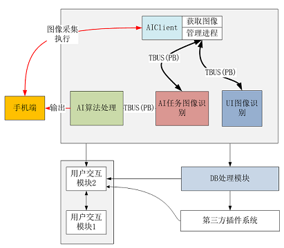
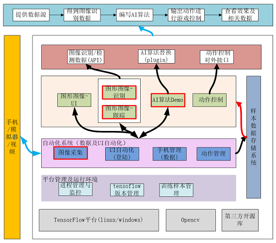
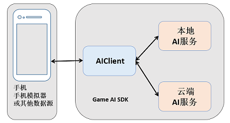
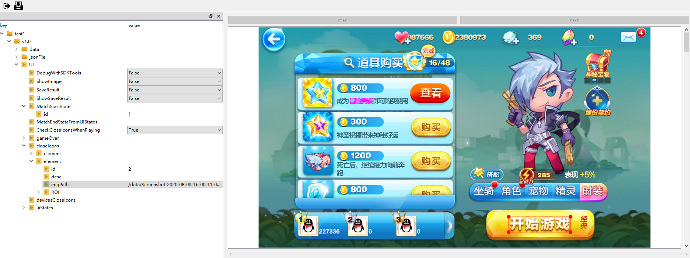

#   AI SDK平台

AI SDK平台 是一个基于游戏图像来开发游戏AI的开源工具包。工具包主要完成了UI检测，游戏内元素识别，AI算法(DQN，IM)等功能。可以基于这个工具包完成游戏自动化测试。目前已支持的游戏类型有跑酷类，吃鸡类，射击类，MOBA类等。

工具包主要包括AI SDK，AI Client，SDKTool(配置文件工具)这几部分。

SDKTool帮助我们生成跟具体游戏相关的AI SDK所需要配置文件。如游戏运行过程中，整个流程中需要动作交互的UI，需要识别的游戏元素等。AI开发过程中用到的信息可来自于游戏图像(AI Client获取)或其他数据。AI SDK能够自动化完成游戏UI操作并进入游戏场景，像玩家一样操作手机玩游戏。

​						             									 图 1 AI SDK 模块图

其中AI SDK部分主要包括AI Clinet模块， MC模块，IO模块， UI模块， GameReg模块，AI模块。

-  AI Client主要与手机端交互，获取游戏图像，并执行UI或AI输出的动作

- IO模块与AI Client交互，作为AI SDK的数据输入输出控制

- MC模块与IO模块交互，将数据分发至AI SDK后端的UI和AI模块，并做一些业务逻辑的管理控制

- UI模块根据游戏图像，识别出需要进行的UI操作

- GameReg模块根据游戏图像，识别出游戏场景内的数字、血条、目标物等元素

- AI模块根据识别到的游戏元素，根据AI算法执行业务逻辑

​									   						          图 2   架构图

 

[TOC]

# 1 环境部署

运行AI SDK中的demo，首先需要安装依赖，然后本地PC机都需要连接手机(或手机模拟器)，通过AI Client实时采集手机(或手机模拟器)的游戏画面，并传给AI服务去处理。并把AI服务处理的动作结果反馈到连接PC的手机上，完成动作的交互。

 图3  AI SDK和手机的交互图

## 部署依赖环境

部署依赖环境主要是安装AI SDK， SDKTool(配置文件生成工具),  AI Client 的环境依赖。

Ubuntu:

目前SDK工具包运行在16.04的64位 Ubuntu 系统上，使用的深度学习框架为tensorflow ，所以使用前需要安装依赖的ubuntu系统和相应的依赖第三方工具包，如tensorflow、opencv、protobuf等。

环境主要依赖nvdia-cuda 9.0, cudnn 7.0, opencv 3.4.2, protobuf 3.2.0, android adb，poster工具集等依赖包。具体请参考[依次安装依赖项说明](doc/environment/InstallStepByStep.md)。

Windows:

SDK包下自带要安装的依赖包文件“requirements.txt”，所以windows下只需要安装“requirements.txt”中的依赖。详见[windows环境依赖安装](doc/environment/SDKToolEnv.md)。

# 2 快速开始

SDK 怎么自动玩游戏的呢？平台内置了 <天天酷跑>的例子，让我们一睹为快。

 
                                                                                                                                 

​    图4 左图为未训练随机做动作，右图是训练好的效果

## 运行Demo

本地运行主要分为以下几步：

Ubuntu:

- Step1:编译AISDK

  进入game_ai_sdk目录，将SDK编译成GPU或CPU版本，详细内容请参考文档[Ubuntu编译AISDK](doc/project/AISDKCompile.md)。

- Step2:安装apk

  请自行在APP商店中下载天天酷跑的APK，本次使用的游戏APK版本为“1.0.78.0.3”

- Step3:启动

  启动AIClient 和 AISDK服务。详细内容请参考[启动](doc/project/QuickStartLocalRunLinux.md)。
  

Windows:

-  Step1:编译AISDK

  进入game_ai_sdk目录，将SDK编译成GPU或CPU版本，详细内容请参考文档[Windows编译AISDK](doc/project/AISDKCompileWin.md)。

- Step2:安装apk

  请自行在APP商店中下载天天酷跑的APK，本次使用的游戏APK版本为“1.0.78.0.3”

- Step3:启动

  启动AIClient 和 AISDK服务。详细内容请参考[启动](doc/project/QuickStartLocalRunWin.md)。

# 3 配置文件工具SDK Tool

在第2章我们介绍了如何运行一个内置的游戏AI，那么我们如何从零开始接入一个新的项目呢？首先我们需要生成跟具体游戏相关的配置文件。如控制游戏运行流程的UI界面(UI配置)，进入游戏场景后，AI所需要识别的游戏场景元素(场景识别配置)等。工具包AI SDK Tool可以协助用户去生成这些配置文件。运行SDK Tool工具的方法如下：

进入SDKTool 目录，运行SDK Tool

`cd game_ai_sdk/tools/SDKTool  //进入到SDKTool目录下`
`python main.py    // 启动SDKTool`

图 5 SDKTool界面介绍

- UI配置

  游戏运行过程中，有些需要玩家交互点击Button，配置好流程中的这些UI界面和需要点击的位置后，AI即可以像玩家一样在相应的界面点击相应的位置。方便用户的自动化测试或是其他需要自动化进入游戏的需求。详细内容，请见 [UI配置文件说明](doc/SDKTool/UIConf.md)。配置完成后，生成文件 SDKTool/project/{gameName}/v1.0/jsonFile/UIConfig.json。用户需要把这此文件拷贝到game_ai_sdk/cfg/task/ui目录下。同时需要把样本图像目录SDKTool/project/ActionCfg/v1.0/data 拷贝到工程目录 game_ai_sdk/data下。

- 场景识别配置

  根据所选择的游戏场景，设置所需要的识别任务。如QQ飞车中的数字，左下角的道具，向左转向的按钮，向右转向的按钮等。场景配置文件可配置的识别类型主要包括固定位置的物体识别(fix object)，形变物体识别(deform object)，数字识别(number)，卡住判断(stuck)，基于像素值的筛选(pixel)，固定血条的识别(fix blood)，不固定血条的识别(deform blood)等。具体参数说明，请见[任务配置文件说明](doc/SDKTool/TaskConf.md)。配置完成后，生成文件 SDKTool/project/gameName/v1.0/jsonFile/task.json和refer.json。用户需要把这两个文件拷贝到game_ai_sdk/cfg/task/gameReg 目录下。同时需要把样本图像目录SDKTool/project/ActionCfg/v1.0/data拷贝到工程目录 game_ai_sdk/data下。图像识别进程根据配置项做处理后，把结果返回给Agent，Agent可以根据游戏元素的识别结果编写相应的AI逻辑。识别类型配置说明以及返回结果示例请见文档[图像识别进程识别类型介绍](doc/project/CollectionTypes.md)。

  

# 4 项目接入

通过第三章我们了解了配置文件工具的功能，那么我们完整接入一个新的项目，需要哪些步骤呢？以<天天酷跑>为例，我们介绍接入新项目的具体步骤。

- Step1: 配置游戏过程UI

​        详细内容请见[项目接入-UI配置](doc/project/ProjectUIConfig.md)。

- Step2: 采集样本，训练识别模型(可变物体的识别算法需求，此步骤为可选步骤，<天天酷跑>不需要此步骤)

  有些识别任务(如可变物体的识别)需要训练网络模型。目前平台内置了YOLO识别算法。我们需要先采集图像样本,并对这些样本进行标注，然后基于这些标注样本去训练YOLO模型。详细过程请参考[图像标注和YOLO模型训练说明](doc/YOLO/TrainDetModel.md)。

- Step3: 选择AI算法

  ​	平台内置的AI算法有DQN，IM(模仿学习)，用户可以根据需求选择AI算法

  - 模仿学习

    - 录制AI样本，并训练AI(模仿学习算法需求，此步骤为可选步骤，<天天酷跑>采用模仿学习算法，需要此步骤）详细内容请见[项目接入-录制样本及模型训练](doc/project/ProjectIMTrain.md)

    - 选择模仿学习算法

      模仿学习配置请参考[模仿学习配置说明](doc/project/IMConf.md)。

  - DQN

    - 训练模型 请参考[DQN模型训练](doc/project/ProjectDQNTrain.md)。
    
    - DQN配置请参考 [DQN强化学习配置说明](doc/project/DQNConf.md)。

- Step4: 运行SDK

  准备工作就绪后，运行SDK，看看我们的AI是怎么玩新游戏的吧。具体内容请见Ubuntu环境: [运行](doc/project/ProjectLocalRunLinux.md), Windows环境: [运行](doc/project/ProjectLocalRunWin.md)。

# 5 二次开发

如果有更高阶的需求，比如现有的AI算法不能满足需求，如何加入自己的AI呢？想增加新的检测或识别算法，该怎么加入到整体框架上？ 那么您可以增加和修改源码，并欢迎上传到git。

- AI的二次开发

  智能体的二次开发，请详见文档[AI的二次开发](doc/2nddev/DevelopAI.md)。

- 图像识别的二次开发

  图像识别的二次开发，请详见文档[图像模块的二次开发](doc/2nddev/DevelopImgProc.md)。
  
  
  
# 6 调试技巧

 在用工具的时候，可能会遇到一些问题，如图像匹配有偏差等问题，请详见文档 [调试技巧说明](doc/opt/Opt.md) 。
 
 
 
 # 7 技术交流
 
 欢迎加入QQ群 1095989343 进行交流。

 # 关于WeTest
 
 腾讯WeTest是由腾讯官方推出的一站式品质开放平台。十余年品质管理经验，致力于质量标准建设、产品质量提升。腾讯WeTest为移动开发者提供兼容性测试、云真机、性能测试、安全防护、企鹅风讯（舆情分析）等优秀研发工具，为百余行业提供解决方案，覆盖产品在研发、运营各阶段的测试需求，历经千款产品磨砺。金牌专家团队，通过5大维度，41项指标，360度保障您的产品质量。
 详情点击：https://wetest.qq.com
