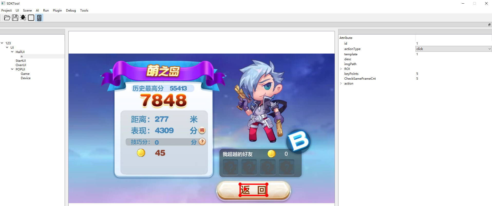
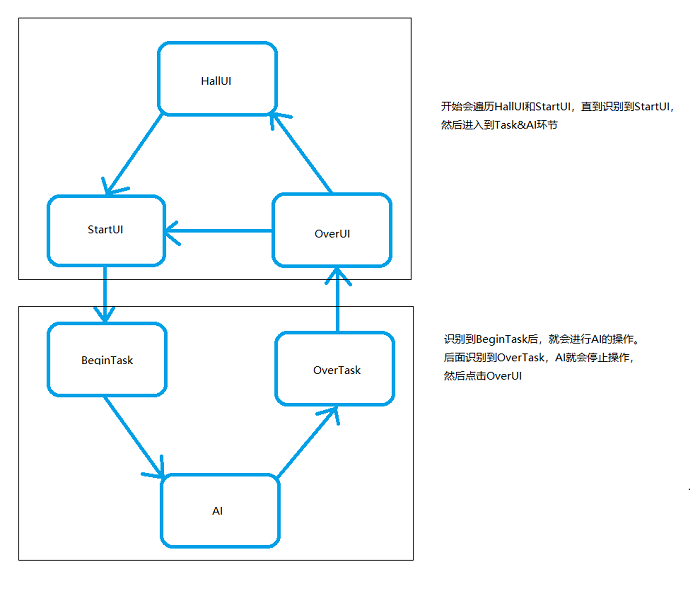

#   aitest 平台

aitest平台 是一个基于游戏图像来开发游戏AI的开源工具包。工具包主要完成了UI检测，游戏内元素识别，AI算法(DQN，IM)等功能。可以基于这个工具包完成游戏自动化测试。目前已支持的游戏类型有跑酷类，吃鸡类，射击类，MOBA类等。详情见[官网](https://aitest.qq.com/)

工具包主要包括AI SDK，AIClient，SDKTool(配置文件工具)这几部分。

SDKTool帮助我们生成跟具体游戏相关的AI SDK所需要配置文件。如游戏运行过程中，整个流程中需要动作交互的UI，需要识别的游戏元素等。AI开发过程中用到的信息可来自于游戏图像(AIClient获取)或其他数据。aitest 能够自动化完成游戏UI操作并进入游戏场景，像玩家一样操作手机玩游戏。

​						             									 图 1 aitest 模块图

其中AI SDK部分主要包括AI Client模块， MC模块，IO模块， UI模块， GameReg模块，AI模块。

-  AI Client主要与手机端交互，获取游戏图像，并执行UI或AI输出的动作

- IO模块与AI Client交互，作为AI SDK的数据输入输出控制

- MC模块与IO模块交互，将数据分发至AI SDK后端的UI和AI模块，并做一些业务逻辑的管理控制

- UI模块根据游戏图像，识别出需要进行的UI操作

- GameReg模块根据游戏图像，识别出游戏场景内的数字、血条、目标物等元素

- AI模块根据识别到的游戏元素，根据AI算法执行业务逻辑

​									   						          图 2  aitest 架构图

 

# 1 环境部署

aitest 可以部署在本地，也可以部署在云端。如果需要在本地运行，除了下载工具包，AIClient外，还需要安装工具包的依赖。如果是在云端运行，只需要下载AIClient。不论采取哪种运行方式，本地PC机都需要连接手机(或手机模拟器)，通过AIClient实时采集手机(或手机模拟器)的游戏画面，并传给本地或是远端的AI服务去处理。并把AI服务处理的动作结果反馈到连接PC的手机上，完成动作的交互。

 图3  aitest 交互图  

## 1.1镜像部署
用户可在电脑上安装docker，使用已经搭建好game_ai_sdk所需环境的ubuntu16.04 docker镜像系统。  

win10用户详细内容请参考[win10-docker镜像安装](doc/environment/WinDockerInstall.md)。  

mac用户详细内容请参考[mac-docker镜像安装](doc/environment/MacDockerInstall.md)。

## 1.2本地部署

本地部署主要是安装AI SDK， SDKTool(配置文件生成工具),  AIClient 的环境依赖。

- 部署AI SDK

  Ubuntu:

  目前SDK工具包运行在14.04或是16.04的64位 Ubuntu 系统上，使用的深度学习框架为tensorflow ，所以使用前需要安装ubuntu系统的依赖和相应的第三方工具包的依赖，如tensorflow、opencv、protobuf等。现有两种方法部署整个环境：借助自动部署工具和依次安装依赖项。

  方法1： 自动部署工具。

  自动部署工具是一个shell脚本，让用户能够自动化部署SDK的环境，减少人力以及错误率。具体内容请详见[SDK环境自动部署工具说明](doc/environment/SDKAutoInstallToolEnv.md)。

  方法2：如果想了解环境的依赖项也可以通过选择依次一步一步的依次安装依赖项。

  环境主要依赖nvdia-cuda 9.0, cudnn 7.0, opencv 3.4.2, protobuf 3.2.0, android adb，poster工具集等依赖包。具体请参考[依次安装依赖项说明](doc/environment/InstallStepByStep.md)。

  Windows:

  用户下载源码后，需要安装python的依赖。有部分模块是基于c++语言实现的，所以需要用户下载vs2017,并编译源码，具体请参考 [python的依赖安装](doc/project/AISDKDownloadWin.md)、[安装vs2017并编译源码](doc/project/AISDKCompileWin.md)

  

- 部署 SDKTool

  AI服务进程所需要的跟具体游戏相关的配置文件和图像标注可通过SDKTool去配置，SDKTool的安装，请见文档[SDKTool部署说明](doc/environment/SDKToolEnv.md)。

  

<!--
## 1.3 云端部署
用户可以选择在云端运行。用户需要安装SDKTool和AIClient的相关依赖。详细内容请参考[SDKTool部署说明](doc/environment/SDKToolEnv.md)，[AIClient部署说明](doc/environment/AIClientEnv.md)。
-->

# 2 快速开始

aitest 怎么自动玩游戏的呢？平台内置了 <天天酷跑>的例子，让我们一睹为快。

​														图 4  左边为未训练运行效果，右边为训练后运行效果

## 2.1 本地运行

本地运行主要分为以下几步：

docker镜像：  
win10用户可在电脑上安装docker，使用已经搭建好game_ai_sdk所需环境的ubuntu16.04 docker镜像系统。详细内容请参考[快速上手](doc/SDKTool/Get_started_quickly.md)

Ubuntu:

- Step1:下载工具包

  下载AISDK，详细内容请参考文档[AISDK工具包下载](doc/project/AISDKDownload.md)。

- Step2:编译AISDK

  进入game_ai_sdk目录，编译GPU或CPU对应SDK版本，详细内容请参考文档[编译AISDK](doc/project/AISDKCompile.md)。

- Step3:安装apk

  PC机连接手机(安卓系统)后，从应用商店或TTKP官网下载即可。

- Step4:启动

  启动AIClient 和 AISDK服务。详细内容请参考[本地启动](doc/project/ProjectLocalRun.md)。
  

Windows:

- Step1:下载工具包

  下载AISDK，详细内容请参考文档[AISDK工具包下载](doc/project/AISDKDownloadWin.md)。

- Step2:编译SDK

  安装vs2017,设置环境变量，编译SDK，详细内容请参考文档[windows下编译SDK](doc/project/AISDKCompileWin.md)

- Step3:安装apk

  PC机连接手机(安卓系统)后，从应用商店或TTKP官网下载即可。

- Step4:启动

  启动AIClient 和 AISDK服务。详细内容请参考[本地启动](doc/project/ProjectLocalRun.md)。

<!--
## 2.2 云端运行

云端运行主要分为以下几步：

- Step1: AIClient工具包

  详细内容请参考文档[AIClient工具包下载](doc/project/AIClientDownload.md)。

- Step2:安装apk

  详细内容请参考[安装apk](doc/project/APKDownLoad.md)。

- Step3:申请资源

  通过ASM web端申请运行AI业务的资源(计算、ip、端口号、key等资源)，详细内容请参考[云端运行-申请资源](doc/project/QuickStartApplyService.md)。

- Step4:运行

  运行步骤请参考文档[云端运行-启动](doc/project/CloudRun.md)。运行结束后，游戏运行过程会录制为视频存储下来，用户可以下载此视频。
-->

# 3 配置文件工具SDK Tool

在第2章我们介绍了如何运行一个内置的游戏AI，那么我们如何从零开始接入一个新的项目呢？首先我们需要生成跟具体游戏相关的配置文件。如控制游戏运行流程的UI界面(UI配置)，进入游戏场景后，AI所需要识别的游戏场景元素(场景识别配置)等。工具包AI SDK Tool可以协助用户去生成这些配置文件。工具的下载和安装方法请参考第一章部署SDKTool部分。

图 5 SDKTool界面介绍

- UI配置

  游戏运行过程中，有些需要玩家交互点击Button，配置好流程中的这些UI界面和需要点击的位置后，AI即可以像玩家一样在相应的界面点击相应的位置。方便用户的自动化测试或是其他需要自动化进入游戏的需求。详细内容，请见 [UI配置文件说明](doc/SDKTool/UIConf.md)。

- 场景识别配置

  根据所选择的游戏场景，设置所需要的识别任务。如QQ飞车中的数字，左下角的道具，向左转向的按钮，向右转向的按钮等。场景配置文件可配置的识别类型主要包括固定位置的物体识别(fix object)，形变物体识别(deform object)，数字识别(number)，卡住判断(stuck)，基于像素值的筛选(pixel)，固定血条的识别(fix blood)，不固定血条的识别(deform blood)等。具体参数说明，请见[任务配置文件说明](doc/SDKTool/TaskConf.md)。图像识别进程根据配置项做处理后，把结果返回给Agent，Agent可以根据游戏元素的识别结果编写相应的AI逻辑。识别类型配置说明以及返回结果示例请见文档[图像识别进程识别类型介绍](doc/project/CollectionTypes.md)。

  

  

# 4 项目接入

通过第三章我们了解了配置文件工具的功能，那么我们完整接入一个新的项目，需要哪些步骤呢？以<天天酷跑>为例，我们介绍接入新项目的具体步骤。  

- 执行项目的整个逻辑流程如下，配置项目的时候需要根据这个流程来配置。

- Step1: 配置游戏过程UI  

    详细内容请见[项目接入-UI配置](doc/project/ProjectUIConfig.md)。

- Step2: 采集样本，训练识别模型(可变物体的识别算法需求，此步骤为可选步骤,<天天酷跑>不需要此步骤。)

  有些识别任务(如可变物体的识别)需要训练网络模型。目前平台内置了YOLO识别算法。我们需要先采集图像样本,并对这些样本进行标注，然后基于这些标注样本去训练YOLO模型。详细过程请参考[图像标注和YOLO模型训练说明](doc/YOLO/TrainDetModel.md)。

- Step3: 配置场景识别任务

  详细内容请见[项目接入-配置task任务](doc/project/ProjectTaskConf.md)。

- Step4: 选择AI算法

  ​	平台内置的AI算法有DQN，IM(模仿学习)，用户可以根据需求选择AI算法

  - 模仿学习

    - 录制AI样本，并训练AI(模仿学习算法需求，此步骤为可选步骤，<天天酷跑>采用模仿学习算法，需要此步骤）详细内容请见[项目接入-录制样本及模型训练](doc/project/ProjectIMTrain.md)
  
  - DQN

    - 训练模型 请参考[DQN模型训练](doc/project/ProjectDQNTrain.md)。
  
  - RainBOW

    - 训练模型 请参考[RainBOW模型训练](doc/project/ProjectRainBowTrain.md)。
  

- Step5: 运行SDK

  准备工作就绪后，运行SDK，看看我们的AI是怎么玩新游戏的吧。具体内容请见[本地运行](doc/project/ProjectLocalRun.md)。

# 5 自动探索

UI自动探索是自动遍历和记录Android手机游戏内所有UI的功能，以<天天酷跑>为例，我们介绍UI自动探索的具体步骤。

​详细内容请见[UI自动探索使用手册](doc/SDKTool/UIAutoExplore.md)。

- Step1: 配置样本图片

    可以从本地导入图片，也可以在工具上实时生成样本图片。

- Step2: 标注样本

    先自动标注样本，再人工检查并调整部分标注。

- Step3: 训练模型

    根据需要和电脑配置调整训练参数，微调次数越大模型的效果越好，但是训练时间越长

- Step4: 执行自动探索

    根据需要设置本次执行的点击次数。执行完指定的点击次数后自动结束。

- Step5: 查看自动探索结果
    
    执行结束后可查看执行过程的图分析，场景和按钮覆盖率，以及每个样本图片的详细覆盖情况

# 6 二次开发

如果有更高阶的需求，比如现有的AI算法不能满足需求，如何加入自己的AI呢？想增加新的检测或识别算法，该怎么加入到整体框架上？ 那么您可以增加和修改源码，并欢迎上传到git。

- AI的二次开发

  智能体的二次开发，请详见文档[AI的二次开发](doc/2nddev/DevelopAI.md)。

- 图像识别的二次开发

  图像识别的二次开发，请详见文档[图像模块的二次开发](doc/2nddev/DevelopImgProc.md)。
  
  
  
# 7 调试技巧

 在用工具的时候，可能会遇到一些问题，如图像匹配有偏差等问题，请详见文档 [调试技巧说明](doc/opt/Opt.md) 。

# 8 常见问题及处理方法  

搭建环境或者运行过程出现问题，查看[FAQ](doc/opt/FAQ.md)
