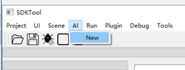
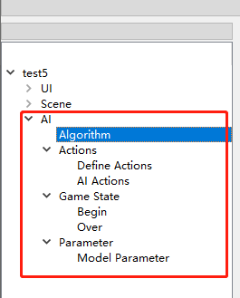
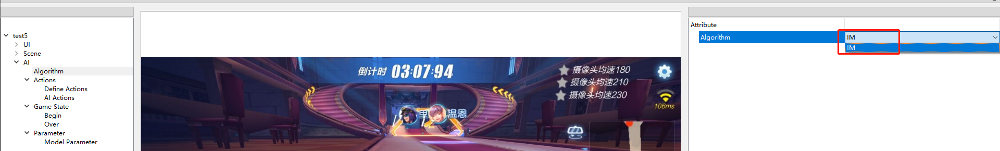
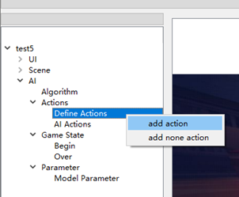
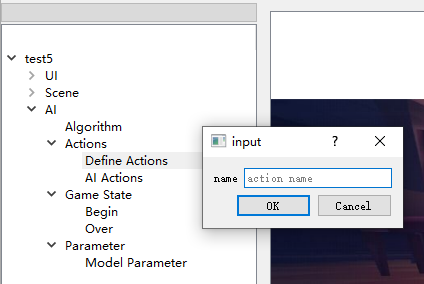
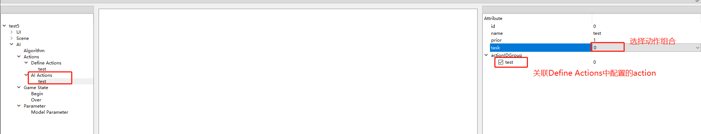
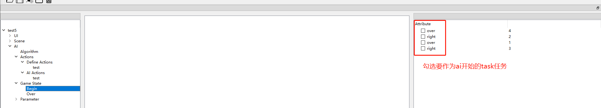
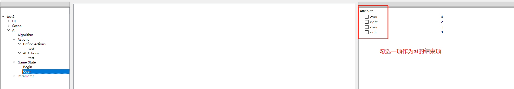
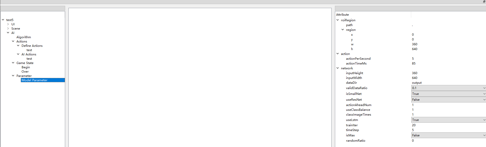

# 动作参数配置说明

## 1 SDKTools整体介绍

SDKTools主要用于生成AI服务所需要的配置文件，按照json格式保存。它是用python编写的，用QT作为图形界面。

## 2 整体流程

   图1-1  整体流程

### 2.1 新建项目

新建项目流程演示（使用16:9的手机进行配置），见下图2-1、2-2、2-3、2-4所示：

图2-1  点击Project》New

图2-2  填写项目名称

图2-3  选择媒介

图2-4  双击要的选择手机

图2-5  窗口中显示手机画面

接下来就可以在工具中进行Scene或UI等的配置了

### 2.2 导入项目

导入项目流程演示，见下图2-5、2-6、2-7、2-8所示：

图2-5  点击Project>Load

图2-6  选择要导入的项目

图2-7  点击OK 按钮

图2-8  成功导入项目

完成以上步骤即可成功导入项目

## 3.动作配置参数说明

| **Key**         | **描述**                                                     |
| --------------- | ------------------------------------------------------------ |
| id              | id号                                                         |
| name            | 名称                                                         |
| contact         | 指触点的标识,可以取-1到9的整数。0到9代表动作对应的触点，-1表示不点击 |
| sceneTask       | 关连的task任务                                               |
| type            | 动作类型有5种：none：在某个区域没有动作down：触点按下去的动作，在某个区域内点下去up：触点弹起，释放某个区域点下去的触点click：down+up一次点击操作swipe：滑动，从某个区域滑到另一个区域，只有swipe有endRect |
| region          | 在这个区域内上面定义的动作发生，会进行记录。区域定义为x，y，w，h左上角的横坐标和纵坐标与宽高 |
| path            | 配置的图片路径                                               |
| beginTaskID     | 关联task任务作为AI的开始                                     |
| overTaskID      | 关联task任务作为AI的结束                                     |
| actionPerSecond | 每秒的动作数量                                               |
| actionTimeMs    | 点击动作的时间                                               |
| inputHeight     | 图像高度（注意区分横屏和竖屏游戏，如果是竖屏则inputHeight>inputWidth，横屏则 inputHeight<inputWidth |
| inputWidth      | 图像宽度                                                     |
| dataDir         | 录制的样本图像存放位置                                       |
| validDataRatio  | 设置训练样本的比例，如果设置0.5，即表示将样本中的一半样本作为训练样本，另一半样本作为验证样本 |
| isSmallNet      | 是否采用小网络                                               |
| useResNet       | 是否使用残差模型                                             |
| actionAheadNum  | 动作标签提前多少帧，针对动作延迟设计                         |
| useClassBalance | 是否使用数据增广                                             |
| classImageTimes | 将样本扩充多少倍                                             |
| useLstm         | 是否使用Lstm                                                 |
| trainIter       | 训练的次数                                                   |
| timeStep        | Lstm的记忆帧数                                               |
| isMax           | 是否采取概率最大的动作。设置为0时，根据动作概率随机做动作    |
| randomRatio     | isMax为0时，给每个动作的输出概率加一个固定值                 |

## 4. 动作配置

动作配置文件用于模仿学习录制样本，点击菜单栏上的“AI>New”，然后分别对AIgorithm、Actions、Game State、Parameter进行配置，详见下图4-1、4-2所示：

图4-1 新建一个AI配置

图4-2 新建好的AI

AIgorithm配置，详见下图4-3：

图4-3 选择算法

Actions配置，详见下图4-4、4-5、4-6、4-7、4-8、4-9、4-10：

图4-4  添加action

图4-5 填写action的名字

 

图4-6  配置action

图4-7  配置ai actions

图4-8  配置ai开始项

图4-9  配置ai结束项

图4-10 设置训练参数Parameter

配置完成后，下一步就是采集样本，进行模型训练，详见“[模仿学习的样本采集及训练](../project/ProjectIMTrain.md)”

