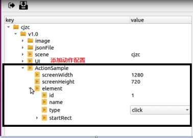
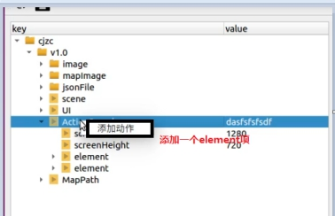
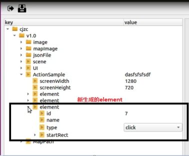

# 动作参数配置说明

[TOC]

## 1 SDKTools整体介绍

SDKTools主要用于生成AI服务所需要的配置文件，按照json格式保存。它是用python编写的，用QT作为图形界面。

## 2 整体流程

图 2-0 整体流程

### 2.1 新建项目

新建项目流程演示（尽量使用1280×720分辨率图片配置），见下图2-1、2-2、2-3、2-4、2-5所示：

图2-1 屏幕右击

图2-2 新建项目

图2-3 输入工程名

图2-4 选择图片文件夹

图2-5 生成工程树状图

选择装有图片的文件夹时，会把所选择文件夹下所有图片或子文件另存到SDKTools/project/cjzc（工程名）/v1.0（版本号）/image/下。生成json文件保存在SDKTools/project/cjzc（工程名）/v1.0（版本号）/jsonFile/下。

### 2.2 导入项目

导入项目流程演示，见下图2-6、2-7、2-8、2-9、2-10所示：

图2-6 屏幕右击

图2-7 导入项目

图2-8 打开project.json文件

完成以上步骤即可成功导入项目

## 3.动作配置参数说明

| **Key**      | **描述**                                                     |
| ------------ | ------------------------------------------------------------ |
| screenWidth  | 图像宽度                                                     |
| screenHeight | 图像高度                                                     |
| element      | 每个动作配置                                                 |
| id           | Id 号                                                        |
| name         | 名称                                                         |
| type         | 动作类型有5种：none：在某个区域没有动作down：触点按下去的动作，在某个区域内点下去up：触点弹起，释放某个区域点下去的触点click：down+up一次点击操作swipe：滑动，从某个区域滑到另一个区域，只有swipe有endRect |
| startRect    | 在这个区域内上面定义的动作发生，会进行记录。区域定义为x，y，w，h左上角的横坐标和纵坐标与宽高 |
| endRect      | 只有swipe动作会有会记录从startRect到endRect的滑动动作，通常用于调视角 |

## 4. 动作配置

动作配置文件用于模仿学习录制样本，可以在版本上右键，添加动作配置，添加一个动作就是添加一个element项，在ActionSample上右击，选择添加动作

详见下图4-1、4-2、4-3所示：

4-1 添加动作配置

 

4-2 添加动作

4-3 生成element

## 5.注意事项

1、配置好这些文件，需要在SDK下使用时，需要手动将这些cfg和data文件拷到相应的路径下，cfg中图片路径可能需要修改。

2、按顺序填写配置项；想要保存到json文件里，一定要先保存（ctrl+s；保存按钮）再关闭。

3、SDKTools保存的项目文件全都存在SDKTools/project/下，请注意不要误删。

