## AI TEST SDK 快速上手

### 母机：windows 10系统  
### docker: windows版   

这里是以Windows10系统为例，Mac系统请查看[mac-docker使用](../environment/MacDockerInstall.md)

### 一.  下载安装

1.  从<a href="http://aitest.qq.com-" data-link="/download/index">下载页面</a>下载本地编译包、镜像包、母机依赖包。

2.  确认开启硬件的虚拟化技术(windows10)

    开启步骤：  
    右键选择左下角“windows图标”-> 选择“应用和功能”-> 选择右上角“程序和功能”-> 选择“启动和关闭windows功能”-> 勾选“Hyper-V”-> 点击“确定”-> 重启计算机
    
3.  解压母机依赖包，运行解压文件目录下的install_rely.bat脚本，运行脚本过程中会弹出软件安装的提示，选择默认配置即可（下一步）。

### 二.   手机链接

1. 将手机的开发人员选项打开（不同品牌手机打开方式不样，可根据使用的手机品牌网上查询打开方法），然后打开USB调试模式。
    
    ① 打开USB调试模式先要开启开发者模式，过程如下。示例是为Huawei MATE9，其它品牌手机操作基本相同。  
    
    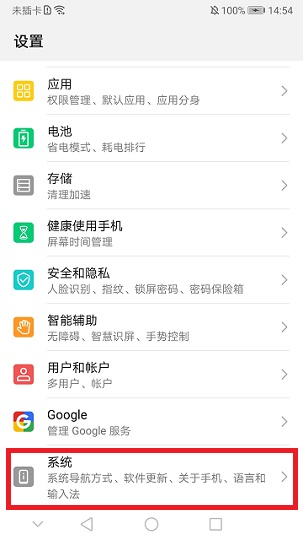  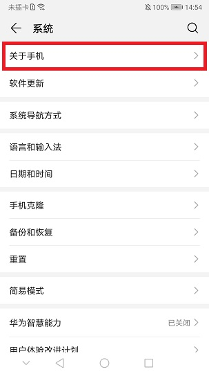  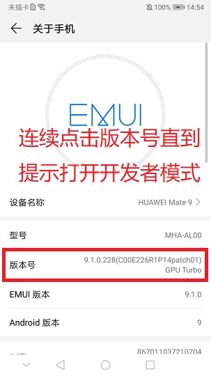  
        
    ② 开启USB调试模式  
    返回上一级能看到多了一个开发者模式入口
        
    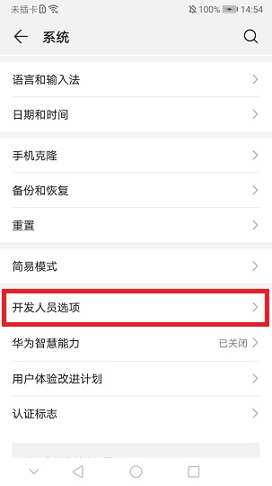  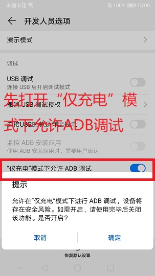  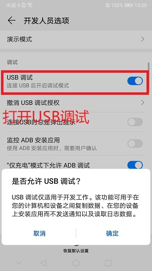  
    
		   
2. 将手机连接电脑，选择同意调试，选择传输文件模式  

	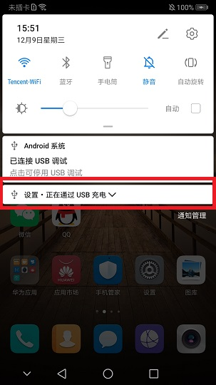  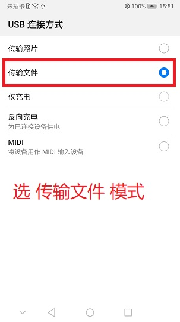  
  
3. 测试手机是否正确连接

	cmd 输入 adb devices，如果List of devices attached下面是一个序列号+device的输出，就表示手机已经连上PC  
	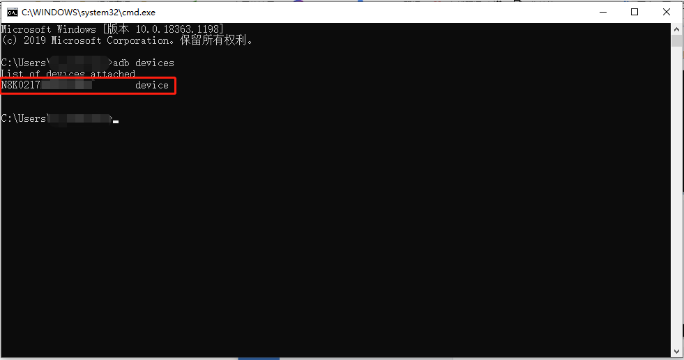
 

### 三．	运行demo
1. 在手机上下载安装天天酷跑客户端；手工启动天天酷跑并登陆，将游戏停在如下画面（内置的demo使用了AI模式，没有加UI模式，所以需要人工点击过UI画面）  
入口：活动大厅》冒险》冒险大陆》萌之岛  

2. 桌面找到docker图标，双击启动；然后加载docker文件；  

    ```
    docker load –i 镜像名称.tar
    ```

    
3. 启动服务：解压下载的本地编译包,执行以下命令  

    ```
    cd GameAISDK/tools/docker  
    start_win_docker.bat
    ```

4. 在SDKTool的界面中加载TTKP工程，在右边属性选择输入源为手机,双击手机序列号稍等如果有手机图像显示在SDKTool中，则工程设置正确。  

	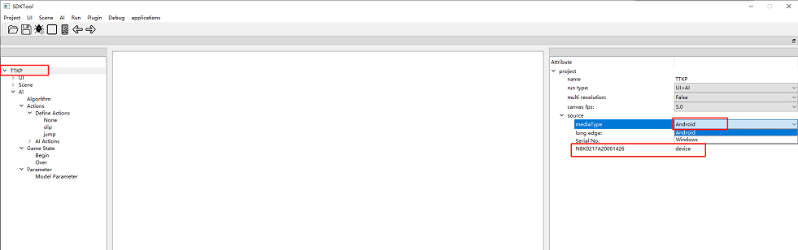  

	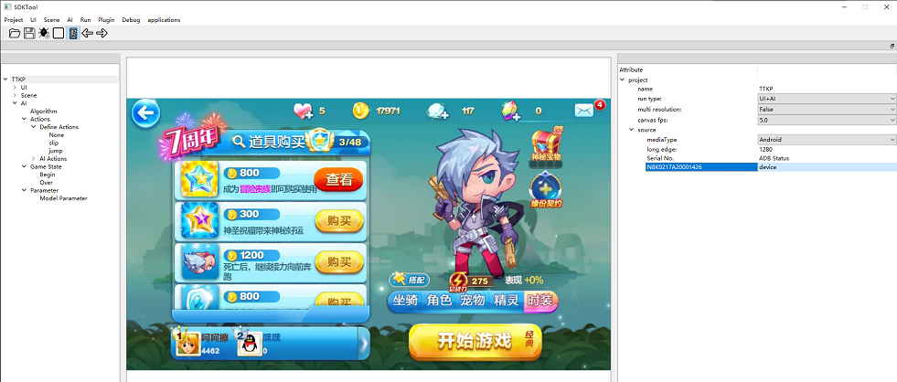  

5. 点击SDKTool中的Run>Test，开始运行demo，可以查看手机运行情况。
   
6. 运行demo的操作视频：详细操作请见<a href="https://aitest.qq.com.../video/Tutorials8.mp4">教学视频</a>

### 四．	项目配置

如果需要应用到其他游戏项目中，需要完成UI和Scene，详细的操作可以查看官网的<a href="https://aitest.qq.com.../video/Tutorials1.mp4">UI&Scene教学视频</a>，里面有详细的说明与操作。  

### 五．	训练测试  

AI TEST SDK平台内置了IM算法和DQN算法，这两种算法都需要进行参数配置，然后使用样本进行训练，训练完成后就可以进行自动化测试了。  
IM算法训练详细的操作可以查看<a href="https://aitest.qq.com.../video/Tutorials3.mp4">IM算法教学视频</a>。  
DQN算法训练详细的操作可以查看<a href="https://aitest.qq.com.../video/Tutorials4.mp4">DQN算法教学视频</a>。  
里面有详细的说明与操作。
