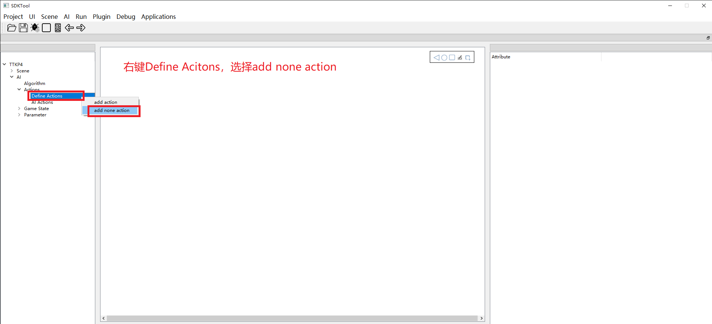
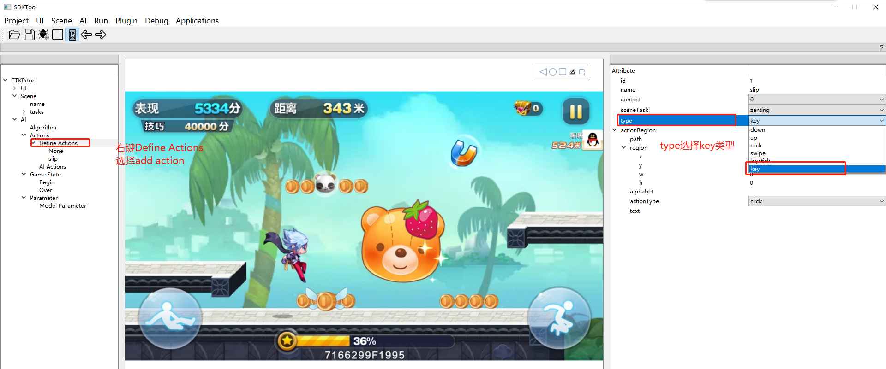
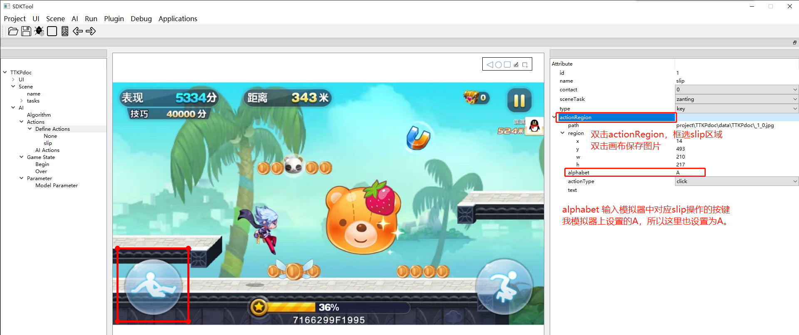
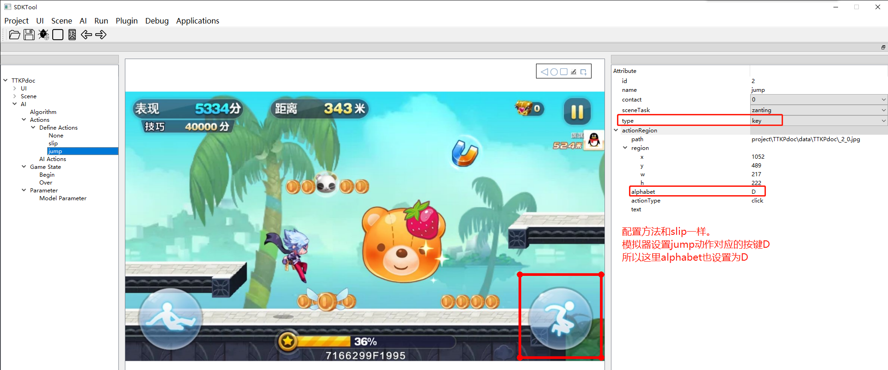
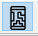

# Windows下Android模拟器定义动作

这里以TTKP为例  
- TTKP需要配置三个动作，滑，跳和一个None。

1. 模拟器设置按键  
点击右侧菜单栏的键盘图标

选择点击要使用的功能按键

在键盘上随意输入一个按键，该按键就执行你选择的功能，保存后就可以使用  
这里演示slip动作为A键，jump动作为D键

1. None动作类型，即游戏中不做任何动作  

  

2. key动作类型，即游戏中的滑行动作slip

  

  

3. key动作类型，即游戏中的跳跃动作

 

· contact:指触点的标识,可以取-1到9的整数。0到9代表动作对应的触点，-1表示不点击

· name:定义动作的名字，可以自己定义

· id:定义动作的id，通常是从0开始的

· type：定义动作的类型，down、up、click、swipe、joystick、key 

path:定义动作范围的图像路径

region:定义动作的范围

sceneTask:关连task任务

配置“定义动作”时，若工具中没有模拟器画面，可点击工具栏上的连接手机按钮

稍等工具中就会出现手机画面，然后选择type类型，双击actionRegion，此时工具中的画面会静止，在静止的画面中框选动作范围，框选完后，双击画面，程序会自动填写path路径，同时也会将配置的图像存储下来