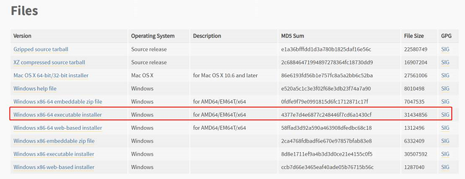

# rainbow server部署

rainbow 部署方式有两种, 一种是本地部署, 一种是镜像部署

## 1 本地部署

### 1.1 windows 环境下部署

#### 1.1.1 安装python

    如果本机已经安装 **python3.6.2**, 则跳转本章节
	
	  否则进入python官网https://www.python.org/downloads/
	  
	  选择python3.6.2，如下图1-1所示：
	  


      图1-1 python3.6.2

点击后拉到底部，选择安装包，如图1-2所示：



​         图1-2 下载python文件

之后打开安装文件，根据提示安装即可。

#### 1.1.2 安装环境依赖

如果本机已经有python的环境，建议安装虚拟环境，进行环境隔离。通过以下命令安装虚拟环境。

```
pip install virtualenv //安装virtualenv
virtualenv env //创建虚拟环境，虚拟环境命名为"env"
env\Scripts\activate         // 进入虚拟环境
```

如果没有安装Rainbow Server的相关依赖，需要先安装相关依赖：

```
cd {path to Rainbow Server} //进入到Rainbow Server目录
pip install -r requirements.txt // 安装依赖
```

相关依赖准备好后，进入Rainbow Server目录，运行Rainbow Server。

```
cd rainbow/Server  //进入到Rainbow Server目录下
python main.py    // 启动Rainbow Server
```

### 1.2 ubuntu 环境下部署

如果本机已经有python的环境，建议安装虚拟环境，进行环境隔离。

如果已经通过自动部署工具部署环境，则已经安装虚拟环境。通过以下命令，进行安装。

```
workon game_ai_sdk
```

如果不是通过自动部署工具部署环境，建议创建一个新的环境。

```
pip install virtualenv         // 如果权限不够，则加上sudo
virtualenv -p /usr/bin/python3 env // 创建虚拟环境，虚拟环境命名为"env"
source env/bin/activate         // 进入虚拟环境
```

如果没有安装AI SDK的相关依赖，需要先安装相关依赖。

```
cd {path to Rainbow Server} // 进入到Rainbow Server目录
pip install -r requirements.txt // 安装依赖
```

相关依赖准备好后，进入Rainbow Server目录，运行Rainbow Server。

```
cd rainbow/server  // 进入到Rainbow Server目录下
python main.py    // 启动Rainbow Server
```

## 2 镜像部署

### 2.1 获取镜像

version 标识当前AISDK的版本号, 具体版本信息可以访问 https://aitest.qq.com./download/index 获取

进行下载地址:

https://aitest.qq.com./api/download/sdk/compile/?version=aisdk_v2.0.0&file=rainbow_server.tar

获取镜像压缩包, 把压缩包上传到目标机器

docker load < rainbow_server.tar.gz 加载镜像, 如果环境上没有安装docker, 请按照docker环境

加载进行后, 会出现进行一条进行记录, 然后执行

docker run -it -p nodePort:containerPort 镜像ID /bin/bash 启动镜像