# 任务配置文件说明

## 1 SDKTools整体介绍

SDKTools主要用于生成AI服务所需要的配置文件，按照json格式保存。它是用python编写的，用QT作为图形界面。

## 2 整体流程

   图1-1  整体流程

### 2.1 新建项目

新建项目流程演示（使用16:9的手机进行配置），见下图2-1、2-2、2-3、2-4、2-5所示：

图2-1  点击Project》New

图2-2  填写项目名称

图2-3  选择媒介

图2-4  双击要的选择手机

图2-5  窗口中显示手机画面

接下来就可以在工具中进行Scene或UI等的配置了

### 2.2 导入项目

导入项目流程演示，见下图2-6、2-7、2-8、2-9所示：

图2-6  点击Project>Load

图2-7  选择要导入的项目

图2-8  点击OK 按钮

图2-9  成功导入项目

完成以上步骤即可成功导入项目

## 3 参数说明

### 3.1 task参数

| **Key**     | **描述**                                                     |
| ----------- | ------------------------------------------------------------ |
| taskID      | 默认从1开始往上叠加；可以自己点上去修改，不可以重复          |
| type        | 识别类型：fix object:固定物体检测pixel:基于像素的检测stuck:卡住检测deform object:形变物体检测number:数字检测 |
| description | 描述，可不填，建议填                                         |
| element     | 识别项，根据type的选择，会生成不同的element                  |

### 3.2 element参数

| **Key**      | **描述**                                                     |
| ------------ | ------------------------------------------------------------ |
| ROI          | 游戏识别区域，在右图上按住鼠标左键拖一个矩形出来，释放鼠标左键，会在ROI中记录矩形左上角的x，y值和宽w，高h（单位都是px） |
| algorithm    | 算法，会跟据上面选择，默认是ColorMatch                                 |
| minScale     | 最小缩放比例，因为可能要做多分辨率处理，可能需要将模板进行放缩，默认是1.0，不进行处理 |
| maxScale     | 最大放大比例,默认是1.0，不进行处理                           |
| scaleLevel   | 将模板在minScale-maxScale中进行，分多少级别进行，默认为1     |
| template     | 模板图像配置，首先先选择一张图片，然后画出模板区域，调整阈值，阈值默认为0.8，阈值越高越难匹配。可以添加多个模板，可以在element上右键添加模板图像。注：task的type等于number时，默认会生成10个模板，需要自己添加0-9的图片 |
| condition    | 每个通道的像素值范围，如："R < 100, G > 100, 90 < B < 130”，表示过滤Red通道灰度值小于100且 Green通道灰度值大于100且Blue通道灰度值在90和130之间的所有像素值 |
| filterSize   | 形态学处理的滤波器大小。(整型)                               |
| maxPointNum  | 返回最大像素点个数                                           |
| intervalTime | 计时器，隔多久检测一次（s）                                  |
| threshold    | 阈值，0-1之间，默认0.8，越大越难识别到                       |
| cfgPath      | 网络的cfg文件，选择一个路径                                  |
| weightPath   | 权重文件路径，选择一个路径                                   |
| namePath     | 名字文件路径，选择一个路径                                   |
| maskPath     | 做了掩膜的图片路径                                           |
| maxBBoxNum   | 返回boxes的最大个数                                          |
| intervalTime | stuck类型时，检测两帧图像的时间间隔                          |
| taskName     | task任务的名称                                               |
| elementName  | element名称                                                  |
| templateName | 模板名称                                                     |

### 3.3 refer参数

| **Key**      | **描述**                                                     |
| ------------ | ------------------------------------------------------------ |
| taskID       | 默认等于task*1000+是第几个element                            |
| type         | location：多分辨率情况下推测检测区域和尺度变化Bloodlengthreg：多分辨率情况下血条长度识别 |
| description  | 描述，可不填，建议填上                                       |
| algorithm    | type：locationDetect：静态Infer：动态type：BloodlengthregTempplateMatch |
| location     | 匹配位置，表示为(x, y, w, h)                                 |
| minScale     | 最小尺度，默认为1.0                                          |
| maxScale     | 最大尺度，默认为1.0                                          |
| scaleLevel   | 尺度等级，默认为1                                            |
| expandWidth  | 扩展宽度，默认为0.1                                          |
| expandHeight | 扩展高度，默认为0.1                                          |
| matchCount   | 匹配次数，默认为5                                            |
| condition    | 每个通道的像素值范围                                         |
| templates    | 模板                                                         |
| path         | 模板路径                                                     |
| threshold    | 匹配阈值                                                     |

## 4 添加配置项

### 4.1 添加场景

点击菜单栏“Scene>New”,添加新场景，如下图4-1、4-2所示：

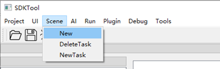

图4-1  添加场景

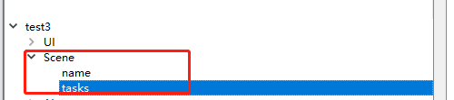

图4-2  添加场景后树状结构

### 4.2 添加task

scene里面主要就是配置每个task，每个task就是一项单独的识别任务。需要添加一个task的话，在tasks上右键，点击"add task"。然后输入task的名称，输入完名称后，点击新添加的task名称，然后点击连接手机按钮，这时工具中会出现手机画面，当工具中显示的手机画面是要配置的task任务的画面时，双击“element",这时工具中的画面会静止，在画面中框选出搜索范围，然后在双击画面，程序会自动填写imgPath的值，然后再双击”template“,配置模板，配置方法和配置element一样。详见下图4-3、4-4、4-5所示：

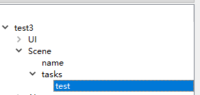

图4-3  添加task任务

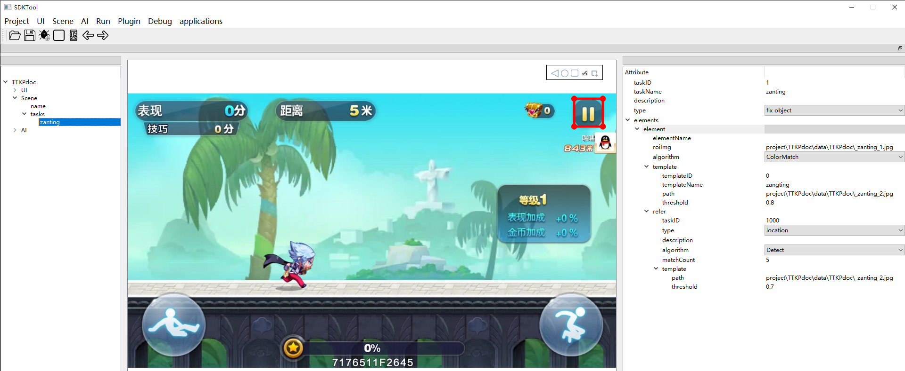

图4-4  配置搜索范围

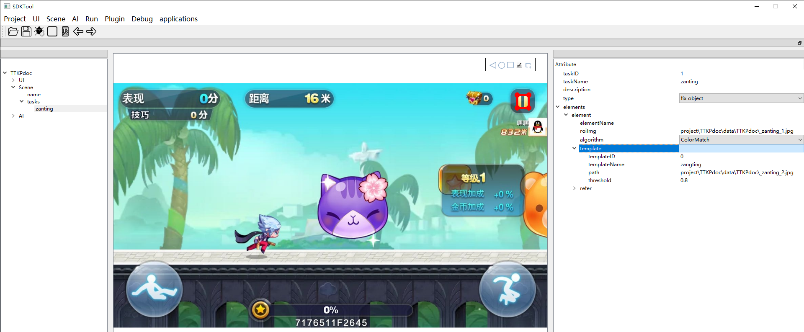

图4-5  配置template

 

### 4.3 添加element

一个task默认会生成一个element，一个task可以有多个element，需要多个element时，可以在想要添加element的elements上右键，选择 add element，如下图4-6、4-7所示：

图4-6  添加element

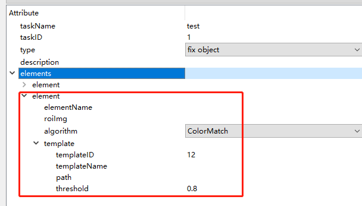

图4-7 新生成的element

### 4.4 添加template

当type为fix object时，固定物体检测使用模板匹配的方法，默认会生成一个模板（template），当type为number时，数值检测也是使用模板匹配的方法，默认会生成十个模板（0-9）**。**当需要多个模板时，可以在需要添加模板（template）的识别项（element）上右键添加模板,如下图所示，配置template时，先选择type值，然后配置template，详见下图4-8、4-9所示：

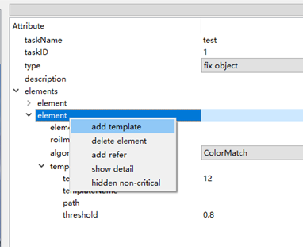

图4-8  添加template

图4-9 生成template

 

### 4.5 添加refer

refer文件是用来做多分辨率下task文件每个element的ROI区域的推测。添加参考任务流程演示如下，可以在你想要添加refer的element上右键添加参考任务，就会在element的下面生成refer文件。  

第一步：添加refer  

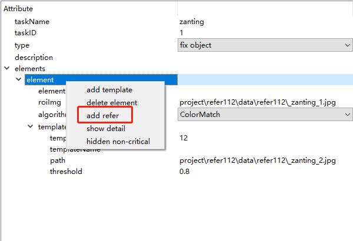

图4-10  添加refer

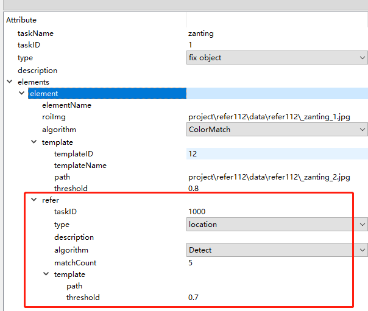

图4-11  refer节点  

第二步：配置refer  (以TTKP的暂停按钮为例)  

1. 双击path，可以选择上方template同样的图片  
框选暂停按钮，框选范围较大，覆盖element的范围

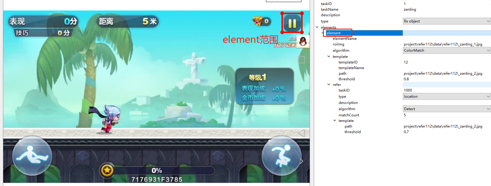  
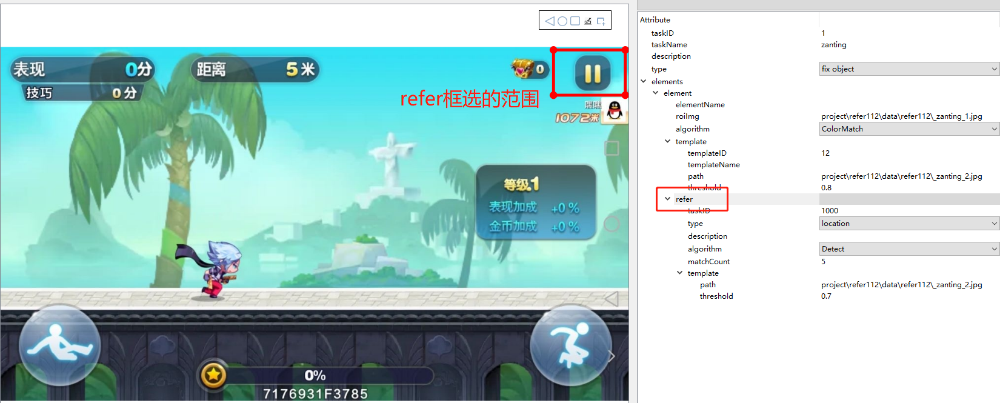  

2. 双击项目名，将右侧的multi resolution设置为True  
    True表示启用多分辨率，就会使用refer的配置。

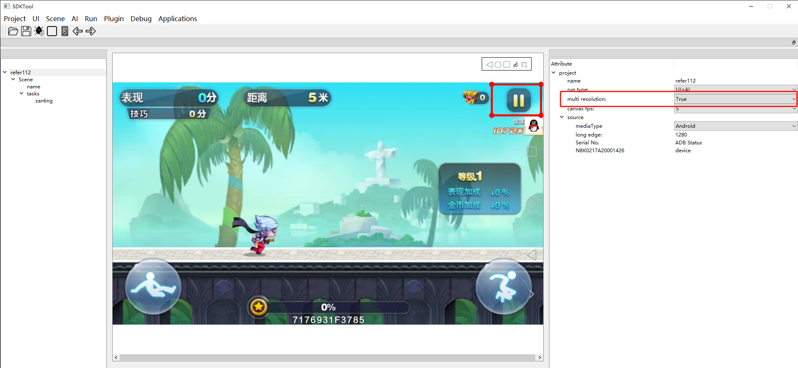  

## 5 任务调试

第一步：电脑连接上手机，并进入游戏，然后菜单栏上的“Debug>GameReg>Start”，开始调试，如下图5-1、5-2所示：

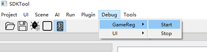

图5-1  调试任务

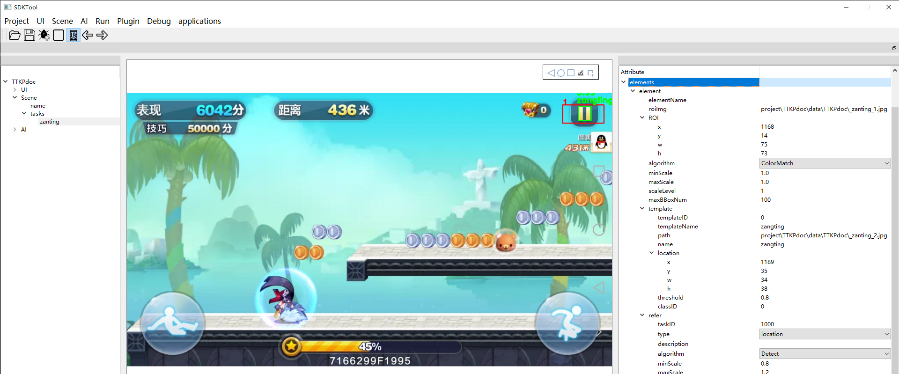

图5-2  task、refer调试效果图

## 6 注意事项

1、按顺序填写配置项；想要保存到json文件里，一定要先保存（ctrl+s；保存按钮）再关闭。

2、配置task、refer时先选择type的值，然后在选择图片

