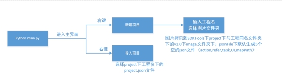
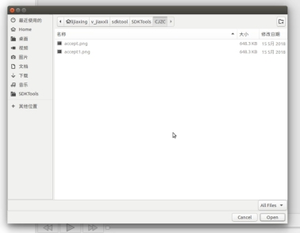
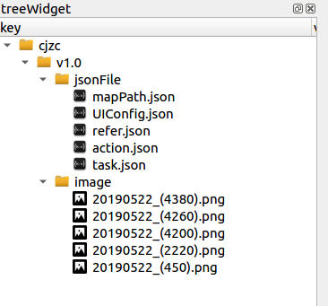
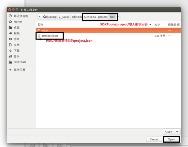
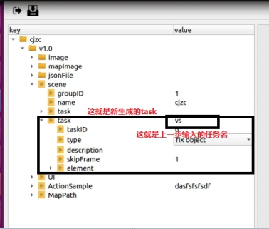
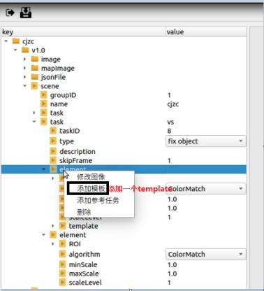
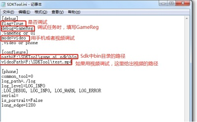
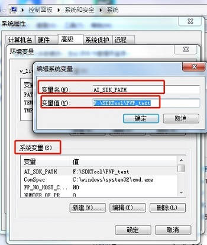
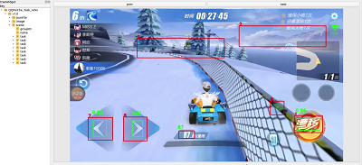

# 任务配置文件说明

[TOC]

## 1. SDKTools整体介绍

SDKTools主要用于生成AI服务所需要的配置文件，按照json格式保存。它是用python编写的，用QT作为图形界面。

## 2.整体流程

整体流程图见下图2-1所示：

图2-1 整体流程图

### 2.1 新建项目

新建项目流程演示（尽量使用1280×720分辨率图片配置），见下图2-2、2-3、2-4、2-5、2-6所示：

图2-2 屏幕右击

图2-3 新建项目

图2-4 输入工程名

图2-5 选择图片文件夹

图2-6 生成工程树状图

选择装有图片的文件夹时，会把所选择文件夹下所有图片或子文件另存到SDKTools/project/cjzc（工程名）/v1.0（版本号）/data/，生成json文件保存在SDKTools/project/cjzc（工程名）/v1.0（版本号）/jsonFile/下。

### 2.2 导入项目

导入项目流程演示，见下图2-7、2-8、2-9所示：

图2-7 屏幕右击

图2-8 导入项目

图2-9 打开project.json文件

完成以上步骤即可成功导入项目

## 3 参数说明

### 3.1 task参数

| **Key**     | **描述**                                                     |
| ----------- | ------------------------------------------------------------ |
| taskID      | 默认从1开始往上叠加；可以自己点上去修改，不可以重复          |
| type        | 识别类型：fix object:固定物体检测pixel:基于像素的检测stuck:卡住检测deform object:形变物体检测number:数字检测 |
| description | 描述，可不填，建议填                                         |
| skipFrame   | 默认为1，可修改，你希望隔多少帧处理一次(暂未使用)            |
| element     | 识别项，根据type的选择，会生成不同的element                  |

### 3.2 element参数

| **Key**      | **描述**                                                     |
| ------------ | ------------------------------------------------------------ |
| ROI          | 游戏识别区域，在右图上按住鼠标左键拖一个矩形出来，释放鼠标左键，会在ROI中记录矩形左上角的x，y值和宽w，高h（单位都是像素） |
| algorithm    | 算法，会跟据上面选择，默认是ColorMatch                       |
| minScale     | 最小缩放比例，因为可能要做多分辨率处理，可能需要将模板进行放缩，默认是1.0，不进行处理 |
| maxScale     | 最大放大比例,默认是1.0，不进行处理                           |
| scaleLevel   | 将模板在minScale-maxScale中进行，分多少级别进行，默认为1     |
| template     | 模板图像配置，首先先选择一张图片，然后画出模板区域，调整阈值，阈值默认为0.8，阈值越高越难匹配。可以添加多个模板，可以在element上右键添加模板图像。注：task的type等于number时，默认会生成10个模板，需要自己添加0-9的图片 |
| condition    | 每个通道的像素值范围，如："R < 100, G > 100, 90 < B < 130”，表示过滤Red通道灰度值小于100且 Green通道灰度值大于100且Blue通道灰度值在90和130之间的所有像素值 |
| filterSize   | 形态学处理的滤波器大小。(整型)                               |
| maxPointNum  | 返回最大像素点个数                                           |
| intervalTime | 计时器，隔多久检测一次（s）                                  |
| threshold    | 阈值，0-1之间，默认0.8，越大越难识别到                       |
| cfgPath      | 网络的cfg文件，选择一个路径                                  |
| weightPath   | 权重文件路径，选择一个路径                                   |
| namePath     | 名字文件路径，选择一个路径                                   |
| maskPath     | 做了掩膜的图片路径                                           |
| maxBBoxNum   | 返回boxes的最大个数                                          |
| intervalTime | stuck类型时，检测两帧图像的时间间隔                          |

### 3.3 refer参数

| **Key**      | **描述**                                                     |
| ------------ | ------------------------------------------------------------ |
| taskID       | 默认等于task*1000+是第几个element                            |
| type         | location：多分辨率情况下推测检测区域和尺度变化Bloodlengthreg：多分辨率情况下血条长度识别 |
| description  | 描述，可不填，建议填上                                       |
| skipFrame    | 默认为1，可修改，你希望隔多少帧处理一次（暂未使用）          |
| algorithm    | type：locationDetect：静态Infer：动态type：BloodlengthregTempplateMatch |
| location     | 匹配位置，表示为(x, y, w, h)                                 |
| minScale     | 最小尺度，默认为1.0                                          |
| maxScale     | 最大尺度，默认为1.0                                          |
| scaleLevel   | 尺度等级，默认为1                                            |
| expandWidth  | 扩展宽度，默认为0.1                                          |
| expandHeight | 扩展高度，默认为0.1                                          |
| matchCount   | 匹配次数，默认为5                                            |
| condition    | 每个通道的像素值范围                                         |
| templates    | 模板                                                         |
| path         | 模板路径                                                     |
| threshold    | 匹配阈值                                                     |

## 4 添加配置项

### 4.1 添加场景

点击添加场景会让你输入一个场景名，输入好之后，就会生成一个场景名为你刚刚输入值的scene，默认会生成三项groupID：1；name：你输入的scene名；一个task。尽量使用1280×720分辨率的图片进行配置。如图4-1、4-2、4-3所示：

图4-1 添加场景

图4-2 输入场景名

图4-3 生成场景文件演示

### 4.2 添加task

scene里面主要就是配置每个task，每个task就是一项单独的识别任务。你可以先修改默认生成的task，需要添加一个task的话，在scene上右键，点击添加任务。点击没有配置过的task，会先让你选择一张图片，然后你可以调整参数，配置过的task，会将你配好的都显示出来。如图4-4、4-5、4-6所示，配置task时，先选择type值，然后在选择图片：

图4-4 添加task任务

图4-5 输入任务名称

图4-6 新生成的task任务

 

### 4.3 添加element

一个task默认会生成一个element，一个task可以有多个element，需要多个element时，可以在想要添加element的task上右键，添加任务元素。如图4-7、4-8所示：

图4-7 添加任务元素

图4-8 新生成的element

### 4.4 添加template

当type为fix object时，固定物体检测使用模板匹配的方法，默认会生成一个模板（template），当type为number时，数值检测也是使用模板匹配的方法，默认会生成十个模板（0-9）**。**当需要多个模板时，可以在需要添加模板（template）的识别项（element）上右键添加模板,如图4-9、4-10所示，配置template时，先选择type值，然后在选择图片

图4-9 添加template

图4-10 生成template

 

### 4.5 添加refer文件

refer文件是用来做多分辨率下task文件每个element的ROI区域的推测。添加参考任务流程演示如下，可以在你想要添加refer的element上右键添加参考任务，就会在element的下面生成refer文件。如图4-11、4-12所示：

图4-11 添加refer

 

图4-12 生成refer

## 5 任务调试

第一步：修改配置文件“SDKTool/cfg/SDKTool.ini”，如图：5-1、5-2所示：

图5-1 打开SDKTool.ini

 

图5-2 修改SDKTool.ini

[debug]
flag=True
debug=GameReg 
;GameReg or UI
mode=image
;video or  phone or image

[configure]
path=F:\SDK\game_ai_sdk_2019.12.20\bin
videoPath=D:\sdk_cfg\1560910445_ui.avi
imagePath=F:\SDKTool\SDKTool_2019.12.31\project\test\v1.0\1_1.jpeg
fps = 0.1

[phone]
common_tool=0
log_path=./log
log_level=LOG_INFO
;LOG_DEBUG, LOG_INFO, LOG_WARN, LOG_ERROR
serial=
is_portrait=False
long_edge=1280

第二步：设置系统变量AI_SDK_PATH（AI_SDK_PATH指向cfg、data文件夹所在路径）

Windows下配置环境变量如图5-3、5-4所示：

图5-3 配置文件

 

图5-4 添加配置文件

 

Linux下配置环境变量，在命令窗口中输入：“export  AI_SDK_PATH=配置文件路径”，例如：export  AI_SDK_PATH=/home/SDK/PVP_test

第四步：导入项目，详见上面2.2导入项目

第五步：电脑连接上手机，并进入游戏，然后点击调试按钮，开始调试，如图5-5、5-6所示，如果是视频调试，则不用连接手机

图5-5调试任务

图5-6 task、refer调试效果图

## 6 注意事项

1、配置好这些文件，需要在SDK下使用时，需要手动将这些cfg和data文件拷到相应的路径下，cfg中图片路径可能需要修改。

2、按顺序填写配置项；想要保存到json文件里，一定要先保存（ctrl+s；保存按钮）再关闭。

3、SDKTools保存的项目文件全都存在SDKTools/project/下，请注意不要误删。

4、使用GameReg调试时，注意SDKTools的bus.ini与GameReg的bus.ini通信端口一致

5、配置task、refer时先选择type的值，然后再选择图片

