# UI自动探索流程

## 1 UI自动探索项目简介

​		UI自动探索是对Android手机游戏自动遍历和记录游戏内所有UI，作为一种新型UI测试工具提供给用户使用。UI自动探索可以从游戏的任意UI出发，通过识别按钮和点击按钮，自动地进入未探索的UI，将每个UI以及不同UI之间的切换关系保存在UI关系图中，以便用户可以快速地查看每个UI是否正确显示，以及不同UI之间是否正确切换。

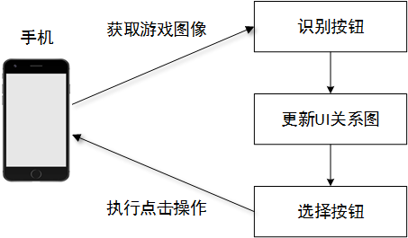

​																					图 1-1

​		本文中详细介绍了关于如何使用SDKTool工具来自动标注样本，训练样本，生成模型文件；本地连接客户端来拉起测试的流程，最终生成UI自动探索的结果文件；以及最后通过SDKTool工具结合探索的结果来分析此次的UI自动探索的情况的一整套流程。

## 2  SDKTool文件准备及程序拉起

1 . 准备好game_ai_sdk\tools\SDKTool文件包，如图2-1。

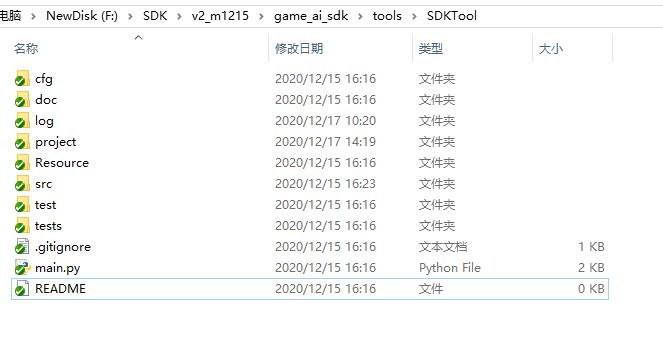

​																					图 2-1
​                                                             
2 . 命令行中切换到game_ai_sdk\tools\SDKTool目录下，运行python main.py，拉起工具界面，如图2-2

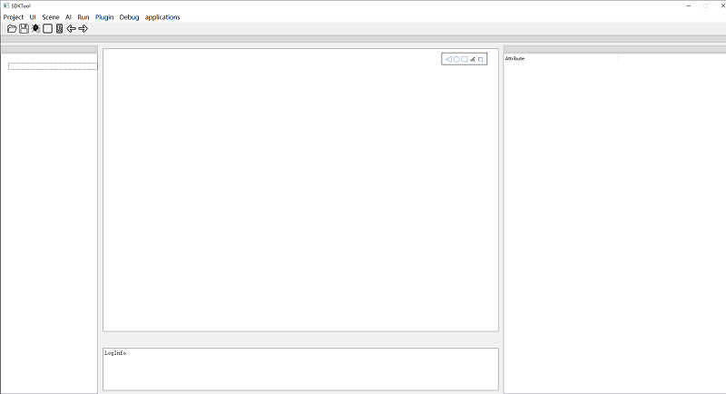

​																					图 2-2

3 .  点击project菜单，新建或者打开本地项目，之后点击右侧run type，选择AutoExplorer，再点击applications,选择UIAutoExplore,创建自动探索目录

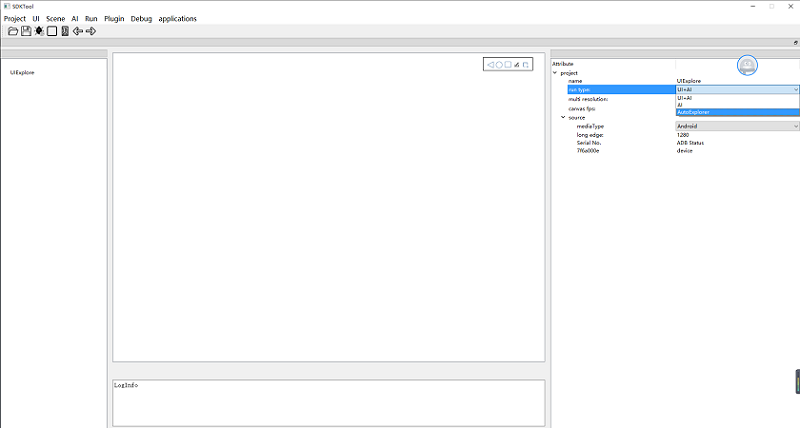
 
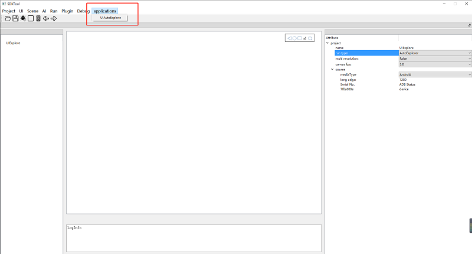

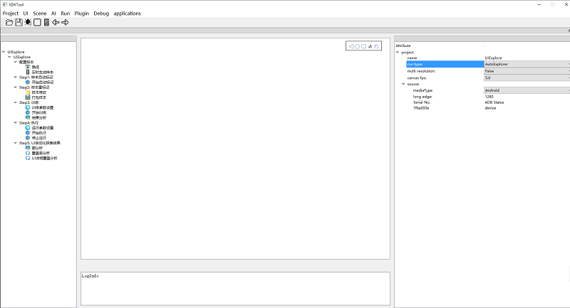

​																					图 2-3

## 3  样本标注及训练

### 3.1  样本配置

​		1)  通过选择本地路径获取样本图片，双击左侧路径后，再双击右侧路径，选择本地图片所在文件，如图3-1
        
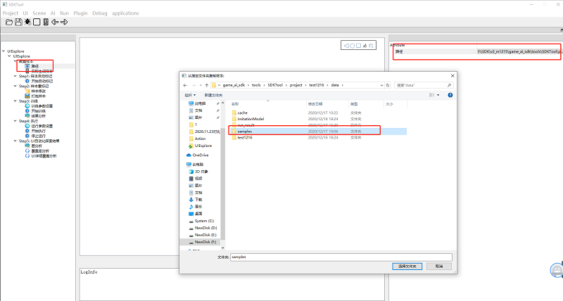 
​																				
	图 3-1

        
​		2)  通过点击屏幕截图实时生成样本，双击左侧的项目名，再双击右侧device连接本地设备（可能会有些许卡顿），然后双击实时生成样本，左键点击屏幕中间的图片即可生成样本，如图3-2

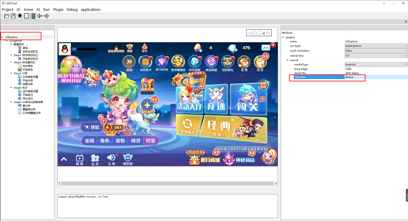 
​																				
	图 3-2

​		3)  本地路径选择和实时生成图片可共同使用，即可以先从路径获取一部分样本图片，再实时生成一部分样本图片。

### 3.2  样本标注

​		1)  样本图片配置完毕后，双击开始自动标记，工具开始自动标记样本，标注完成后会提示处理完成。如图3-3

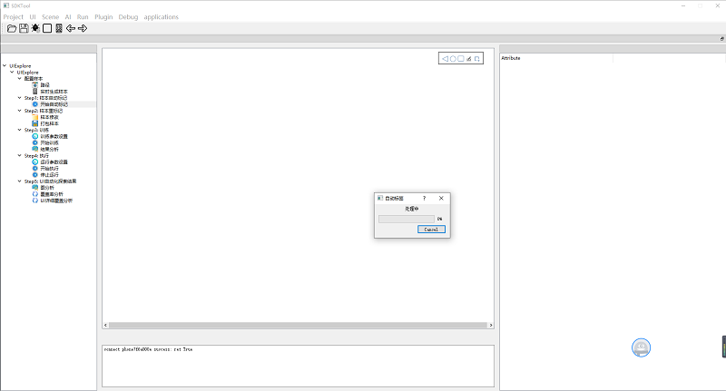 

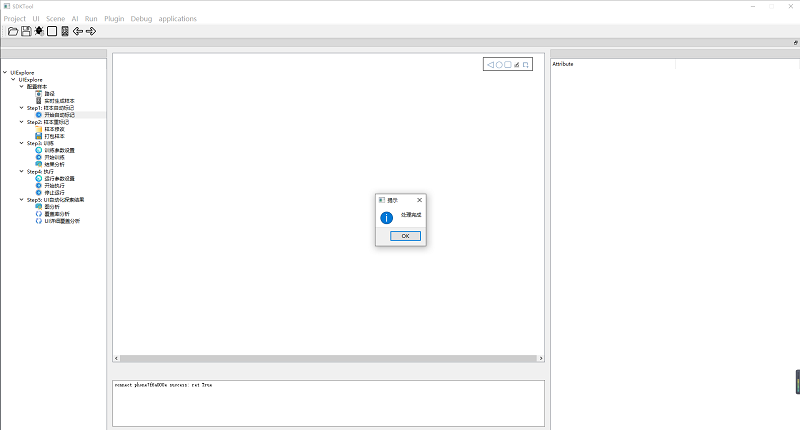 

图3-3

​		2)  样本标记完成之后，需要检查一下工具自动标记的样本是否正确。点击step2中的样本修改，可以查看自动标记完成的样本文件。

​		3)  样本标记可以进行增加，删除，移动，缩放操作。
                
                删除，右键想要删除的标注，点击删除；
                移动，鼠标左键点住拖动即可；
                缩放，鼠标左键点住拖动标注四个角即可；
                更名，鼠标左键双击标注，可以更换标注名称；
                标注，先左键点击图片，再按esc，鼠标左键框选即可；
                保存，切换样本图片时，会自动保存上一个样本图片的修改，或者点击左上方的保存。
                注：返回按钮，标注为return，页签按钮标注为tag，关闭按钮标注为close，其余标注为other。
                
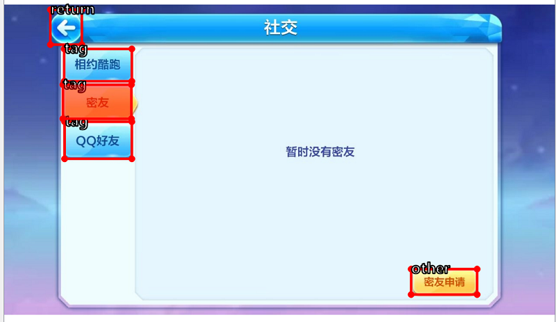 

图3-4
​		
        4)	如果发现有的样本图片不符合要求，可以右键点击样本图片，选择替换或者删除图片。

​		5)	如果需要增加样本文件，可以按照样本配置的步骤，选择本地样本或者实时生成，完成后双击样本修改刷新即可。注意，新加样本图片没有标注，需自己手动标注，或者重新自动标注。
															
​		6)  现暂只支持本地测试，所以可以不用打包。样本整理好之后，点击打包样本，等到显示弹窗success，则打包成功。打包的压缩文件存放在样本的同级目录下，文件名字和样本文件名字相同。后续的云端测试时，需要上传压缩的样本文件包，所以在此处提前对样本文件进行打包处理。

### 3.3 开始训练模型

​		1)  设置训练参数。 
                微调次数：训练的轮数，越大模型的效果越好，同时用的时间也越久。 
                batch_size：每次处理的样本个数，这个值太大会消耗更多的内存，容易出现内存不够的问题。越大耗时越短。 
                num_workers：启动多少个线程并行训练，越大耗时越短。 
                is_debug：选择1，后台只会扩充少量的样本训练，训练时间短，选择0，会扩充比较多的样本，训练时间久一些，但效果也会更好。    
        
​		2)  点击step3中的开始训练，此时右边窗口会显示训练的曲线图，下面显示的是以训练的轮数，如图3-5。

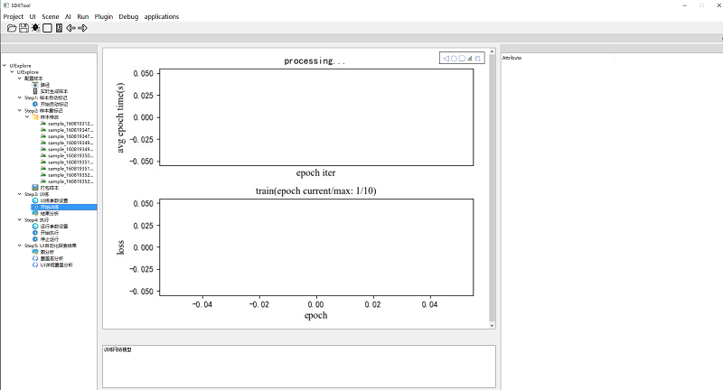

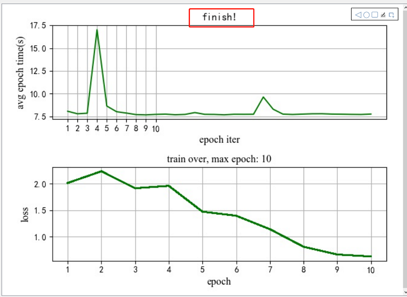
​																					
	图 3-5

​		3)  样本训练完成之后，可点击结果分析，查看此次的训练结果。其界面如图3-6所示，可得到训练的mAP值（mean average precision）。

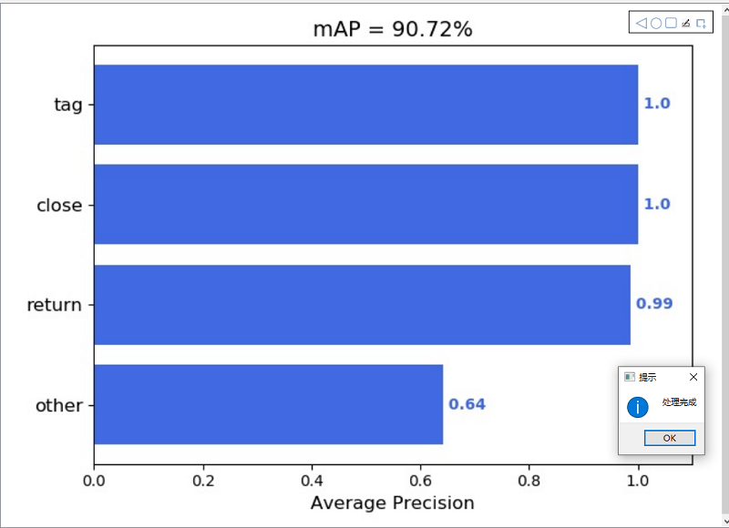
​																					
	图 3-6

​		4) 训练完成之后会生成名字为Final_Refine_hc2net_version3_self_dataset.pth的模型文件，该模型存放在所选的项目中game_ai_sdk\tools\SDKTool\project\项目名\data。

                    
   图 3-7

## 4  本地执行

### 4.1  运行参数设置

​	       设置运行参数。 
                MaxClickNumber：本次执行点击多少次后停止，该值越大遍历效果越好，耗时也会越久。 
                WaiteTime：一次点击后的等待时间 
                ComputeCoverage；训练完成后，是否需要进行指标的计算，默认为Ture 
                ShowButton：运行是展示按键，默认为Ture   

### 4.2  本地客户端配置

​		准备好客户端phone_client文件包放到game_ai_sdk/tools目录下，如图4-1所示。

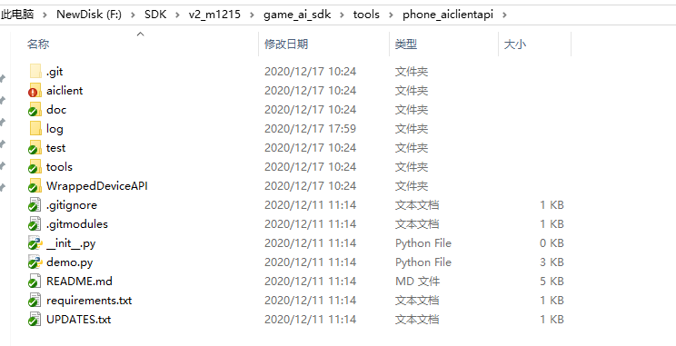

​																							图 4-1

### 4.3  开始执行

​        1) 打开游戏，画面停留在游戏大厅主界面处		

​		2) 双击开始执行，即可执行自动探索，如图4-4，小图显示的是当前场景以及该场景上的所有点击位置，工具中间的图显示的是当前点击位置和已点击次数。
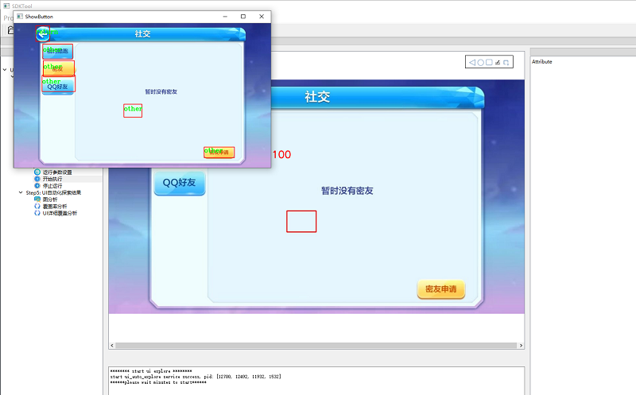

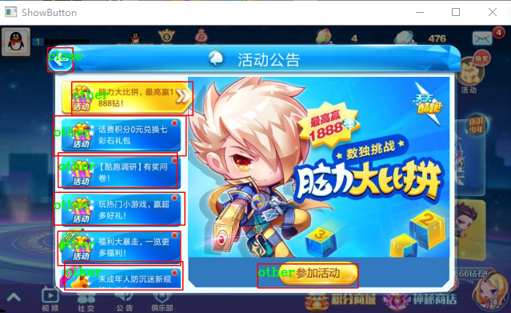

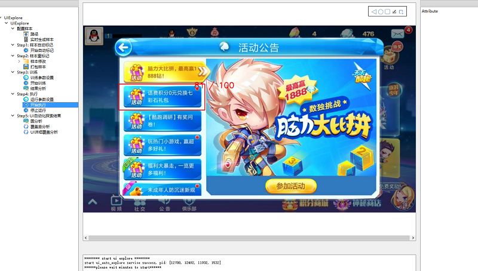
​																						
图 4-4

## 5 UI自动化探索结果分析

​		1) UI自动探索完成之后，双击图分析，出现如图5-1所示画面。可单击右侧显示栏中的图片，查看UI点击的顺序，会有箭头连线指示UI点击的顺序。也可双击右侧显示栏中的图片进行放大，如图5-2所示，查看每张UI中的button点击情况；其中带有红色边框的图片，代表button没有点击完全；没有边框的代表button全部都点击了。也可双击箭头连线，放大查看前后两张UI的图像，如图5-3所示。

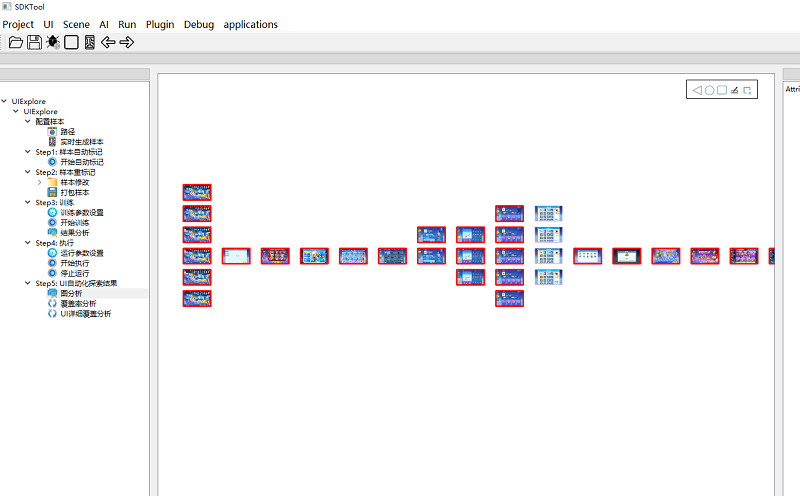

​																					   图 5-1

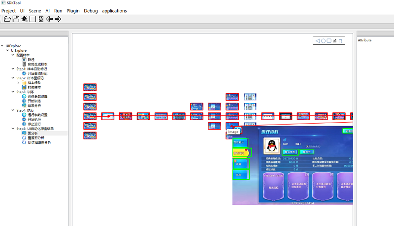

​																						图 5-2

​																						图 5-3

​		2) 点击覆盖率分析，出现如图5-4所示。可得到UI场景的覆盖率和按钮的覆盖率。其中场景图中绿色柱体的数量代表样本中所包含的总的场景数量，黄色柱体的数量代表UI自动探索到的场景数量，它们的比例即为场景覆盖率；按钮图中紫色的柱体数量代表样本中所标记的总的按钮数量，粉色的柱体数量代表UI自动探索过程中所点击的按钮数量，它们的比例即为按钮覆盖率。

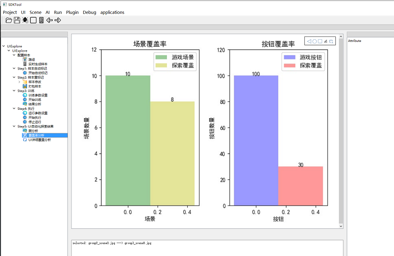 

​																						图 5-4

​		3) 点击UI详细覆盖分析，出现如图5-5所示。可以看到每张图像上面的按钮数以及UI自动探索对每张图片上的按钮覆盖数量以及覆盖率，还可以统计覆盖率达到百分之百的场景的比例，有一个比较直观的展示。还可以通过点击表格上方四个属性名称进行排序，方便统计。

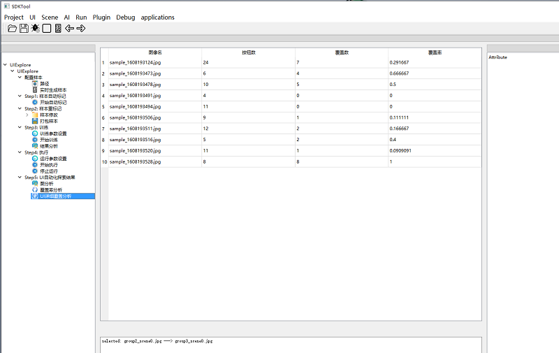 

​																							图 5-5