#  UI配置文件说明

## 1 SDKTools整体介绍

SDKTools主要用于生成AI服务所需要的配置文件，按照json格式保存。它是用python编写的，用QT作为图形界面。

## 2 整体流程

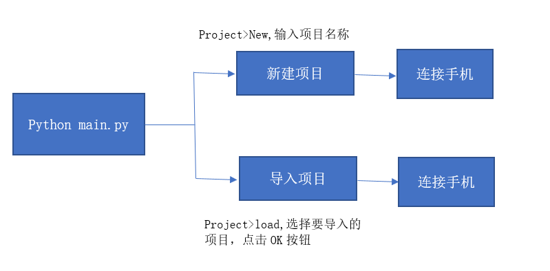

   图1-1 整体流程

### 2.1 新建项目和导入项目

新建项目或导入项目之后才可进行UI相关的配置

1. 新建项目  

    流程演示（使用16:9的手机进行配置），见下图2-1、2-2所示：

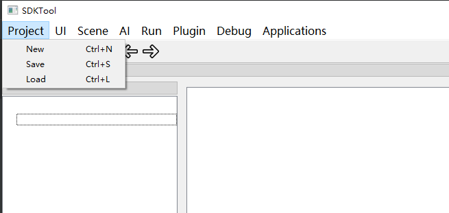

图2-1 点击Project》New

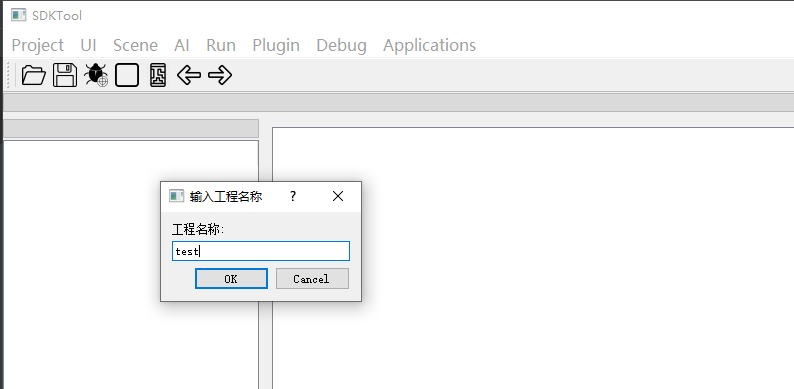

图2-2  填写项目名称

2. 导入项目  

    流程演示，见下图2-3、2-4、2-5、2-6所示：

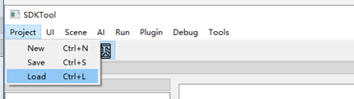

图2-3  点击Project>Load

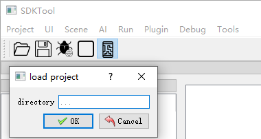

图2-4  选择要导入的项目

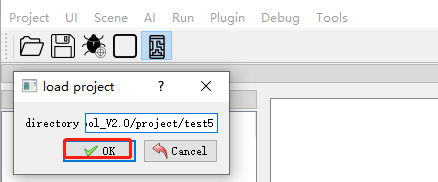

图2-5  点击OK 按钮

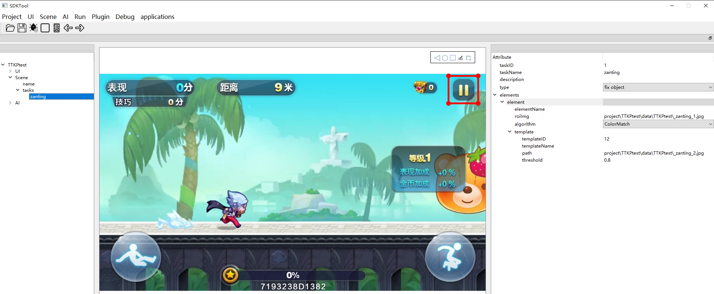

图2-6  成功导入项目

完成以上步骤即可成功导入项目

### 2.2 连接设备
在新建或导入项目后，要先连接一个设备，用来配置项目。目前支持Android手机和Android模拟器。  
具体连接方式可以查看[Android手机连接](../SDKTool/AndroidConnect.md)和[Android模拟器连接](../SDKTool/WinAndroidConnect.md)

## 3 UI配置关键字段说明

| **Key**                    | **描述**                                                     |
| -------------------------- | ------------------------------------------------------------ |
| HallUI          | 用来配置进入游戏的流程，如选区，挑选模式 |
| StartUI         | 配置游戏开始        |
| OverUI          | 用于配置游戏结束的画面，如胜利，失败                         |
| POPUI           | 用于配置多次弹出某些重复的图标，比如某些广告界面，很多里面内容都不一致，但上面的关闭图标都是一样的，就可以把关闭图标配成POPUI |

 

Ui配置字段说明如下图3-1所示：

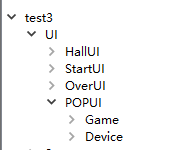

图3-1  ui配置字段说明

 

## 4 流程演示

添加UI时先确定需要配置的UI的类型，比如要配置一个OverUI类型的UI，先将光标移到OverUI上，然后右键，添加元素，就添加了一个OverUI的UI。

### 4.1 Element关键字说明

| **Key**              | **描述**                                                     |
| -------------------- | ------------------------------------------------------------ |
| id                   | 用作标志，最好不要重复                                       |
| action_type          | 动作类型分为click点击动作，drag滑动动作，dragcheck滑动到指定目标出现为止（应用场景如选英雄），script绑定脚本的UI，只有uiStates的action_type有drag、dragcheck、script、click类型，gameOver的action_type只有click、drag类型，其他类型的ui无action_type |
| desc                 | 描述，可不填                                                 |
| imgpath              | 用作模板的图像；选择一张图像，会在右侧的框中显示出来         |
| ROI                  | 模板图像的标志区域；在右侧的图像上左键拉一个框然后释放，ROI会记录左上角点的x，y，区域的宽w，高h |
| action               | 点击动作，滑动动作；点击：在右边的图像上左键点一个点，滑动：在右边图像上左键从A点滑到B点释放，会记录下x，y值；当游戏中ROI区域匹配上时，就会做这个操作 |
| template             | 是否使用模板匹配，0不使用模板匹配，1使用一个模板匹配         |
| keypoints            | 特征点个数，默认为100                                        |
| templateOp           | 多个模板之前的关系，值有or、and                              |
| actionDir            | 滑动的方向，有down、up、left、right                          |
| actionX              | 滑动开始点的x坐标，单位为像素                                |
| actionY              | 滑动开始点的y坐标，单位为像素                                |
| dragLength           | 单次滑动的距离，单位为像素                                   |
| dragCount            | 滑动的最大次数，当滑动到设置的最大次数还未找到目标时，停止滑动 |
| targetImg            | 目标模板图像的路径                                           |
| x                    | 模板图像的左上角点的x坐标，单位为像素                        |
| y                    | 模板图像的左上角点的y坐标，单位为像素                        |
| w                    | 模板图像的宽度，单位为像素                                   |
| h                    | 模板图像的高度，单位为像素                                   |
| scriptPath           | 脚本路径                                                     |
| tasks                | 动作序列表                                                   |
| duringTimeMs         | 动作执行持续时间                                             |
| actionSleepTimeMs    | 动作执行完后睡眠时间                                         |
| taskid               | 动作序列标号，脚本中会使用该标号指定执行动作                 |
| type                 | 点击类型                                                     |
| templateThreshold    | 模板阈值，越大越难识别                                       |
| actionThreshold      | 动作阈值，越大越难识别                                       |
| actionTmplExpdWPixel | 动作模板横向扩展，单位为像素                                 |
| actionTmplExpdHPixel | 动作模板竖向扩展，单位为像素                                 |
| actionROIExpdWRatio  | 动作检测区域横向扩展，取值范围是[0,1]                        |
| actionROIExpdHRatio  | 动作检测区域竖向扩展，取值范围是[0,1]                        |
| closeIconsCounter    | 隔多少帧检测一次closeIcons类型ui，一般和checkInterVal搭配使用 |
| checkInterVal        | 隔多少帧检测一次结束UI                                       |

### 4.2 UI配置步骤

第一步：点击菜单栏上的“UI》New”,详见下图4-1：

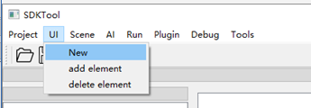

图4-1  添加UI

 

添加完UI，生成树状结果图如下图4-2所示：

图4-2 UI树状结果图

 

第二步：添加元素，右击树状结构图中的HallUI、StartUI、OverUI、POPUI，选择添加元素，如下图4-3所示：

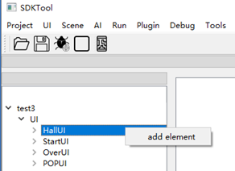

图4-3 添加element

 

第三步：选择actionType类型，以及模板数量，如图4-4、4-5所示所示：

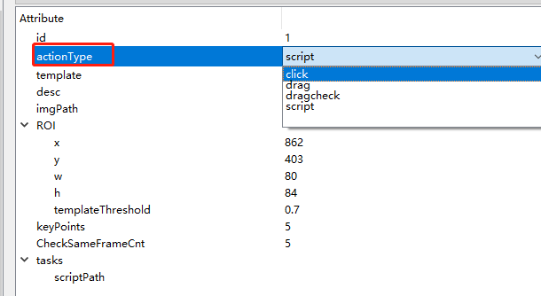

图4-4  选择actionType类型

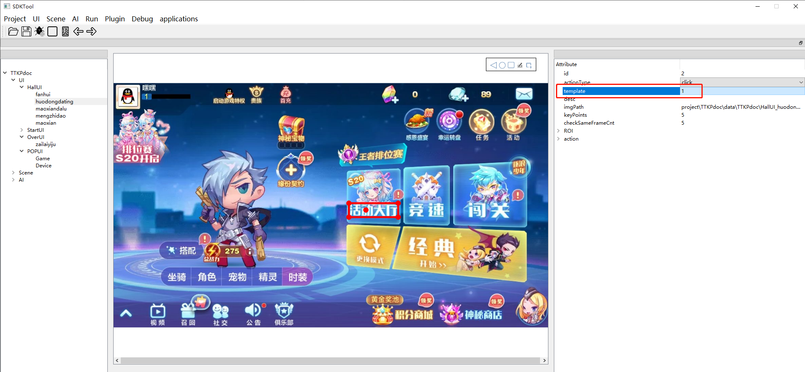

图4-5  填写模板数量

 
第四步：框选模板，选定点击位置，双击工具中显现的图片，如下图4-6所示：

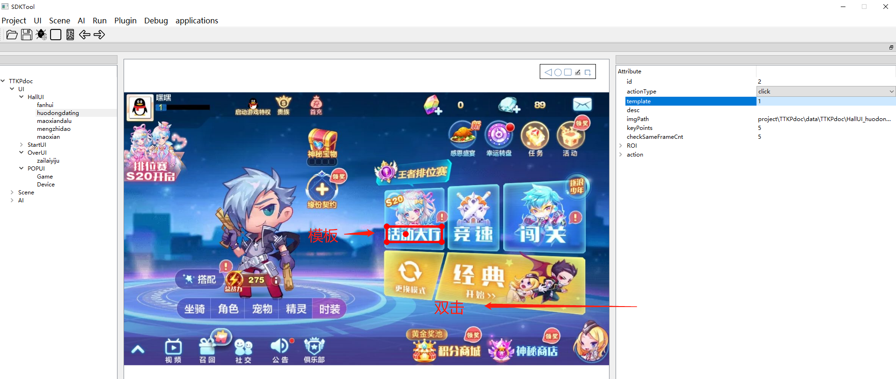

图4-6 击工具中的图片程序自动填写imgpath

第五步：在图中点击、框选、拖动想要配置的位置如下图4-7、4-8、4-9所示:

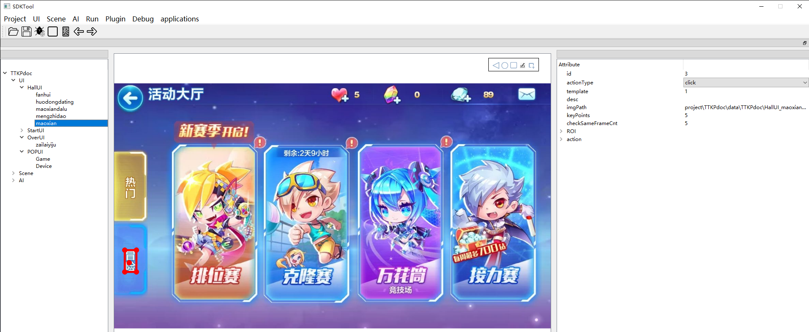

图4-7   点击

 

图4-8  拖动

 

图4-9  框选模板

 

## 5 UI调试

第一步：电脑连接上手机，并进入游戏

第二步：点击菜单栏上的“Debug>UI>Start”，详见图5-1、5-2

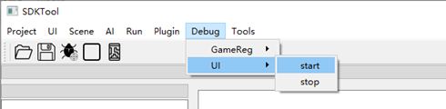

 图5-1 UI调试

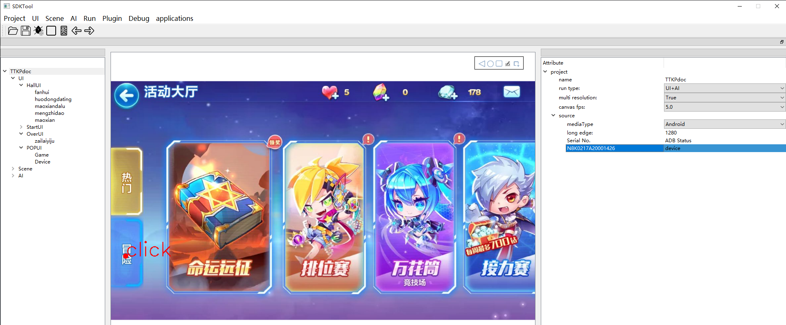

图5-2  调试效果图

## 6 注意事项

1、按顺序填写配置项；想要保存到json文件里，一定要先保存（ctrl+s；保存按钮）再关闭。

2、配置UI时，要先选择actionType的值，然后再选择要配置的图片