#  UI配置文件说明

[TOC]

## 1 SDKTools整体介绍

SDKTools主要用于生成AI服务所需要的配置文件，按照json格式保存。它是用python编写的，用QT作为图形界面。


## 2 整体流程

整体流程见下图2-1所示


图2-1 整体流程图

### 2.1 新建项目

新建项目流程演示（尽量使用1280×720分辨率图片配置），见下图2-2、2-3、2-4、2-5、2-6所示：


图2-2 屏幕右击


图2-3 新建项目


图2-4 输入工程名


图2-5 选择图片文件夹


图2-6 生成工程树状图

选择装有图片的文件夹时，会把所选择文件夹下所有图片或子文件另存到SDKTools/project/cjzc（工程名）/v1.0（版本号）/data/，生成json文件保存在SDKTools/project/cjzc（工程名）/v1.0（版本号）/jsonFile/下。

### 2.2 导入项目

导入项目流程演示，见下图2-7、2-8、2-9所示：


图2-7 屏幕右击


图2-8 导入项目


图2-9 打开project.json文件

完成以上步骤即可成功导入项目

## 3 UI配置字段说明

| **Key**                    | **描述**                                                     |
| -------------------------- | ------------------------------------------------------------ |
| debugWithSDKTools          | 是否在SDKTools中调试UI                                       |
| showImage                  | 展示UI窗口（暂未使用）                                       |
| saveResult                 | 保存匹配图片（暂未使用）                                     |
| showSaveResult             | 在窗口中显示匹配结果（暂未使用）                             |
| matchStartState            | 配置一个id   UIStates里面点击游戏开始的UI（UIStates里标志游戏开始的id） |
| matchEndStateFromUIState   | （暂未使用）                                                 |
| checkCloseIconsWhenPlaying | 是否在游戏中检查CloseIcons（true：检查，false不检查）        |
| gameOver                   | 用于配置游戏结束的画面，如胜利，失败                         |
| closeIcons                 | 用于配置多次弹出某些重复的图标，比如某些广告界面，很多里面内容都不一致，但上面的关闭图标都是一样的，就可以把关闭图标配成CloseIcons，CloseIcons会在全图去寻找关闭图标 |
| uIStates                   | 用来配置进入游戏的流程，如挑选模式，开始游戏                 |
| devicesCloseIcon           | 用于配置系统或设备UI，当检查完closeIcons后，会检查该项UI     |

 

Ui配置字段说明如下图3-1所示：

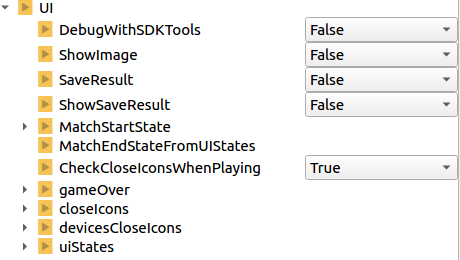

图3-1 Ui配置字段说明

注意：GameOver，CloseIcons，UIStates，devicesCloseIcons都是配置element，每个element就是一个动作。

 

## 4 流程演示

element的添加是先确定需要配置的element类型，比如要配置一个GameOver的element，先将光标移到GameOver上，然后右键，添加元素，就添加了一个GameOver的element。

### 4.1 Element关键字说明

| **Key**              | **描述**                                                     |
| -------------------- | ------------------------------------------------------------ |
| id                   | 用作标志，最好不要重复                                       |
| action_type          | 动作类型分为click点击动作，drag滑动动作，dragcheck滑动到特定的图标，script绑定脚本的UI |
| desc                 | 描述，可不填                                                 |
| imgpath              | 用作模板的图像；选择一张图像，会在右侧的框中显示出来         |
| ROI                  | 模板图像的标志区域；在右侧的图像上左键拉一个框然后释放，ROI会记录左上角点的x，y，区域的宽w，高h |
| shift                | 搜索区域等于ROI值加上shift值；默认值为20（暂未使用）         |
| action               | 点击动作，滑动动作；点击：在右边的图像上左键点一个点，滑动：在右边图像上左键从A点滑到B点释放，会记录下x，y值；当游戏中ROI区域匹配上时，就会做这个操作 |
| template             | 是否使用模板匹配，0不使用模板匹配，1使用一个模板匹配         |
| keypoints            | 特征点个数，默认为100                                        |
| templateOp           | 多个模板之前的关系，值有or、and                              |
| actionDir            | 滑动的方向，有down、up、left、right                          |
| dragX                | 滑动开始点的x坐标                                            |
| dragY                | 滑动开始点的y坐标                                            |
| dragLen              | 单次滑动的距离，单位为像素                                   |
| dragCount            | 滑动的最大次数，当滑动到设置的最大次数还未找到目标时，停止滑动 |
| targetImg            | 目标模板图像的url值                                          |
| targetX              | 目标模板图像的左上角点的x坐标                                |
| targetY              | 目标模板图像的左上角点的y坐标                                |
| targetW              | 目标模板图像的宽度                                           |
| targetH              | 目标模板图像的高度                                           |
| scriptPath           | 脚本路径                                                     |
| tasks                | 动作序列表                                                   |
| duringTimeMs         | 动作执行持续时间                                             |
| sleepTimeMs          | 动作执行完后睡眠时间                                         |
| taskid               | 动作序列标号，脚本中会使用该标号指定执行动作                 |
| type                 | 点击类型                                                     |
| templateThreshold    | 模板阈值，越大越难识别                                       |
| actionThreshold      | 动作阈值，越大越难识别                                       |
| actionTmplExpdWPixel | 动作模板横向扩展，单位为像素                                 |
| actionTmplExpdHPixel | 动作模板竖向扩展，单位为像素                                 |
| actionROIExpdWRatio  | 动作检测区域横向扩展                                         |
| actionROIExpdHRatio  | 动作检测区域竖向扩展                                         |


### 4.2 UI配置步骤

第一步：版本号右击添加UI，如图4-1所示：


图4-1 添加UI

 

添加完UI，生成树状结果图如下图4-2所示：

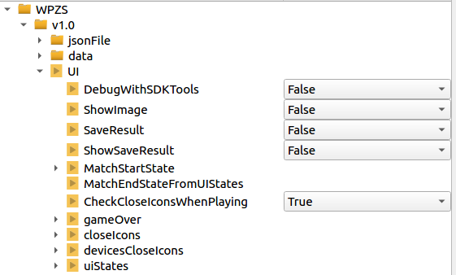

图4-2 UI树状结果图

 

第二步：添加元素，右击树状结果图中的gameOver、closeIcons、uiStates、devicesCloseIcons,选择添加元素，如下图4-3所示：

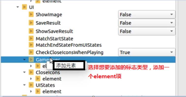

图4-3 添加元素

 

第三步：选择actionType类型，以及模板数量，如图4-4、4-5所示：

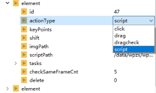

图4-4 选择actionType类型

 

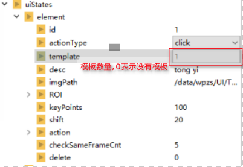

图4-5 选择模板 数量

 

第四步：选择图片，双击element，或者双击imgPath，然后从弹窗中选择要配置的图片，如图4-6、4-7所示：


图4-6 双击element或imgPath


图4-7 弹框中选择图片

 

第五步：在图中点击、框选、拖动想要配置的位置如图4-8、4-9、4-10所示:

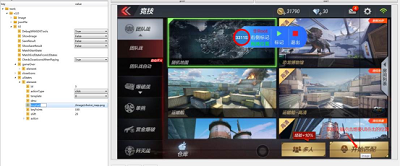

图4-8 点击

 

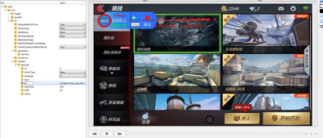

图4-9 拖动

 

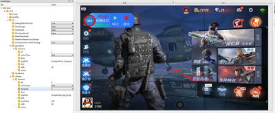

图4-10 框选模板

 

## 5 UI调试

第一步：修改配置文件“SDKTool/cfg/SDKTool.ini”，如图：5-1、5-2所示：

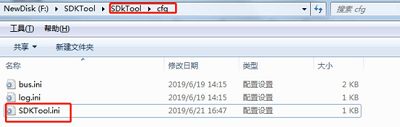

图5-1 打开SDKTool.ini

 

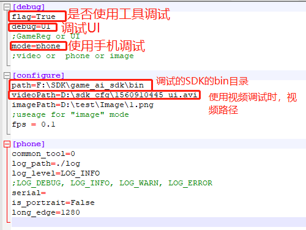

图5-2 修改SDKTool.ini

```
[debug]
flag=True
debug=UI
;GameReg or UI
mode=phone
;video or  phone or image

[configure]
path=F:\SDK\game_ai_sdk\bin
videoPath=D:\sdk_cfg\1560910445_ui.avi
imagePath=D:\test\Image\1.png
;useage for "image" mode
fps = 0.1

[phone]
common_tool=0
log_path=./log
log_level=LOG_INFO
;LOG_DEBUG, LOG_INFO, LOG_WARN, LOG_ERROR
serial=
is_portrait=False
long_edge=1280
```

 

第二步：设置系统变量AI_SDK_PATH（AI_SDK_PATH指向cfg、data文件夹所在路径）

Windows下配置环境变量如图5-3、5-4所示：

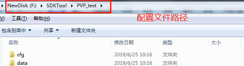

图5-3 配置文件

 

 

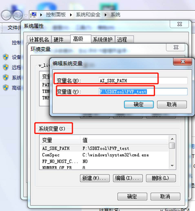

图5-4 添加配置文件

 

Linux下配置环境变量，在命令窗口中输入：“export  AI_SDK_PATH=配置文件路径”，例如：export  AI_SDK_PATH=/home/SDK/PVP_test

 

第三步：导入项目，详见上面2.2 项目导入

 

第四步：电脑连接上手机，并进入游戏，然后点击调试按钮，开始调试，如图5-5、5-6所示，如果是视频调试，则不用连接手机，注意在工具中调试时，要将"debugWithSDKTools"的值置为True，但在AISDK下运行，要将"debugWithSDKTools"的值置为False

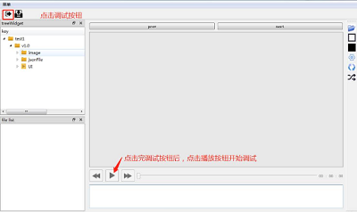

图5-5 调试UI

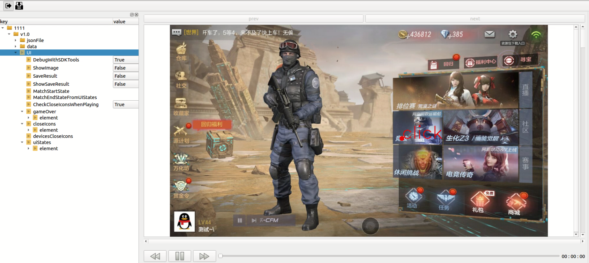

图5-6 调试效果图

## 6 注意事项

1、配置好这些文件，需要在SDK下使用时，需要手动将这些cfg和data文件拷到相应的路径下，cfg中图片路径可能需要修改。

2、按顺序填写配置项；想要保存到json文件里，一定要先保存（ctrl+s；保存按钮）再关闭。

3、SDKTools保存的项目文件全都存在SDKTools/project/下，请注意不要误删。

4、配置UI时，要先选择click的值，然后再选择要配置的图片

5、在工具中调试时，要将"debugWithSDKTools"的值置为True，但在AISDK下运行，要将"debugWithSDKTools"的值置为False