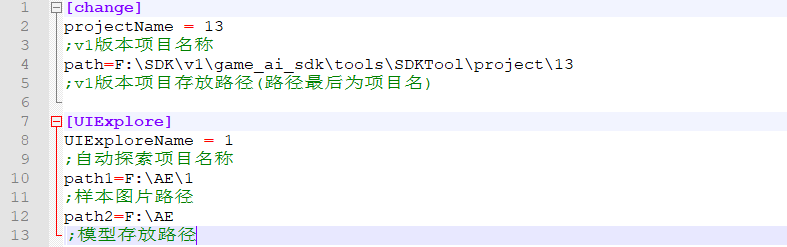
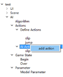
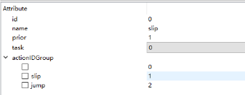
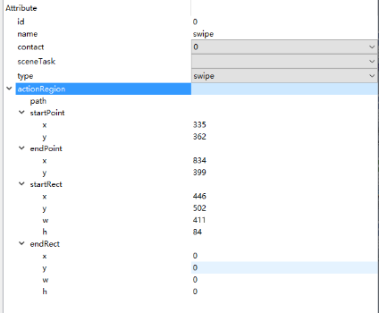
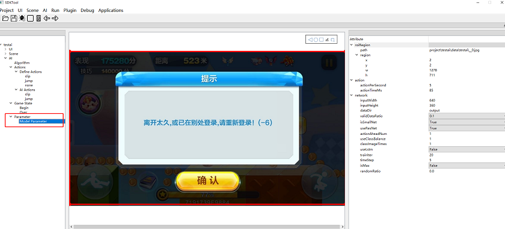

## V1版本项目转换到v2版本

### 更改项目路径和项目名

UI或者AI项目，需更改path.ini中change下的projectName和path参数

projectName，为项目名称

path，为项目所在位置，注意路径末尾为所选项目

自动探索项目，需更改path.ini中UIExplore.py下的UIExploreName和path1，path2参数

UIExploreName，为项目名称

path1为图片存放路径

path2为模型存放路径，若还没有训练出模型，则和path1保持一致即可

### 运行脚本处理v1版本项目

UI或者AI项目，运行python chang.py后，在v2文件夹中可看到所得到的v2版本的项目

自动探索项目，运行python UIExplore.py后，在UIExplore文件夹中可看到所得到的的v2版本的项目

### 运行v2版本SDKTool

UI和AI项目，使用v2版本的SDKTool打开项目，连上手机。如果原v1项目有ai动作，打开v2版本后，需要添加ai动作，然后在右边选择相应动作。

    
    
打开后需查看UI，secene，和AI下的图片，部分v1版本为0的值，在v2版本需修改。

若v1版本项目有swipe类型动作，需在v2版本重新设置该动作

 

有IM和DQN算法的项目，需修改AI--Paramrter--Model Parameter中的相应参数，具体配置可以参考模仿学习配置说明和DQN强化学习配置说明。

 
