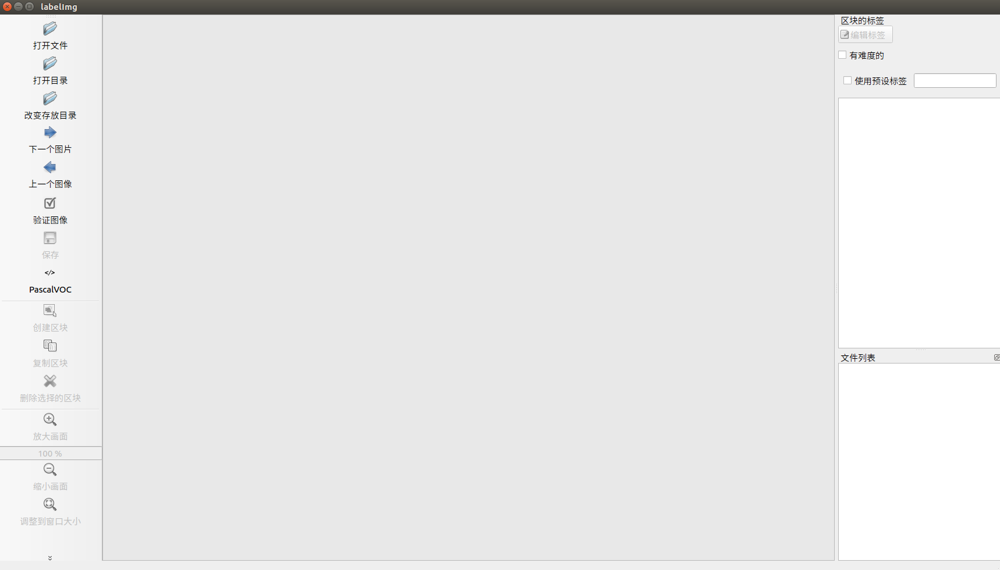
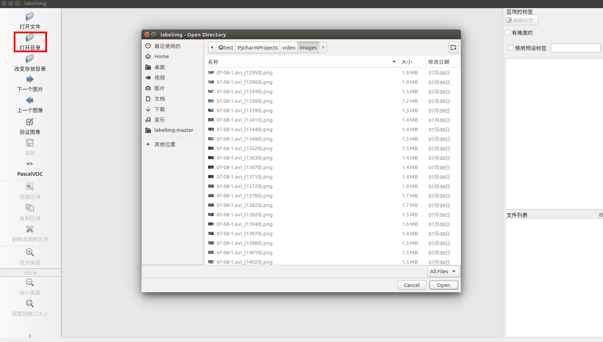
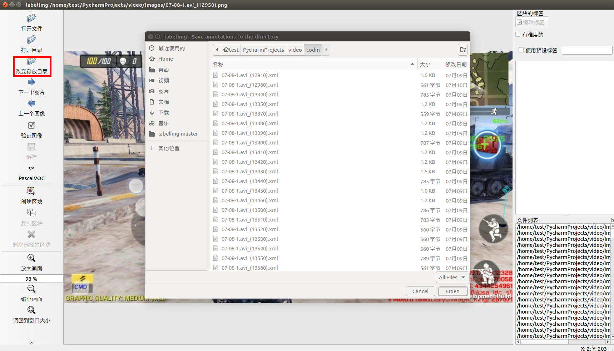
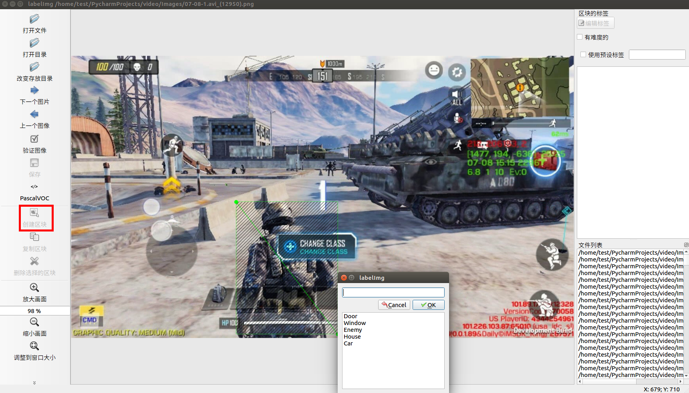
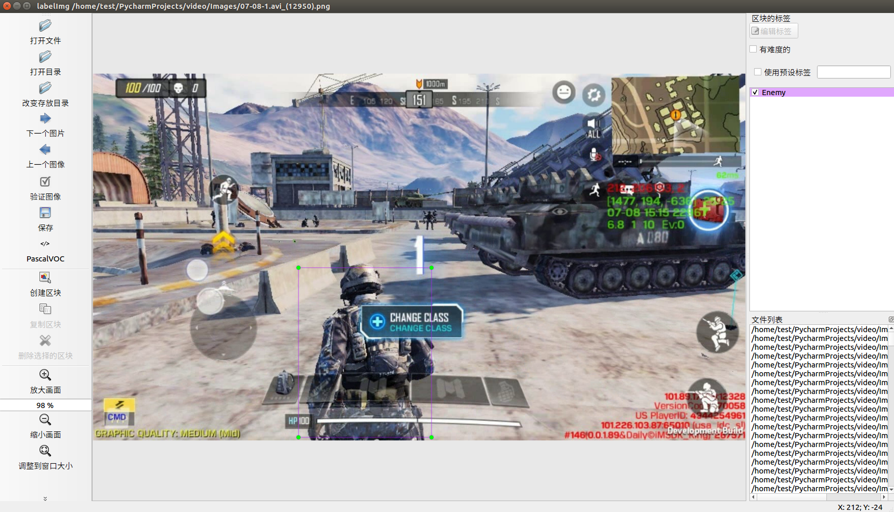
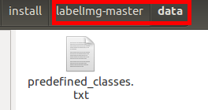
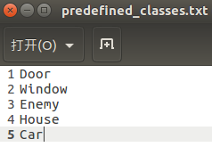
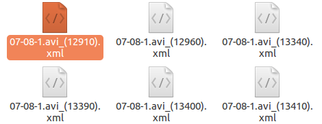

## 图像标注和YOLO模型训练说明


## 1 准备游戏视频

将需要标注yolo的游戏录制视频，录制视频的方法:

- 可以通过拉起AISDK以及phone_aiclient运行游戏（打开保存视频开关AISDK/cfg/platform/MC.ini中的Enable = True），在AISDK的result目录下找到运行游戏的视频

- 可以使用手机录屏软件将游戏录屏

## 2 将游戏视频切成图片

将录制好的视频切成图片，以下方法为示例切图方法：

这里推荐一个切图脚本，命名为saveImg.py，同时在相同目录下再新建mp4、Images两个文件夹，将录制好的视频放入mp4中，在终端运行：

```
python3 saveImg.py 
```

saveImg.py中切图间隔帧数以及图片命名等可以自己调整，脚本内容如下：

```
import cv2
import os
import time

video_path = './mp4/'
dateName = time.strftime("%m-%d",time.localtime(time.time()))
skipFrame = 5   #设置将视频每隔多少帧的图片保存下来
imgDir = './Images/'
imgSize = (1280, 720)
videos =os.listdir(video_path)

idx = 0
for videoName in videos:
    cap = cv2.VideoCapture(video_path+videoName)

    #  验证是否读到视频
    while cap.isOpened():
        # get a frame
        ret, frame = cap.read()
        
        if frame is None:
            break

        if idx % skipFrame == 0:
            img = cv2.resize(frame, imgSize)
            cv2.imwrite(imgDir + dateName + '-' + videoName + "_(" + str(idx) + ")" + '.png', img)
        idx = idx + 1

    cap.release()
    cv2.destroyAllWindows()
```

切好的图片将保存在Images目录中。

## 3 标图工具使用

标图使用的工具为labelImg, github地址为：https://github.com/tzutalin/labelImg，根据主页提示安装相关依赖后，文件根目录中有一个labelImg.py文件，在终端运行：

```
python labelImg.py
```

如运行报错，可以自行根据提示安装依赖

打开窗口如下图1所示



​                                                                                          图1

点击“打开目录”，选择切好的图片，如图2



​                                                                                        图2

点击“改变存放目录”，选择一个你标注yolo后的xml文件存放位置，如图3



​                                                                                           图3

设置好了以后，开始标注图片，点击创建选区，然后在图片上拖框，框住你要标注的东西，然后会有一个弹框，选择一个标签，如图4，点击OK，如图5



​                                                                                                     图4



​                                                                                                图5

如果需要修改，可以在图片的选区位置，点击右键，可以看到创建区块、编辑标签、复制区块、删除选择的区块，以及软件左边菜单栏的其他操作。

这里的标签是我设置的，你可以设置你需要的标签，打开lablImg的安装文件夹，打开data文件夹，具体设置位置如图6、图7



​                                                                                                   图6



​                                                                                                 图7

修改图7文件后保存，在下一次标注时，就会有你修改的标签（建议先修改标签后再标注）。

## 4 输出标注文件



​                                                                                                  图8

标注好的文件如图8,都为xml文件，其中内容类似如下：

```
<annotation>
	<folder>Images</folder>
	<filename>07-08-1.avi_(13400).png</filename>
	<path>/home/test/PycharmProjects/video/Images/07-08-1.avi_(13400).png</path>
	<source>
		<database>Unknown</database>
	</source>
	<size>
		<width>1280</width>
		<height>720</height>
		<depth>3</depth>
	</size>
	<segmented>0</segmented>
	<object>
		<name>House</name>
		<pose>Unspecified</pose>
		<truncated>0</truncated>
		<difficult>0</difficult>
		<bndbox>
			<xmin>780</xmin>
			<ymin>242</ymin>
			<xmax>890</xmax>
			<ymax>360</ymax>
		</bndbox>
	</object>
	<object>
		<name>Enemy</name>
		<pose>Unspecified</pose>
		<truncated>1</truncated>
		<difficult>0</difficult>
		<bndbox>
			<xmin>428</xmin>
			<ymin>379</ymin>
			<xmax>681</xmax>
			<ymax>720</ymax>
		</bndbox>
	</object>
</annotation>
```

训练yolo时，除了xml文件，还需要对应xml文件的刚刚标注的图片，这时可能会有，有些图片没有标注，有些图片标注了，都混在了一个文件夹中，我这里写了一个脚本来区分这些文件，命名为DelUnLabelImg.py

其内容如下：

```
import os

imagePath = 'Images1'  #图片文件夹
labelPath = 'codm1'    #xml文件文件夹

imageFileList = os.listdir(imagePath)
labelFileList = os.listdir(labelPath)

for fileName in imageFileList:
    fileWName = fileName[:-3]
    fileWName += "xml"
    if fileWName not in labelFileList:
        os.remove(imagePath + "/" + fileName)

for fileName in labelFileList:
    fileWName = fileName[:-3]
    fileWName += "png"
    if fileWName not in imageFileList:
        os.remove(labelPath + "/" + fileName)
```

同样的，执行该脚本时，需要将该脚本和需要区分的图片的文件夹以及标注好的xml文件的文件夹放在同一目录下，然后执行：

```
python DelUnLabelImg.py
```

将没有标注的图片都删除(以上两个脚本可做参考，具体使用可以自由发挥。

## 5 转换文件格式

通过上述步骤，我们生成了xml格式的标签文件，yolo要求是txt格式的文件，而txt的格式要求每个标注框的格式如下

```
<object-class> <x_center> <y_center> <width> <height>
```

- object-class 类名：从0到（类别数-1）

- x_center 中心点横坐标：这里的坐标并不是绝对坐标（真实坐标），而是相对于图片宽度的相对坐标，转换公式为<x_center> = <absolute_x> / <image_width>，这里的absolute_x是指标注框中心的横坐标

- y_center  中心点纵坐标：这里的坐标并不是绝对坐标（真实坐标），而是相对于图片高度的相对坐标，转换公式为<x_center> = <absolute_y> / <image_height>，这里的absolute_x是指标注框中心的纵坐标

- width 标注框宽度：这里的宽度并不是绝对宽度（真实宽度），而是相对于图片宽度的相对宽度，转换公式为width = <absolute_width> / <image_width>

height 标注框宽度：这里的宽度并不是绝对宽度（真实宽度），而是相对于图片宽度的相对高度，转换公式为height = <absolute_height> / <image_height>

### 5.1 创建文件夹

在`darknet/scripts`目录下创建以下目录

```
├── VOCdevkit
│   └── VOC2007
│       ├── Annotations
│       ├── ImageSets
│       │   ├── Layout
│       │   ├── Main
│       │      ├── test.txt
│       │      ├── train.txt
│       │      └── val.txt
│       ├── JPEGImages
│       └── labels
└── voc_label.py
```

### 5.2 转换标注集格式

**修改voc_label.py**，如我们有5个类别"Door", "Window", "Enemy", "House", "Car"

```
sets=[('2007', 'train'), ('2007', 'val'), ('2007', 'test')]

classes = ["Door", "Window", "Enemy", "House", "Car"]
.......
os.system("cat 2007_train.txt 2007_val.txt > train.txt")
```

**运行文件'script/voc_label.py'**

```
python voc_label.py
```

会在目录下生成一系列文件并将VOC格式标注转为YOLO格式txt标注

```
0 0.485546875 0.465972222222 0.10234375 0.170833333333
0 0.16015625 0.463888888889 0.071875 0.105555555556
0 0.331640625 0.450694444444 0.05234375 0.0763888888889
0 0.395703125 0.449305555556 0.02421875 0.0569444444444
```

## 6 修改配置文件并训练

### 6.1 修改data/voc.names

```
Door
Window
Enemy
House
Car
```

### 6.2 修改cfg/voc.data

```
classes= 5
train  = /home/xxx/game_ai_sdk/Modules/darknetV3/src/scripts/2007_train.txt
valid  = /home/xxx/game_ai_sdk/Modules/darknetV3/src/scripts/2007_test.txt
names = data/voc.names
backup = backup
```

### 6.3 修改cfg/yolov3-voc.cfg

修改yolo标签中的classes, 和此yolo标签上的convolutional的filters数值，共有3组。

```
[convolutional]
size=1
stride=1
pad=1
filters=30 # 修改filter = 3*(classes+1+4)，如本例中 classes 为5
activation=linear

[yolo]
mask = 0,1,2
anchors = 10,13,  16,30,  33,23,  30,61,  62,45,  59,119,  116,90,  156,198,  373,326
classes=5 # 修改class 的个数，如本次训练，类别为5
num=9
jitter=.3
ignore_thresh = .5
truth_thresh = 1
random=1
```

****

### 6.4 下载预训练权重文件并训练

```
wget https://pjreddie.com/media/files/darknet53.conv.74
./darknet detector train cfg/voc.data cfg/yolov3-voc.cfg darknet53.conv.74
```
