# mac-docker使用

### 母机：mac系统  
### docker: mac版    


1. 环境安装  
    1. docker安装  
        ```
        brew install docker
        ```
    2. socat安装  
        ```
        brew install socat   # 可能需要cask命令安装: brew cask install socat
        ```
    3. xquartz安装  
        ```
        brew install xquartz
        ```
    4. adbkit 安装  
        ```
        brew install node
        npm i –g adbkit
        ```

2. Aisdk使用  

     1.启动docker  

    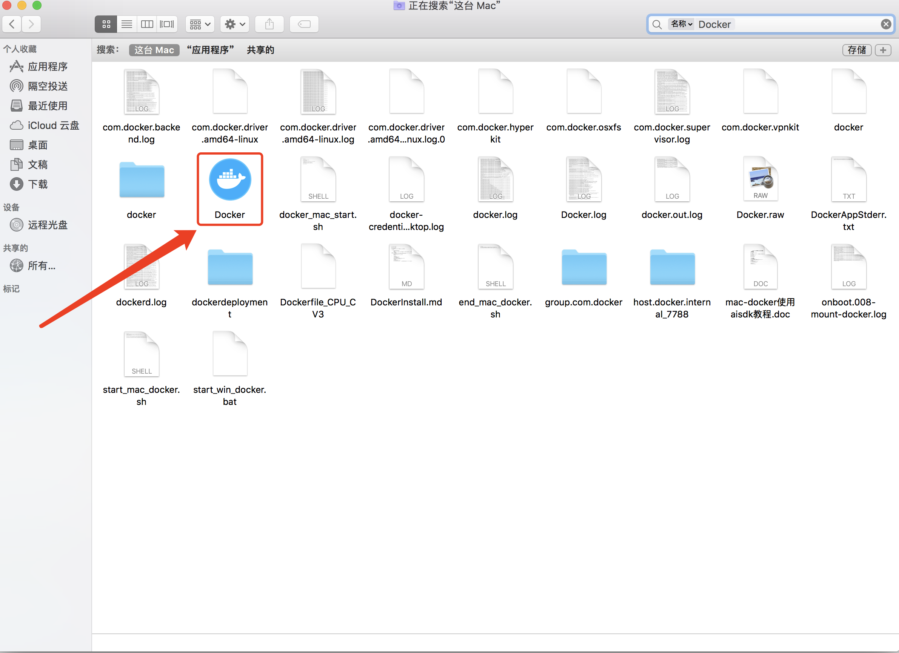

    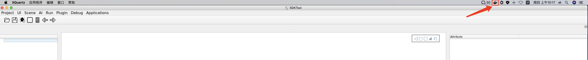

     2.导入镜像

     docker load -I xx

     docker run -v /Users/et/Downloads/game_ai_sdk:/data1/game_ai_sdk -it xx /bin/bash 

     3.在镜像环境下操作

     cp *.so* /usr/local/lib

     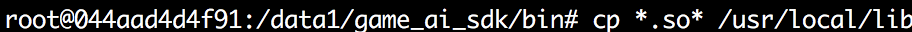

     ldconfig

     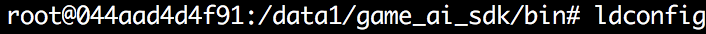
 
     socat启动

     socat TCP-LISTEN:6000,reuseaddr,fork UNIX-CLIENT:\"$DISPLAY\"

     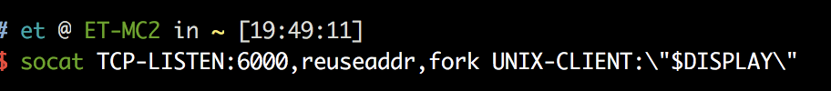

     启动xquartz

     open -a xquartz

     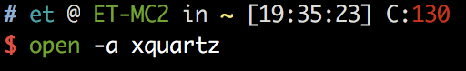
     
     相关设置：  
       
     
     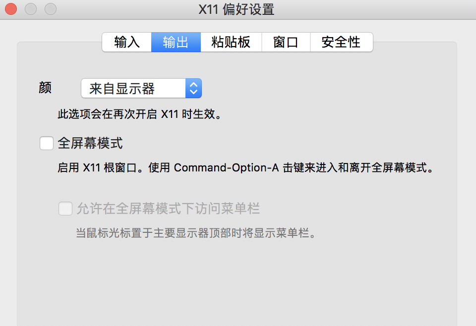  
     
     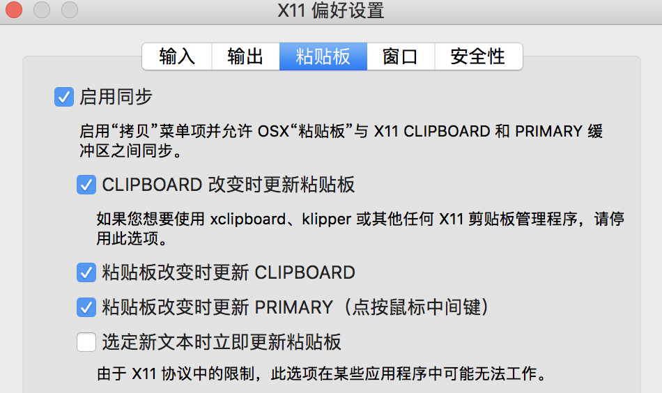  
     
     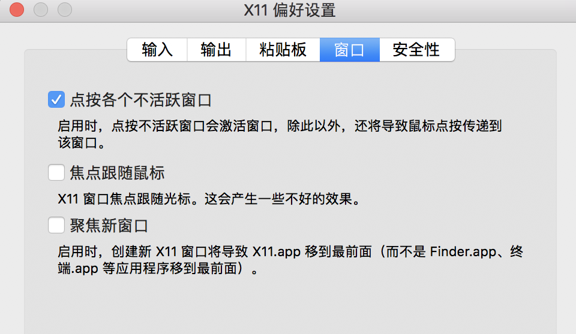  
     
     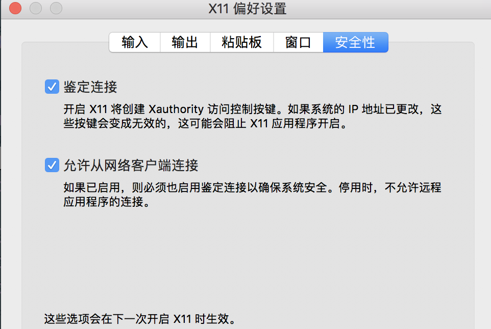

     4.连接手机
     adb devices 查看序列号

     adbkit usb-device-to-tcp -p 7788 序列号

     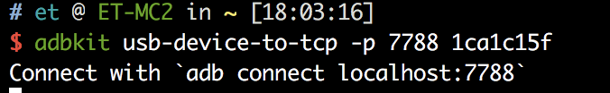

     5.在容器中 连接手机

     adb connect host.docker.internal:7788

     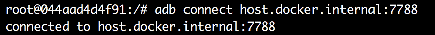

     6.启动SDKTool 工具

     python main.py

      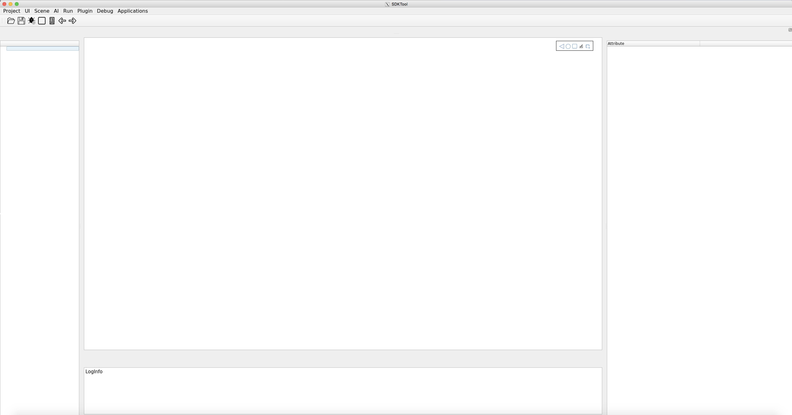

      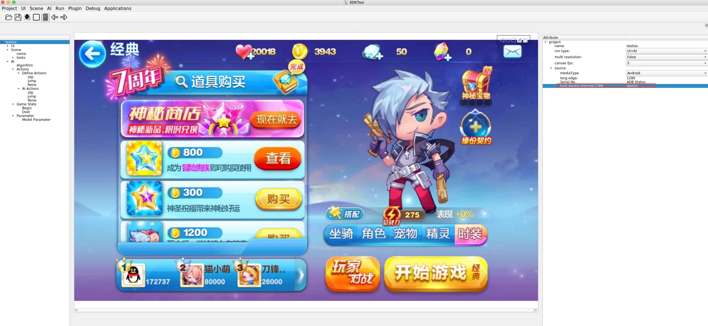
