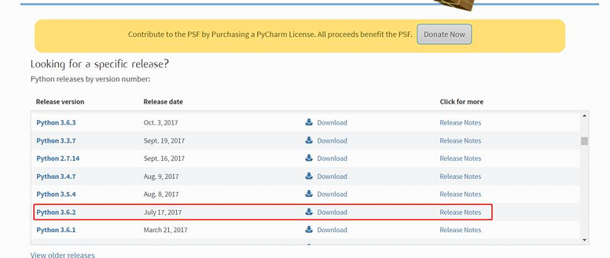

# SDKTool部署说明

## 1 windows环境安装

### 1.1 安装python

​	如果本机已经安装 **python3.6.2**

​      进入python官网https://www.python.org/downloads/

​      选择python3.6.2，如下图1-1所示：



​      图1-1 python3.6.2

点击后拉到底部，选择安装包，如图1-2所示：


​         图1-2 下载python文件

之后打开安装文件，根据提示安装即可。

### 1.2 安装环境依赖

如果本机已经有python的环境，建议安装虚拟环境，进行环境隔离。通过以下命令安装虚拟环境。

```
pip install virtualenv //安装virtualenv
virtualenv env //创建虚拟环境，虚拟环境命名为"env"
env\Scripts\activate         // 进入虚拟环境
```

如果没有安装AI SDK的相关依赖，需要先安装相关依赖：

```
cd {path to AISDK} //进入到SDK目录
pip install -r requirements.txt // 安装依赖
pip install -r requirements_SDKTool.txt // 安装依赖
```

相关依赖准备好后，进入SDKTool 目录，运行SDK Tool。

```
cd tools/SDKTool  //进入到SDKTool目录下
python main.py    // 启动SDKTool
```

 

## 2 Ubuntu环境安装

如果本机已经有python的环境，建议安装虚拟环境，进行环境隔离。

如果已经通过自动部署工具部署环境，则已经安装虚拟环境。通过以下命令，进行安装。

```
workon game_ai_sdk
```

如果不是通过自动部署工具部署环境，建议创建一个新的环境。

```
pip install virtualenv         // 如果权限不够，则加上sudo
virtualenv -p /usr/bin/python3 env // 创建虚拟环境，虚拟环境命名为"env"
source env/bin/activate         // 进入虚拟环境
```

如果没有安装AI SDK的相关依赖，需要先安装相关依赖。

```
cd {path to AISDK} // 进入到SDK目录
pip install -r requirements.txt // 安装依赖
pip install -r requirements_SDKTool.txt // 安装依赖
```

相关依赖准备好后，进入SDKTool 目录，运行SDK Tool。

```
cd tools/SDKTool  // 进入到SDKTool目录下
python main.py    // 启动SDKTool
```

