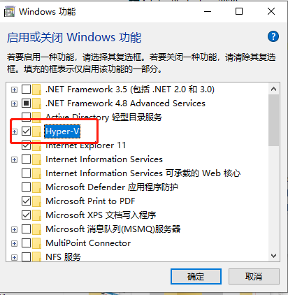
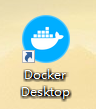
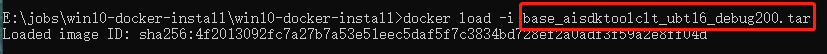
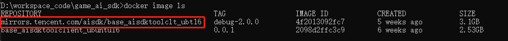
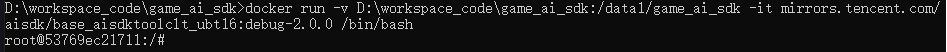
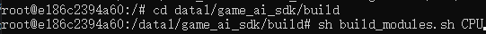
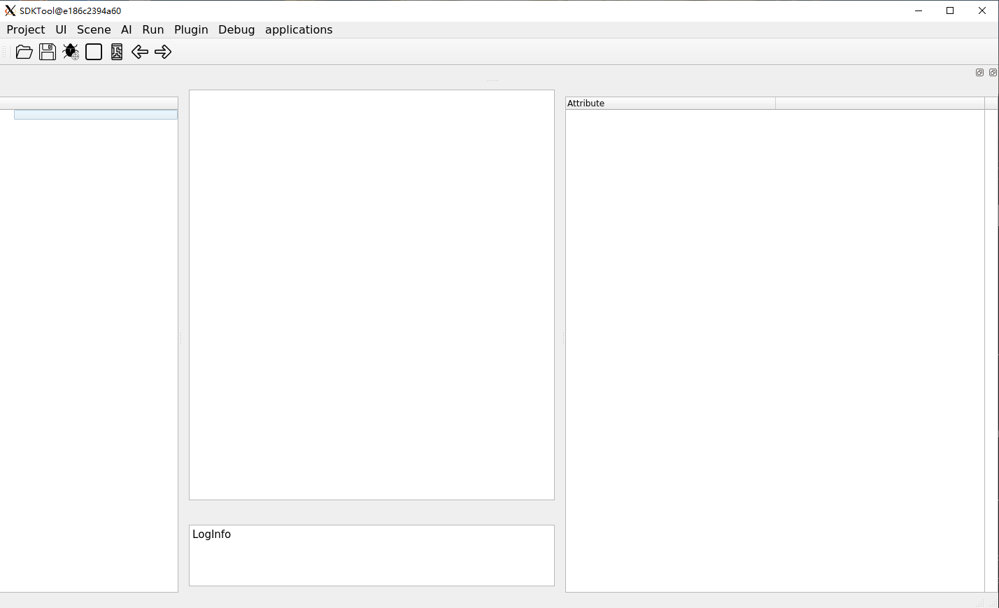
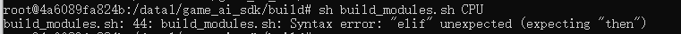
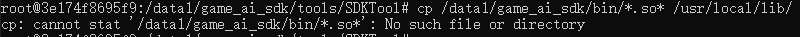

# win10-docker使用

### 母机：windows 10系统  
### docker: windows版    

1. 环境安装  
	1. 确认开启硬件的虚拟化技术  
	开启步骤：  
	右键选择左下角“windows图标”-> 选择“应用和功能”-> 选择右上角“程序和功能”-> 选择“启动和关闭windows功能”-> 勾选“Hyper-V”-> 点击“确定”-> 重启计算机  
	  

	2. 下载docker安装包  
	<a href="https://aitest.qq.com/download/index">下载环境包</a>  
	解压zip文件  
	运行install_rely.bat脚本  

2.	Aisdk使用  

	1. 手动启动docker  
	a)找到docker图标，双击启动  

	 

	2. aisdk环境镜像获取  

	a)<a href="https://aitest.qq.com/download/index">下载本地docker包tar文件  </a> 镜像名称.tar

	b)docker load –i 镜像名称.tar  

     

	3. 启动服务  
	a)下载GameAISDK代码,把GameAISDK代码放到D:\workspace_code\这个目录里面

    b) 本地文件和docker镜像共享文件

	执行命令 docker image ls,看一下镜像名称

     

	docker run -v D:\workspace_code\game_ai_sdk:/data1/game_ai_sdk -it ”镜像名称“ /bin/bash

     

	c)编译项目文件
       
	cd data1/game_ai_sdk/build

	sh build_modules.sh CPU

    sh build.sh CPU
    
	
     
	d)启动工具

	进入game_ai_sdk/tools/docker目录

	运行start_win_docker.bat文件

#### 正确启动工具  

## 常见问题
1. 格式错误
	

	出现这种报错由于git拉取下来文件格式不是UNIX格式，
	解决方法：拉取项目之前执行 git config --global core.autocrlf false，然后再拉取文件

2. 编译失败
	

	如果运行的时候出现这种报错，说明编译没有成功，要重新编译一下，编译的时候看一下是否有报错出现。