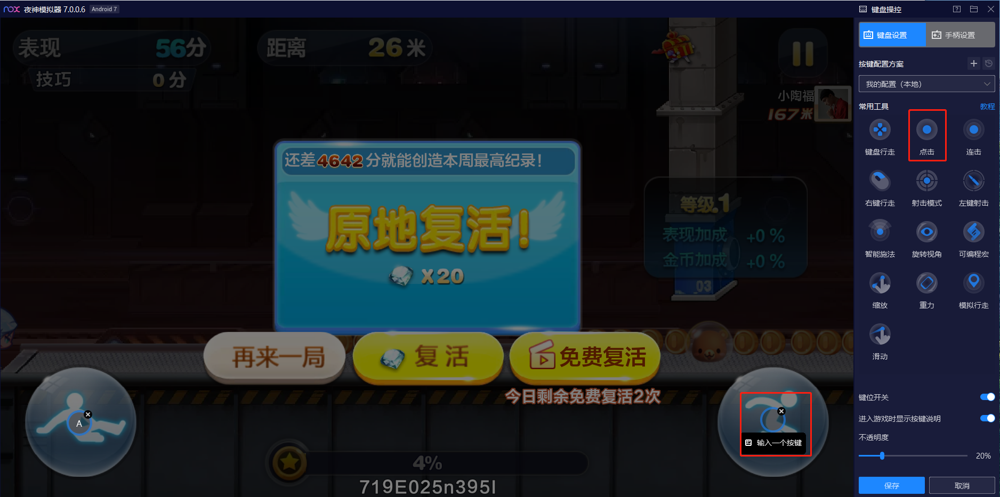
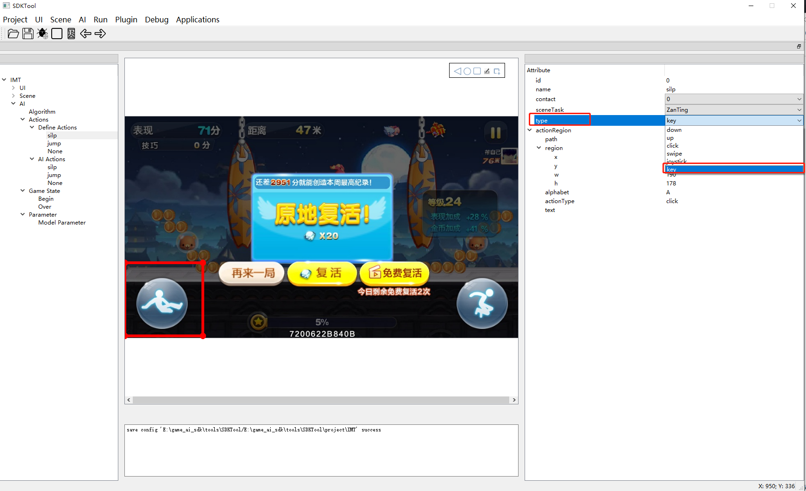
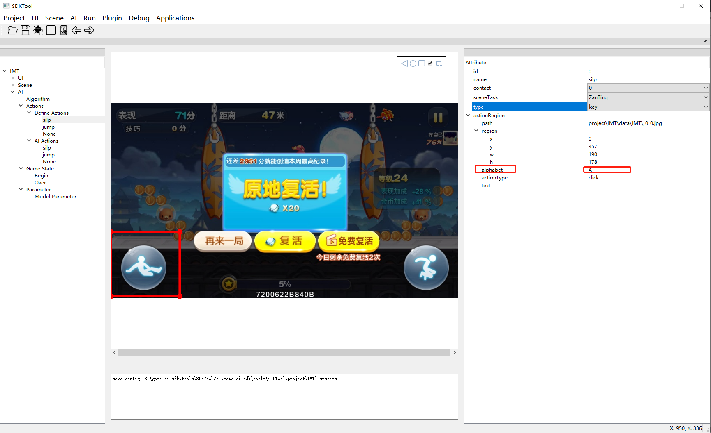
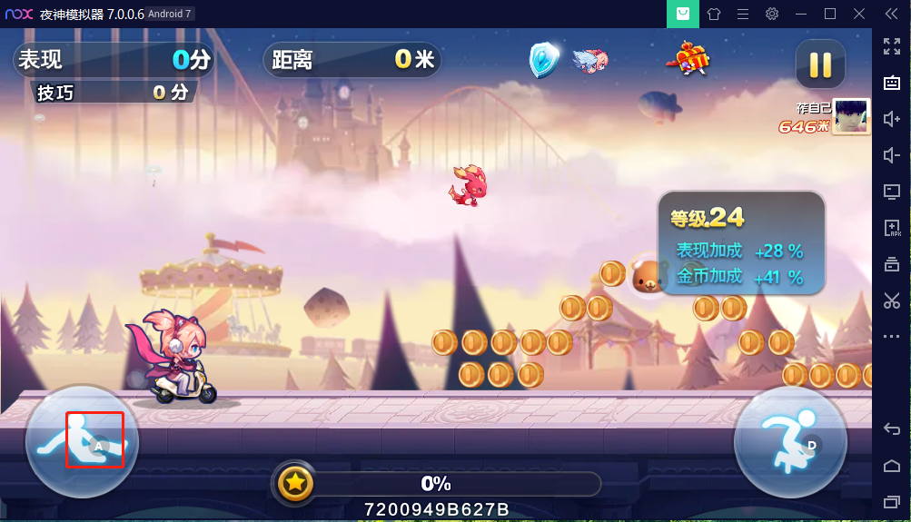
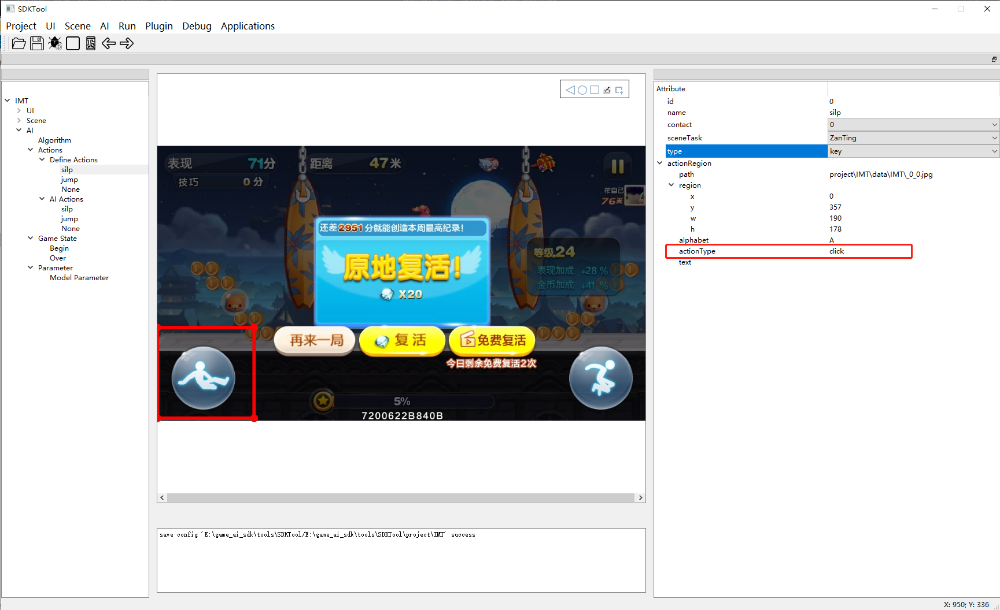

# Windows 模拟器测试

下载安装模拟器

运行模拟器

首先选择“mediaType”下拉选择Windows

双击“Spy Window”,鼠标在模拟器窗口悬停至少3秒

SDKTool工具显示模拟器画面

### 模拟器游戏按键设置

点击右侧菜单栏的键盘图标

选择点击要使用的功能按键

在键盘上随意输入一个按键，该按键就执行你选择的功能，保存后就可以使用

### SDKTool工具上设置按键

选择“type”下拉选项选择“key”

找到“alphabet”填写模拟器对应设置的键盘按键

找到“actionType”下拉选择对应执行功能

### 模拟器游戏录制

双击左侧菜单"Start Record"启动录制功能

选中模拟器窗口按键盘F1键进行录制，F2暂停录制

可以通过电脑上显示出的frame窗口左上角的帧序号来判断目前的状态是否处于录制中，如果帧序号在变化说明正处于录制中，如果帧序号没有变化，说明没有处于录制中

录制样本存放在game_ai_sdk/tools/SDKTool/project/{game_name}/data 目录下

双击左侧“Stop Record"录制结束