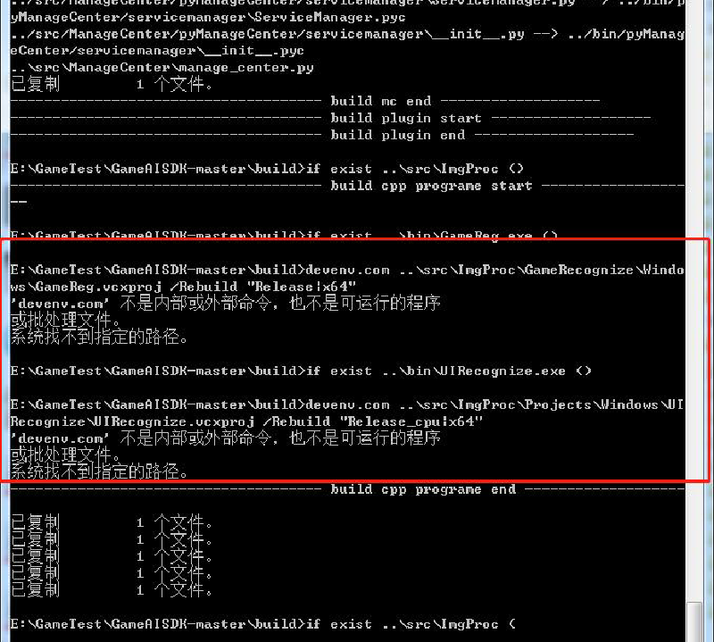
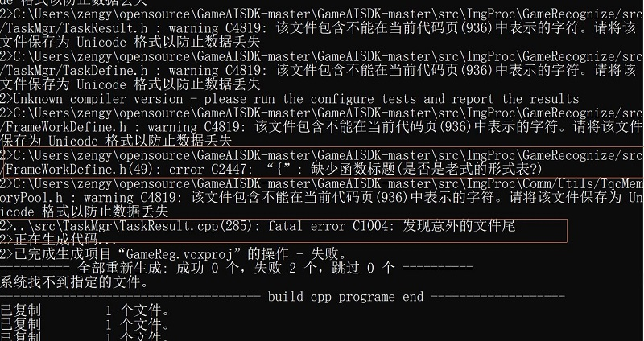
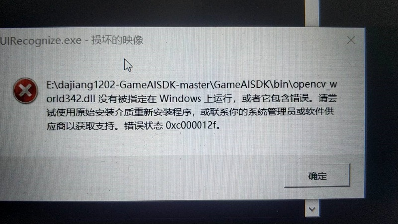
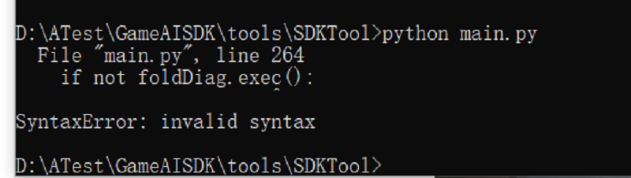
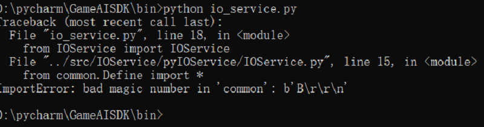
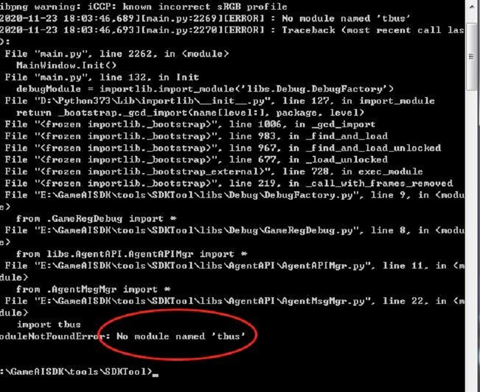
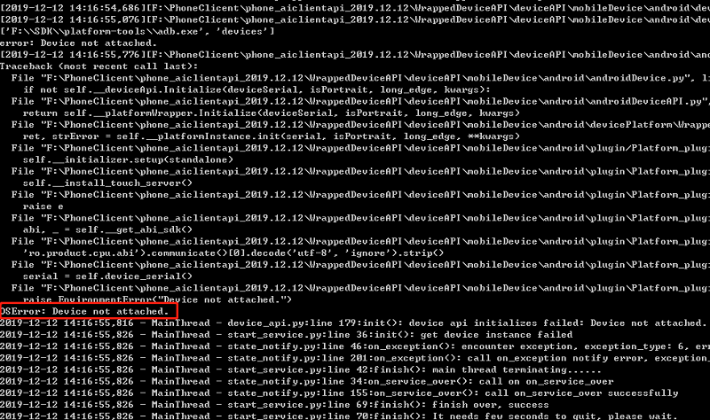
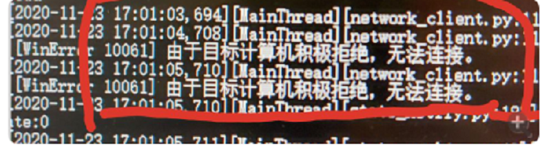

## 常见问题及处理方法  

### 编译问题
1. 没有安装vs2017或没有设置环境变量  
    编译失败，提示devenv.com不是内部或外部命令，也不是可运行程序。  

	  

	解决方法：  
	下载安装vs2017,找到devenv.exe所在的目录。设置用户环境变量，将其目录添加在path下。  

2. win编译，代码格式错误  
	当在windows上编译时，出现以上错误，表示代码格式不正确，原因是git上的代码是linux格式，当采用下载压缩包的方式下载代码时，下载的代码格式依然还是linux  

	  

	解决方法：  
	1、将Linux格式的代码转换成windows格式  
	2、直接官网下载本地编译包，替换掉GameAISDK-master\bin目录  

3. linux编译，代码格式错误  
	当在linux下执行编译文件时，出现以上的错误，说明文件格式是windows格式，不是unix格式
	
	  

	解决方法：  
	SDK目录下，在命令行中输入 find . -type f -exec dos2unix {} \；  

4. linux编译，权限问题  
	当在linux下执行编译文件时，出现以上的错误，说明文件没有权限  

	  

	解决方法：  
	在命令行中输入 chmod  +x  ./build_modules.sh

### 运行问题  

1. 缺少opencv_world342.dll  
	在运行时start_ui_ai时提示缺少opencv_world342.dll或损坏  

	  

	解决方法：  
	1、重新git下载，重新编译  
	2、官网下载同名文件，复制到GameAISDK\bin目录替换掉旧文件  

2. 启动报语法错误  
	启动SDKTool工具报错，SyntaxError：invalid syntax  

	  

	解决方法：  
	重新安装依赖  
	在执行pip install requirement.txt和pip install requirement_SDKTool.txt时，看有没有出错，检查有没有全部装上。

3. python编译版本和运行版本不一致  
	运行start_ui_ai时有进程关闭，单独启动关闭的进程（如：agentai.py、manage_center.py）报错bad magic number  

	  

	解决方法：  
	将python版本重新安装成3.6.2

4. tbus问题  
	运行main.py报错，no module name ‘tbus’

	  

	解决方法：  
	重新编译，在build目录下,cmd运行build.bat。编译失败窗口不会关闭，如果编译失败可以查看报错信息。

5. 运行时，UI不点击  
	在SDK下运行程序，当所有程序启动后，UI也识别到了，并且日志中有点击的动作，但是ui却没有执行点击动作。原因有二：  
	1、	客户端（AIClient）配置文件communication_cfg.ini中service不为2，启动manage_center.py不是用的UI+AI的方式启动  
	2、	UI配置文件Uiconfig.json中“debugWithSDKTools”的值为true  

	原因一处理方法：查看客户端的” communication_cfg.ini”文件中的service是否等于2，其次确认启动manage_center.py ，是否用命令“python manage_center.py --runType=UI+AI”启动  
	原因二处理方法：将“GameAISDK-master\cfg\task\ui\Uiconfig.json”中的“debugWithSDKTools”值置为false

6. 设备未连接或断开  
	当运行demo.py时，出现以下错误，说明设备未成功连接电脑。  

	  

	解决方法：  
	重新连接设备，直至在命令行使用“adb devices”后，出现手机序列号，方表示设备连接电脑成功，此时重新启动客户端，即可正常运行

7. demo.py由于目标计算机积极拒绝，无法连接  
	运行demo.py出错，报错如下  

	  

	解决方法：  
	检查sdk的进程，查看日志报错信息。