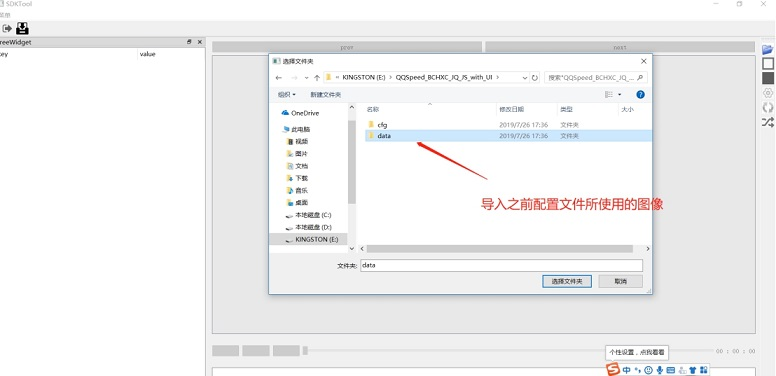
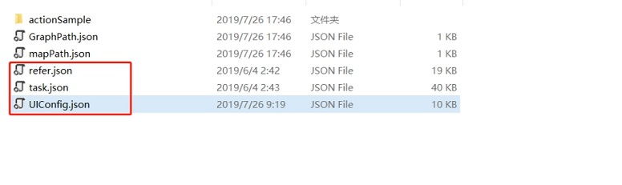
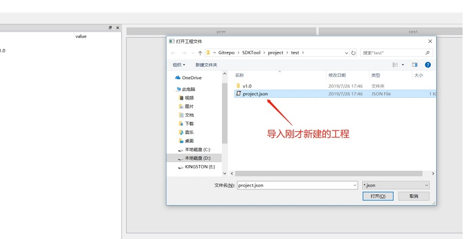
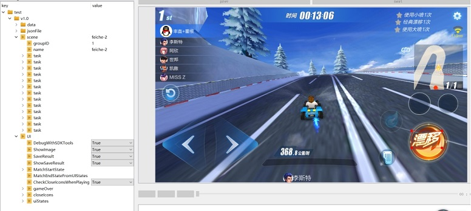

# 调试技巧说明

[TOC]

## 1 多分辨率参考任务配置技巧

### 1.1 阈值设定

threshold 默认为0.8，如果误匹配比较高，可以提高此阈值，但不应当高于1.0; 如果漏匹配比较高，可适当较低此阈值，但一般不建议低于0.7。

### 1.2 异形屏搜索区域

- expandWidth 默认值为0.1， expandHeight默认值为0.1，即向左右分别扩展原图宽度的0.05倍，上下分别扩展原图高度的0.05倍。但是因为游戏内部界面的不同适配，虽然检测区域已经向外扩展了，但是模板图像还是在检测区域之外，此时需要扩大检测区域。即通过expandWidth 扩展水平方向上的检测区域，expandHeight扩大竖直方向上的检测区域。
- 类型为location，算法为Detect的参考任务，在多分辨率的情况下，在新的分辨率下找到的搜索区域和模板区域大小相同。因为算法采用的是离散的scale，所以可能会存在匹配位置稍有偏差(1个像素)的问题。如果采用这个算法，遇到了检测不到的问题，可以尝试更改算法类型为Infer，其中location参数为模板的匹配区域。设置inferROI，inferLocations为相同的参数，同时这个矩形区域包含location所表示的矩形区域，inferLocations 为模板图像的搜索区域。这样在新的分辨率下得到的搜索区域将比模板的区域较大，解决了因为离散参数导致的搜索区域的偏差。

## 2 场景任务配置技巧

尽量减少模板区域的半透明背景部分。

可适当增加检测范围,即ROI区域。

## 3 SDKTool调试

SDKTool还提供导入之前手动配置的配置文件的功能。

### **3.1** 新建空的工程

右键树窗口，点击新建工程，创建一个新项目，并将需要导入的配置文件所用的图像导入工程，如图3-1所示：

 

图3-1 导入配置文件

### 3.2 导入需要调试的配置文件

将需要导入的task.json，refer.json，UIConfig.json拷贝至<project_path>/v1.0/jsonFile/下，替换掉原有的配置文件，如图3-2所示：

 

图3-2 导入task、refer

右键树窗口，点击导入工程，导入刚才创建的项目，即可看到task和UI，如图3-3所示：

 

图3-3 工程文件project.json

导入后的结果如下图3-4所示：

 

图3-4 导入结果

### 3.3 开始调试

UI的调试请参考 [UI配置文件说明](../SDKTool/UIConf.md) 第5小节。

识别进程调试 请参考 [任务配置文件说明](../SDKTool/TaskConf.md) 第5小节。