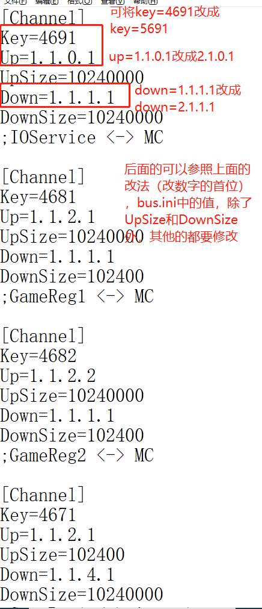
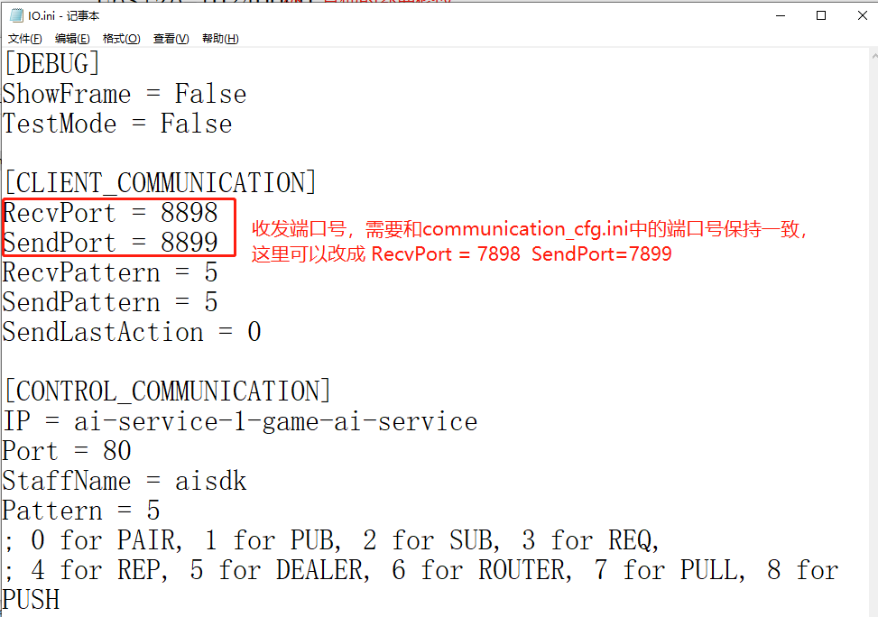
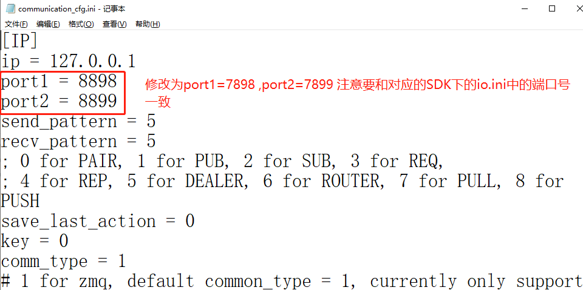
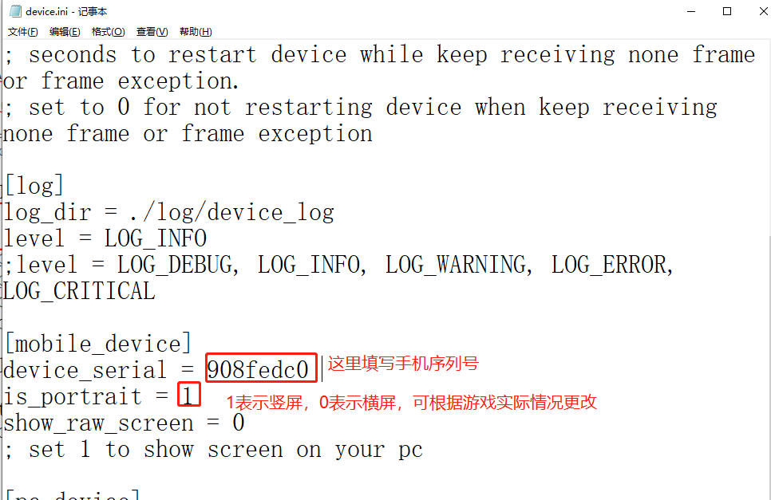

# SDK并发执行配置更改

[TOC]

### 一、要跑几个手机就复制几份SDK和PhoneClient

### 二、修改SDK下的bus.ini(注意：每个SDK下的bus.ini的值不能相同)

修改sdk/cfg/platform/bus.ini，修改下图框选的地方

### 三、修改IO.ini(注意：每个SDK下的io.ini中的值RecvPort、SendPort 不能相同)

修改sdk/cfg/platform/io.ini，修改如下图

### 四、修改AIClient下的 communication_cfg.ini

修改AIClient/aiclient/cfg/network_comm_cfg/communication_cfg.ini，修改如下图：

)

### 五、填写device_serial

命令窗口运行 adb devices获取手机的序列号，然后修改AIClient\aiclient\cfg\device_cfg\device.ini，修改如下图

