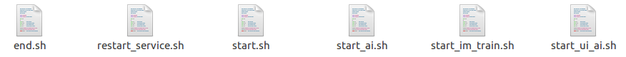

## 编译AISDK

1)  编译依赖文件（初次使用该AISDK时需要编译）：

进入AISDK/build目录，执行以下命令：

```
./build_modules.sh  {GPU|CPU}
```

将会在AISDK/bin目录下生成三个so文件，分别是libtbus.so、libjsoncpp.so、tbus.cpython-35m-x86_64-linux-gnu.so

2)  进入build目录：

执行./build.sh {GPU|CPU}  编译GPU或CPU版

编译CPU版运行下面的命令：

```
./build.sh CPU 
```

编译GPU版运行下面的命令：

```
./build.sh GPU 
```



​                                                                               图1 编译前的bin目录

                                                           

​                                                                              图2 编译后的bin目录

