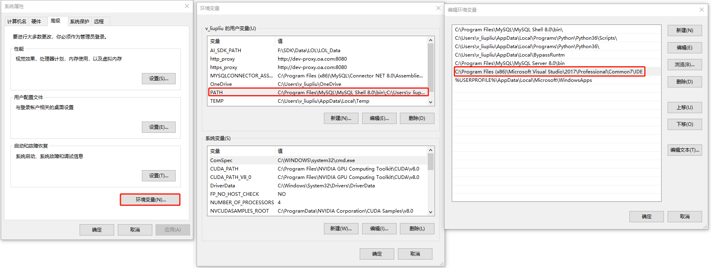
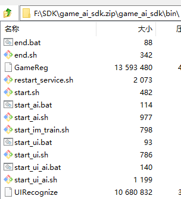
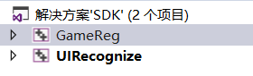
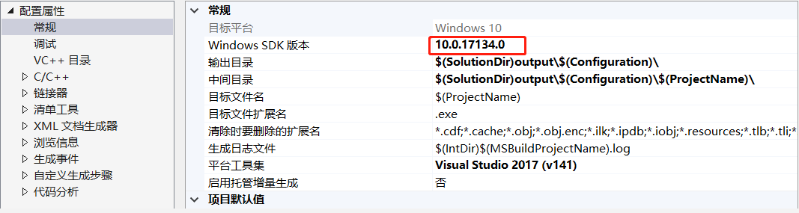

## win上编译AISDK

1）安装VS 2017

在windows上编译AISDK，需要安装VS2017，安装完成后需要把vs的IDE路径添加到用户环境变量PATH下，如图1所示：

​                                                                   图1 将IDE添加到PATH下

2）编译AISDK

进入AISDK/build目录，执行以下命令：

`./build.bat`

编译后前后bin目录对比，见下图2、图3所示

​                                                                                 图2 编译前的bin目录

​                                                                             图3 编译后的bin目录

#### **注意事项**

(1) 如果编译中有错误，可能是由于git拉取的代码是unix格式导致的。 

使用命令“git config --system --list”，查看core.autocrlf设置是否为true，如果不为true，把core.autocrlf设置改为true，再重新拉取代码

(2)如果编译中发生Windows SDK版本相关的错误，可能是由于VS2017安装的Windows SDK版本和AI SDK项目配置的Windows SDK版本不一致导致。

VS2017打开src\ImgProc\Projects\Windows\UIRecognize目录下的解决方案SDK.sln，然后设置GameReg、UIRecognize项目的Windows SDK版本。

右键点击项目GameReg --> 属性，设置Windows SDK版本；右键点击项目UIRecognize --> 属性，设置Windows SDK版本。

设置Windows SDK版本为本机安装的Windows SDK版本，详情步骤见下图1、图2所示:

​                                                                        图1 右击项目

​                                                                        图2 设置SDK版本号