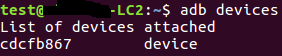
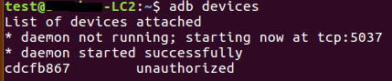

## 安装apk

1)  连接手机

确保电脑装有adb（推荐版本1.0.40），如果没有可以自行网上下载安装，通过USB连接PC和手机，进入手机设置--系统--开发人员选项--打开“开发人员选项”--打开“usb调试”--打开“usb调试（安全设置）”-- 打开“显示点按操作反馈”（不同手机可能界面不一样，如果找不到可以针对自己的机型查资料），确保以上操作以后，将手机通过usb连接电脑，可能会在手机上有两个弹窗，一直点确定就可以,在终端中输入命令：adb devices，如果结果如图4所示，说明已经正常连接，如果看不到手机序列号，或者显示如图2（unauthorized）,这时候可能需要手机多连接几次电脑，或者是找到开发人员选项中“撤销usb调试授权”撤销授权再连接。

 



​                                                                                      图1 正常连接



​                                                                                      图2 未连接上

2)  安装apk

安装游戏包base.apk：在终端中进入到游戏包存放的目录下执行命令 : 

```
cd data/NIN_Jump/
adb install base.apk
```

​                               

​                                                                                图3 进入游戏包存放的目录下                     

3）打开apk

​	以平台内置<忍者跳跃>游戏为例，打开<忍者跳跃>游戏后，进入界面：


图 4 忍者跳跃游戏初始界面