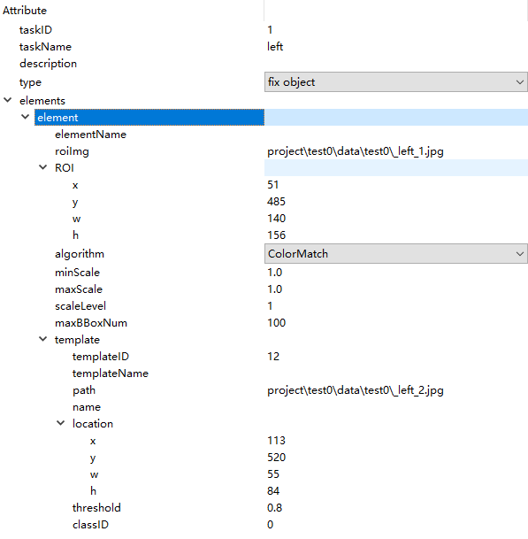
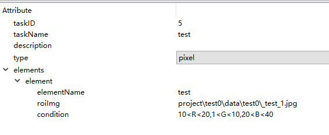
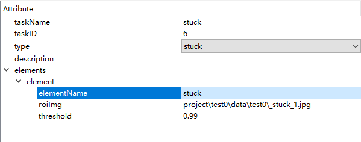
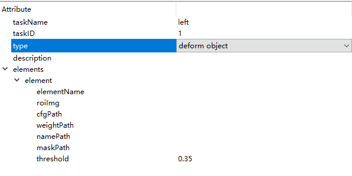
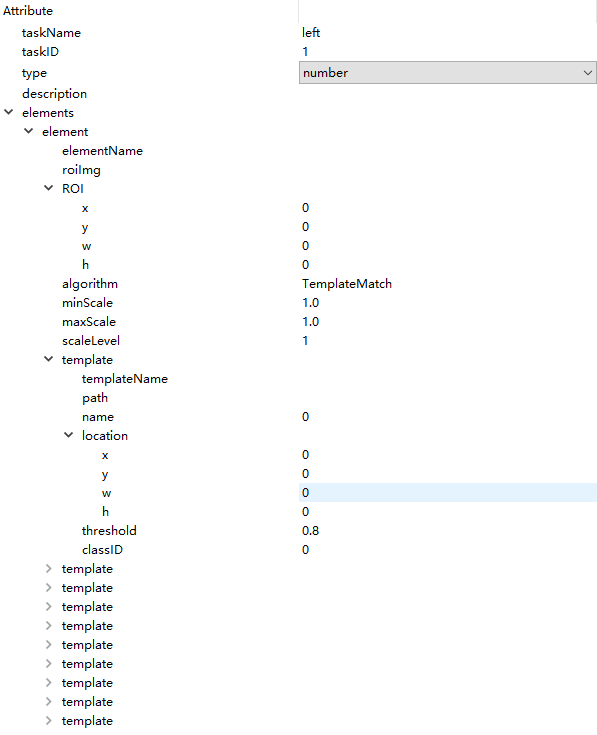

# 图像识别进程识别类型介绍

## 1.fix object

fix object类型是对固定不变的物体进行检查，其配置项的说明见下表1-1所示，fix object的配置如下图1-1所示：

| 参数名       | 参数解释                                                     |
| ------------ | ------------------------------------------------------------ |
| groupID      | 组ID号                                                       |
| name         | 组的名字                                                     |
| task         | 任务配置列表                                                 |
| taskID       | 任务ID号                                                     |
| type         | 任务类型                                                     |
| description  | 任务描述信息                                                 |
| elements     | 元素列表                                                     |
| ROI          | 搜索区域，在该区域中搜索配置的模板                           |
| algorithm    | 算法，目前只有ColorMatch一种                                 |
| minScale     | 最小缩放比例，因为可能要做多分辨率处理，可能需要将模板进行放缩，默认是1.0，不进行处理 |
| maxScale     | 最大放大比例,默认是1.0，不进行处理                           |
| scaleLevel   | 将模板在minScale-maxScale中进行，分多少级别进行，默认为1     |
| maxBBoxNum   | 返回boxes的最大个数                                          |
| templates    | 模板图像配置，首先先选择一张图片，然后画出模板区域，调整阈值，阈值默认为0.8，阈值越高越难匹配。可以添加多个模板，可以在element上右键添加模板图像。 |
| path         | 模板图像的路径                                               |
| name         | 模板的名称                                                   |
| location     | 模板区域                                                     |
| threshold    | 阈值，0-1之间，默认0.8，越大越难识别到                       |
| classID      | 模板id号，可以重复，fix object对classID要求不严格，可以使用默认值 |
| taskName     | task任务名字                                                 |
| elementName  | 单个element命名                                              |
| templateName | 模板名称                                                     |
| roiImg       | 搜索区域图像路径                                             |

表1-1fix object参数配置表

图1-1 fix object配置图

fix object类型的识别结果以及fix object的示列代码见“[FixObjectResult.md](../project/GameRegResult/FixObjectResult.md)”

## 2.pixel

pixel类型是对像素点的检测，一般用于对某个颜色区域内点的检测，常见应用场景有血条的检测等

其配置项的说明见下表2-1所示，pixel的配置如下图2-1所示：

| 参数名      | 参数解释                                                     |
| ----------- | ------------------------------------------------------------ |
| groupID     | 组ID号                                                       |
| name        | 组的名字                                                     |
| task        | 任务配置列表                                                 |
| taskID      | 任务ID号                                                     |
| type        | 任务类型                                                     |
| description | 任务描述信息                                                 |
| elements    | 元素列表                                                     |
| ROI         | 搜索区域，在该区域中搜索配置的模板                           |
| condition   | 每个通道的像素值范围，如："R < 100, G > 100, 90 < B < 130”，表示过滤Red通道灰度值小于100且 Green通道灰度值大于100且Blue通道灰度值在90和130之间的所有像素值 |
| filterSize  | 形态学处理的滤波器大小。(整型)                               |
| maxPointNum | 返回最大像素点个数                                           |
| taskName    | task任务名字                                                 |
| elementName | 单个element命名                                              |
| roiImg      | 搜索区域图像路径                                             |

表2-1pixel配置参数表

图2-1 pixel配置图

pixel类型的识别结果以及pixel的示列代码见“[PixlResult.md](../project/GameRegResult/PixlResult.md)”

## 3.stuck

stuck是对卡住的检测，一般用于游戏中人物卡住的检测，其配置项说明见下表3-1所示，stuck的配置如下图3-1所示：

| 参数名       | 参数解释                               |
| ------------ | -------------------------------------- |
| groupID      | 组ID号                                 |
| name         | 组的名字                               |
| task         | 任务配置列表                           |
| taskID       | 任务ID号                               |
| type         | 任务类型                               |
| description  | 任务描述信息                           |
| skipFrame    | 跳帧数，暂时未用                       |
| element      | 元素列表                               |
| ROI          | 搜索区域，在该区域中搜索配置的模板     |
| intervalTime | stuck类型时，检测两帧图像的时间间隔    |
| threshold    | 阈值，0-1之间，默认0.8，越大越难识别到 |
| taskName     | task任务名字                           |
| elementName  | 单个element命名                        |
| roiImg       | 搜索区域图像路径                       |

表3-1 stuck参数配置表

图3-1 stuck配置图

stuck类型的识别结果以及stuck的示列代码见“[StuckResult.md](../project/GameRegResult/StuckResult.md)"

## 4.deform object

deform object是对形变物体的检测，其配置项的说明见表4-1，deform object的配置如下图4-1所示：

| 参数名      | 参数解释                                |
| ----------- | --------------------------------------- |
| groupID     | 组ID号                                  |
| name        | 组的名字                                |
| task        | 任务配置列表                            |
| taskID      | 任务ID号                                |
| type        | 任务类型                                |
| description | 任务描述信息                            |
| skipFrame   | 跳帧数，暂时未用                        |
| element     | 元素列表                                |
| ROI         | 搜索区域，在该区域中搜索配置的模板      |
| cfgPath     | 网络的cfg文件，选择一个路径             |
| weightPath  | 权重文件路径，选择一个路径              |
| namePath    | 名字文件路径，选择一个路径              |
| maskPath    | 做了掩膜的图片路径                      |
| threshold   | 阈值，0-1之间，默认0.35，越大越难识别到 |

表4-1 deform object参数配置表

图4-1 deform object配置图

deform object类型的识别结果以及deform object的示列代码见“[DeformObjectResult.md](../project/GameRegResult/DeformObjectResult.md)”

## 5.number

number是对数字的检测，其配置项的说明见表5-1所示，number的配置如下图5-1所示：

| 参数名      | 参数解释                                                     |
| ----------- | ------------------------------------------------------------ |
| groupID     | 组ID号                                                       |
| name        | 组的名字                                                     |
| task        | 任务配置列表                                                 |
| taskID      | 任务ID号                                                     |
| type        | 任务类型                                                     |
| description | 任务描述信息                                                 |
| skipFrame   | 跳帧数，暂时未用                                             |
| element     | 元素列表                                                     |
| ROI         | 搜索区域，在该区域中搜索配置的模板                           |
| algorithm   | 算法，会跟据上面type的选择，默认给                           |
| minScale    | 最小缩放比例，因为可能要做多分辨率处理，可能需要将模板进行放缩，默认是1.0，不进行处理 |
| maxScale    | 最大放大比例,默认是1.0，不进行处理                           |
| scaleLevel  | 将模板在minScale-maxScale中进行，分多少级别进行，默认为1     |
| template    | 模板图像配置，首先先选择一张图片，然后画出模板区域，调整阈值，阈值默认为0.8，阈值越高越难匹配。可以添加多个模板，可以在element上右键添加模板图像。task的type等于number时，默认会生成10个模板，需要自己添加0-9的图片 |
| path        | 模板图片的地址                                               |
| name        | 模板的名字                                                   |
| location    | 模板区域                                                     |
| threshold   | 阈值，0-1之间，默认0.8，越大越难识别到                       |
| classID     | 模板id号，number对classID检测严格，必须对应检测的数字，当检测的数字是1时，classID填1 |

表5-1number参数配置表

图5-1number配置图

number类型的识别结果以及number的示列代码见“[NumberResult.md](../project/GameRegResult/NumberResult.md)”

