# **DQN模型训练**

DQN是一种强化学习算法，从随机的模型开始训练，训练过程中不断与实际游戏环境进行交互，交互过程中agent会尝试各种动作，好的动作会给予正向的reward，坏的动作会给予负的reward，通过agent与环境的大量交互逐渐学习到最优的AI模型。

平台内置了DQN强化学习算法，可以直接使用DQN算法训练AI模型。由于DQN训练要在实际游戏环境中进行，所以需要配置游戏UI，使游戏能够不断重复进入游戏场景；此外还需要游戏场景识别配置，通过识别游戏内特定的游戏元素（按钮、数字、血条等），设置游戏内训练开始、训练结束、以及设置reward奖励。

 

下面以<天天酷跑>游戏为例，说明如何使用内置的DQN算法训练游戏AI.

### 场景识别配置

* 场景识别配置文件路径为cfg/task/gameReg/Task.json，DQN算法中需要配置4个识别任务：

1.识别游戏开始，当检测到该任务为True时，开始AI模型训练；

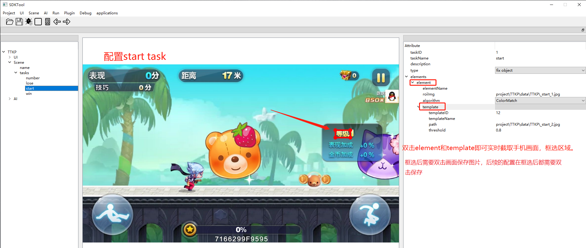

2.识别游戏胜利，本游戏中不存在游戏胜利的情况，配置与失败相同；

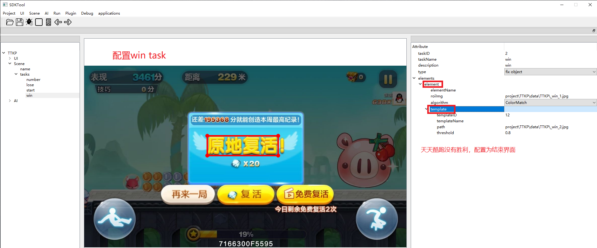

3.识别游戏失败，当检测到该任务为True时，停止AI模型训练；

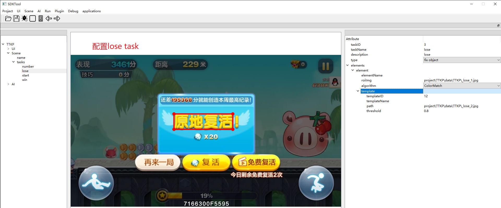

4.识别游戏画面上方的数字，根据跟数字来计算强化学习中的reward；

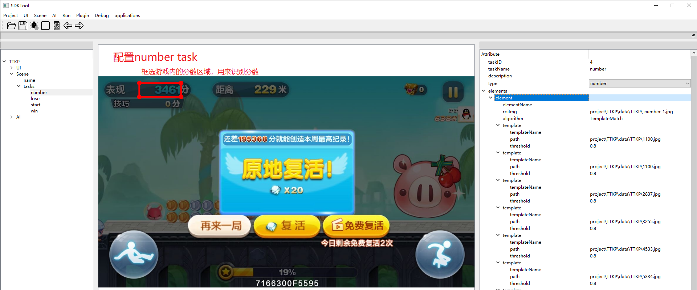

### 选择算法
在AI-Algorithm中选择DQN

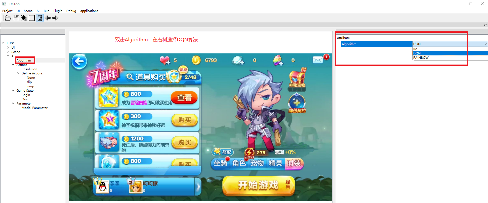

### 设置配置图片的大小

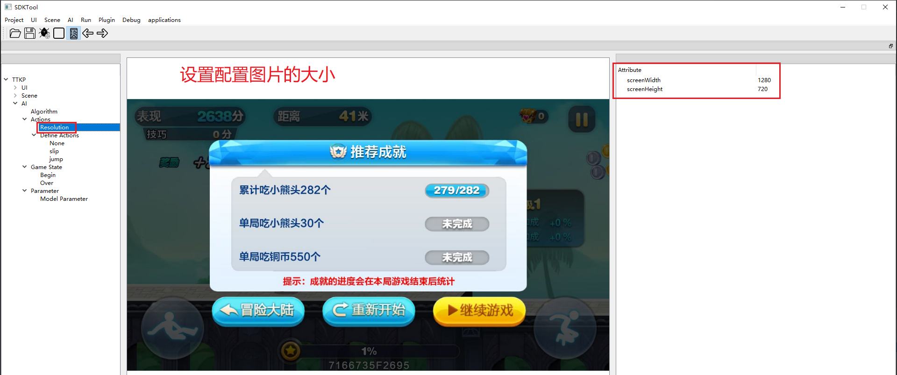

### 配置游戏动作
- TTKP需要配置三个动作，滑，跳和一个None。

1.id为0的None动作类型，即游戏中不做任何动作

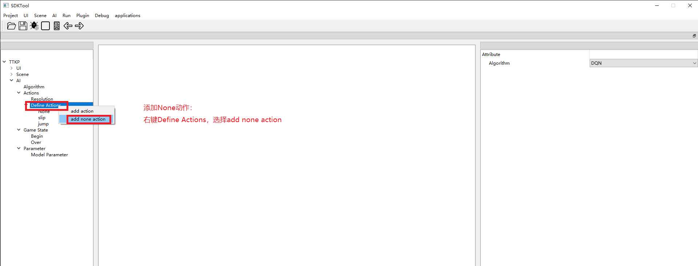

2.id为1的click动作类型，即游戏中的滑行动作

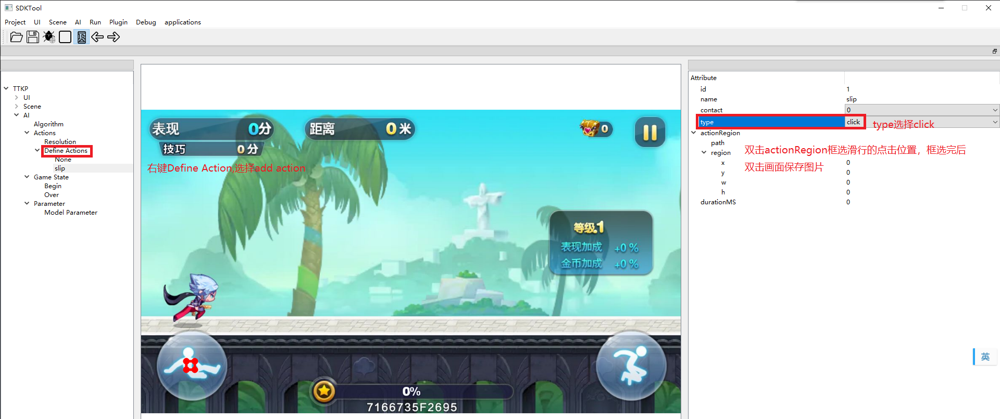

3.id为2的click动作类型，即游戏中的跳跃动作

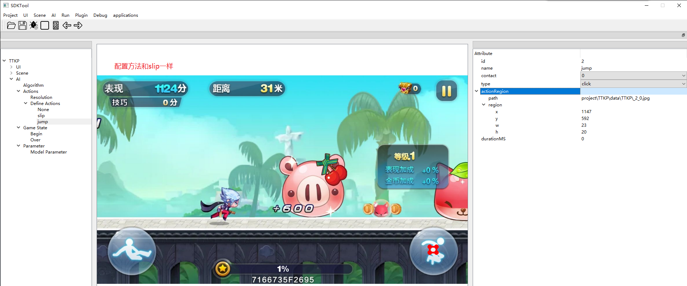

### 配置begin和over

* begin：添加作为游戏开始scene

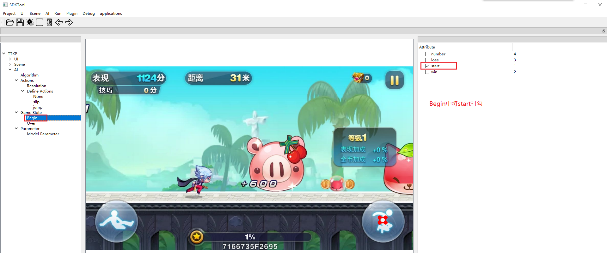

* over：添加作为游戏结束的scene

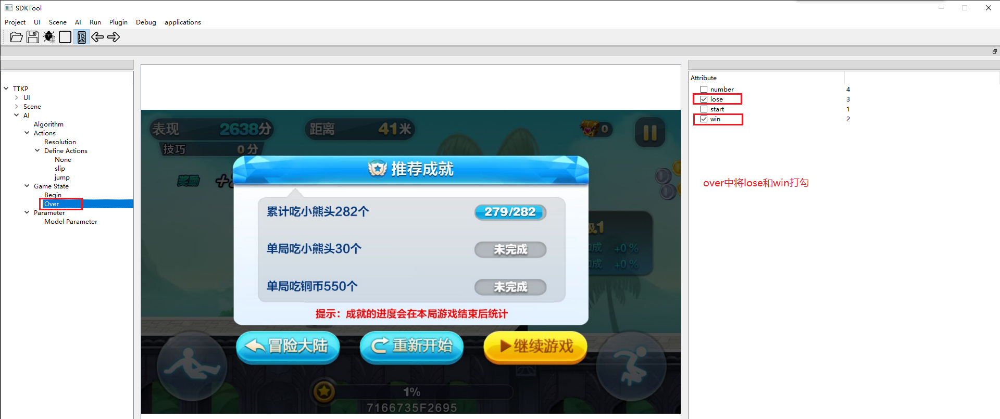

### 配置Reward奖励和DQN算法参数

* 训练时传送的图像

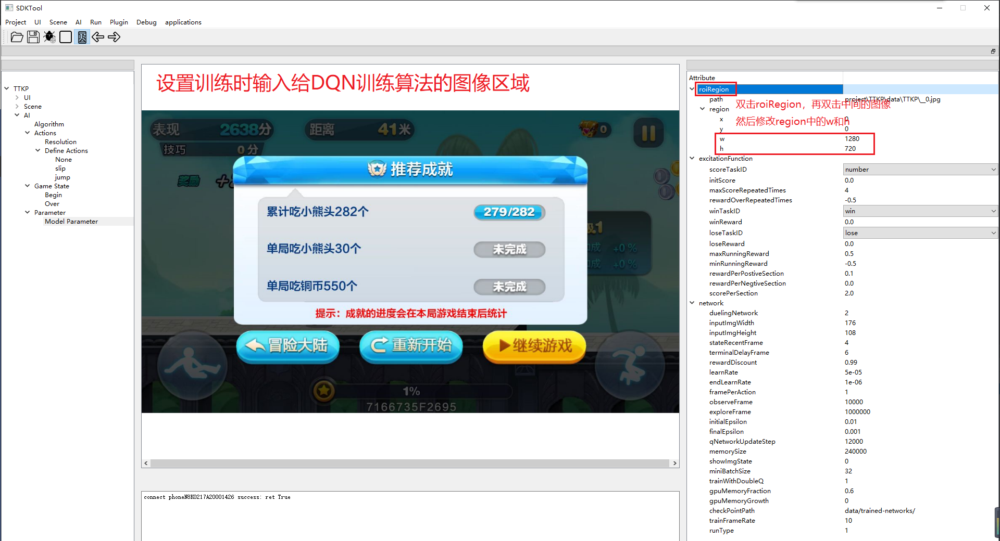

* 配置taskID

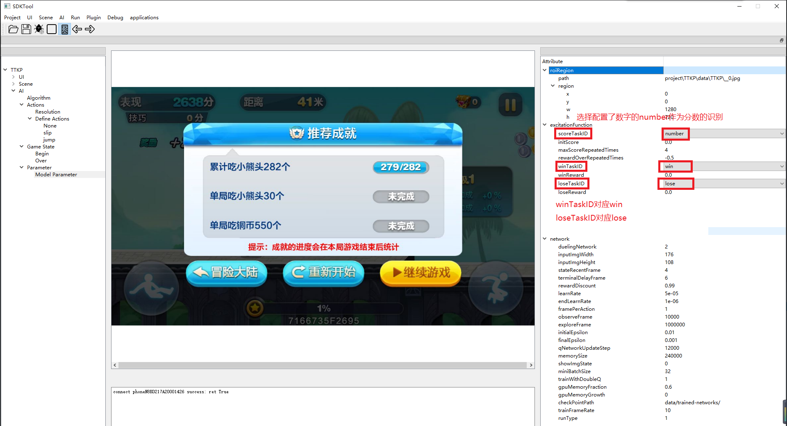

* 配置Reward奖励和DQN算法参数

强化学习训练过程中，根据环境反馈的reward进行模型训练。好的动作得到正的reward，差的动作得到负的reward。<天天酷跑>游戏中，可以根据游戏画面上方的距离数字作为游戏得分，并根据得分计算reward。得分增加表示agent一直在前进，给予正的reward；得分停止不变时表示agent死亡，给予负的reward。

其它游戏的reward计算方法，要根据实际情况来设置，总体的原则是好的动作给予正的reward，坏的动作给予负的reward。<天天酷跑>游戏中，可以设置如下所示：

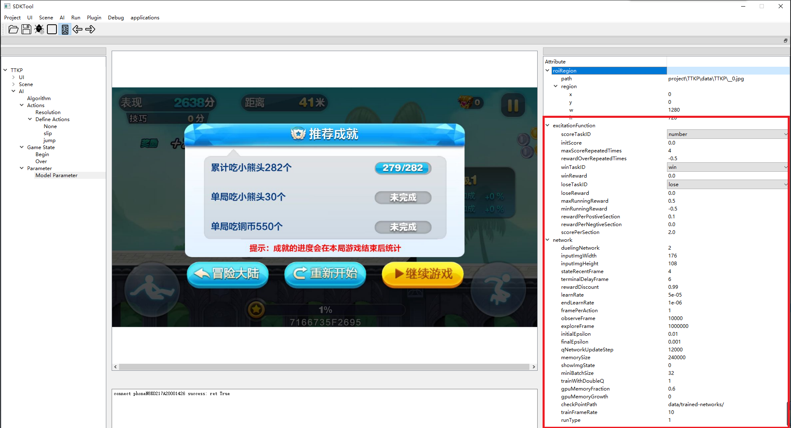

配置Reward奖励：

1.  StartX、StartY、Width、Height表示训练时输入给DQN训练算法的图像区域，本例中图像区域为整个游戏画面；
2.  InitScore 表示游戏开始时的初始得分；
3.  MaxScoreRepeatedTimes = 4、RewardOverRepeatedTimes = -0.5 表示当同一个得分数字重复超过4个连续帧时，给予的reward。本游戏中得分数字重复不变时，表示agent死亡，所以给予-0.5的reward；
4.  WinReward 表示检测到游戏胜利时，给予的reward值，由于本游戏中不存在游戏胜利结束的情况，可以设置为0；
5.  LoseReward 表示检测到游戏失败时，给予-0.5的reward；
6.  MaxRunningReward、MinRunningReward 表示游戏过程中给予的最大、最小reward值；
7.  ScorePerSection = 2.0、RewardPerPostiveSection = 0.1、RewardPerNegtiveSection = 0.0  表示2.0作为一个得分区间，当得分每增加一个区间给予RewardPerPostiveSection（本例为0.1） 的reward，当得分每减少一个区间给予RewardPerNegtiveSection（本例为0）的reward。
8. 由于本游戏中不存在得分减少的情况，设置RewardPerNegtiveSection为0；

配置DQN算法参数：

DQN算法包含一些训练参数，如学习率、replay memory大小、初始随机动作概率等，大部分情况下可以使用默认参数。

1.  QNetworkType参数表示DQN神经网络结构，1表示Nature结构的神经网络，Nature结构的神经网络直接输出每个动作的价值；2表示Dueling结构的神经网络，Dueling将网络输出的价值分为状态价值和动作优势两部分；
2.  InputImgWidth和InputImgHeight表示训练输入图像的宽和高；
3.  StateRecentFrame = 4 表示将连续的4帧图像作为训练输入；
4.  TerminalDelayFrame = 6 表示训练过程中检测到的游戏结束比真实情况延迟了6帧；如果实际情况不存在延迟可以设置为0；
5. RewardDiscount 表示强化学习中reward的折扣系数；
6.  LearnRate 表示训练中的学习率；
7.  FramePerAction 表示多少帧输出一个动作，训练中发现某些游戏如果输出动作频率太高，将难于收敛；
8.  InitialEpsilon和FinalEpsilon  DQN训练采用ε-greedy策略，开始训练时有InitialEpsilon大小的概率采用随机动作，之后随机动作概率逐渐减小到FinalEpsilon；
9. ObserveFrame = 10000 表示收集10000帧的数据后才开始训练模型；
10. ExploreFrame = 1000000 表示经过1000000帧的训练后，随机动作概率降低到FinalEpsilon；
11. MemorySize 表示训练中的经验池replay memory大小；
12. ShowImgState 表示是否显示训练图像，0表示不显示，1表示显示；
13. MiniBatchSize 表示采用minibatch方式训练的batch大小；
14. TrainWithDoubleQ 表示表示是否采用Doule DQN方式训练，Doule DQN将动作选择和价值估计采用两个网络来进行，实践中采用Double DQN方式训练有更好的效果；
15. GPUMemoryFraction 表示训练中限制GPU显存比例；
16. CheckPointPath 表示训练的网络模型保存路径，确保已经创建了设置的保存路径；
17. TrainFrameRate 表示训练模型的FPS帧率；
18. RunType 表示DQN算法运行方式，0表示训练模型，1表示测试训练模型；

-  AI模型训练

完成上述配置后，点击菜单栏”Run》Test",窗口左侧出现Run树状结构。

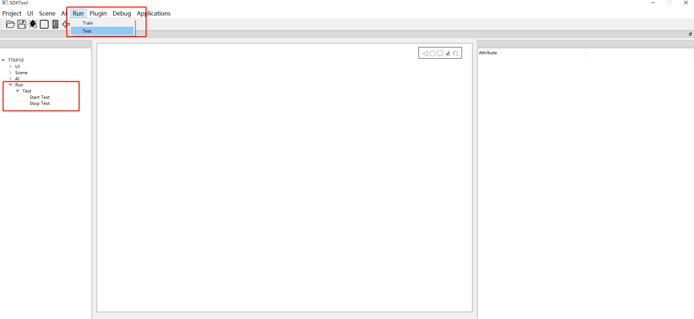

双击Start Test开始训练