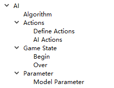
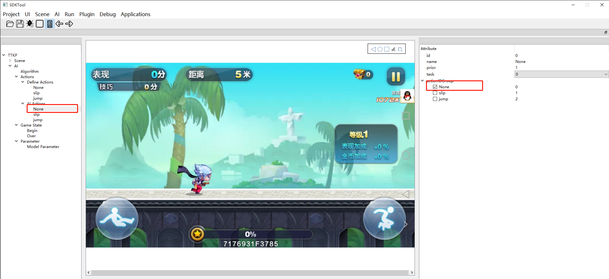
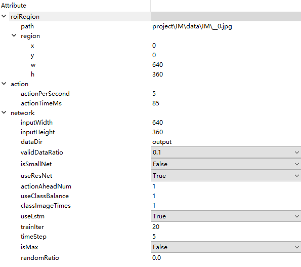
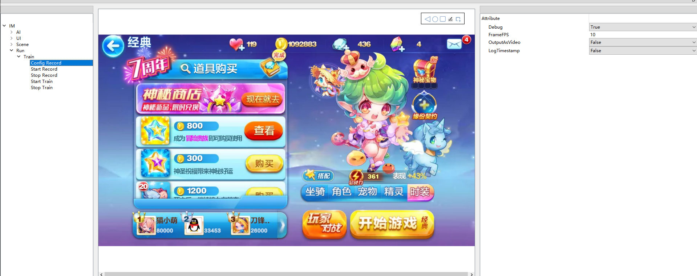
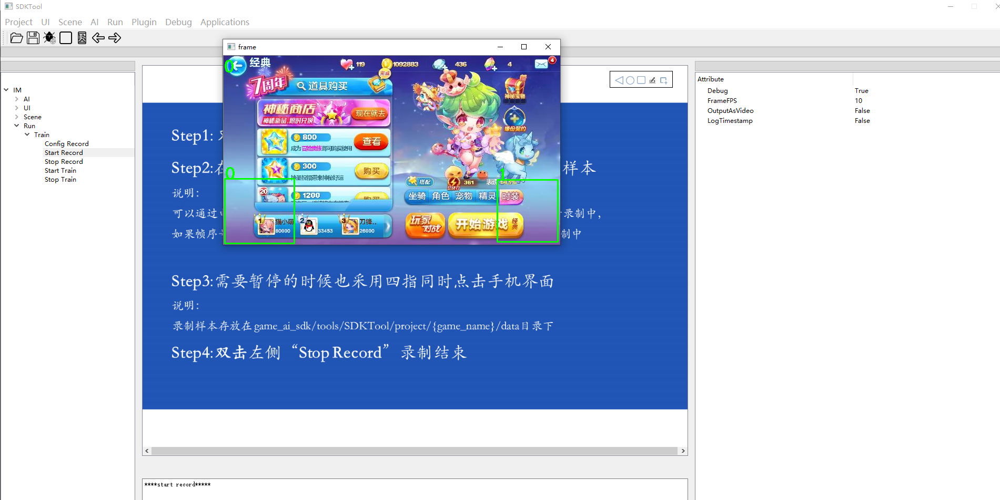
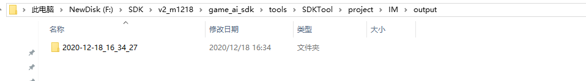
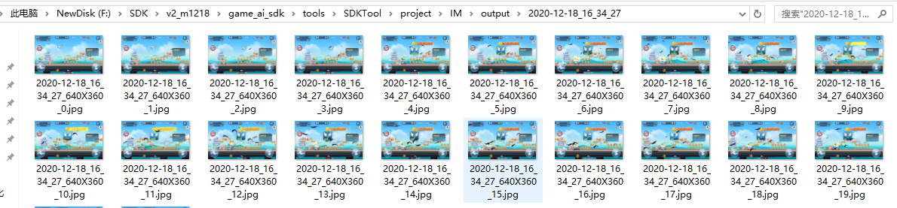
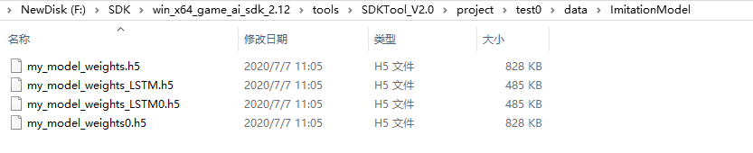

# 录制样本和训练模型

### 1 样本录制

#### 1.1新建AI

点击菜单栏“AI》New”,新建一个AI,完成后会在左侧生成一个AI树，如下图1-1所示：
    

图1-1 生成AI树

#### 1.2 选择算法

点击AI树中的“AIgorithm",然后在右侧详情窗口中选择IM算法

#### 1.3 定义动作
Android手机和Android模拟器定义动作的方法不同  
具体步骤请参考[Android手机定义动作](../SDKTool/IMActionAndroid.md)和[Android模拟器定义动作](../SDKTool/IMActionwindows.md)

#### 1.4 定义AI动作

右击“AI Actions”选择“add action",右侧详情窗口会出现配置动作的参数。  
新建None，在右树勾选None。

新建slip，在右树勾选slip；新建jump，在右树勾选jump。方法同上一步None

图1-3 ai actions

· name:定义动作的名字，可以自己定义

· id:定义动作的id，通常是从0开始的

prior:动作的先验，对应动作的输出概率为网络输出值乘先验

task:动作列表，可选择单个动作，也可选择多个动作组合

actionIDGroup:关联Define Actions中定义的动作

定义AI动作，主要是从Define Action中选择一个配置好的动作进行关联，如果是组合动作，还需要在task下拉框中选择组合动作的id

#### 1.5 配置游戏AI的开始和结束

“Game State”下有Begin、Over,点击Begin或Over后，在右侧的窗口中勾选相关的task任务，将相关的task任务作为Ai的开始或结束（IM算法不用配置Game State）

#### 1.6 设置训练参数

点击“Parameter》Model Parameter”,右侧的详情窗口会显示详情参数，详见下图1-5：

图1-5 模型参数设置

· roiRegion：输入网络的图像区域，包含左上角的x、y坐标、宽度和高度

  path: 输入范围图像，只是用于配置region，没实际意义

 actionPerSecond：每秒的动作数量

. actionTimeMs：点击动作的时间

· inputHeight：图像高度（注意区分横屏和竖屏游戏，如果是竖屏则inputHeight>inputWidth，横屏则             inputHeight<inputWidth

· inputWidth：图像宽度

 dataDir：录制的样本图像存放位置

· isSmallNet：是否采用小网络

· isMax：是否采取概率最大的动作。设置为0时，根据动作概率随机做动作

· randomRatio：isMax为0时，给每个动作的输出概率加一个固定值

· actionAheadNum：动作标签提前多少帧，针对动作延迟设计

· classImageTimes：将样本扩充多少倍

. useLstm：是否使用Lstm

. trainIter：训练的次数

. timeStep：Lstm的记忆帧数

 validDataRatio:设置训练样本的比例，如果设置0.5，即表示将样本中的一半样本作为训练样本，另一半样本作为验证样本

 useResNet:是否使用残差模型

 useClassBalance:是否使用数据增广

#### 1.7 设置录制参数

点击菜单栏”Run》Train",窗口左侧出现Run树状结构，点击Run下的Train》Config Record,右侧窗口会显示详情，如下图1-6所示：

图1-6 录制参数设置

Debug：是否开启录制

FrameFPS：录制的帧数

OutputAsVideo：是否录制成视频，False表示录制成图片，录制样本需要录制成图片

logTimestamp：是否有时间戳，一般设置成False

#### 1.8 录制样本

点击“Start Record"会弹出frame窗口，窗口中显示手机画面，如下图1-7所示：

### 

图1-7 frame窗口

在手机游戏录制界面，采用类似四指同时点击的操作开始录制样本（会生成一个文件夹），需要暂停的时候也采用四指同时点击（文件夹中样本不再增加），可以通过电脑上显示出的ｆrame窗口左上角的帧序号来判断目前的状态是否处于录制中，如果帧序号在变化说明正处于录制中，如果帧序号没有变化，说明没有处于录制中，这时候在"{path to AISDK}/tools/SDKTool/project/项目名称/output/日期+时间命名的文件夹"中如下图所示，可看见输入的图像文件夹，里面存放采集的样本（为了保证训练效果，NIN JUMP通常需要录制游戏局内时间达到30分钟，游戏手动录制时，尽量玩的好一点，不要做太复杂的操作，录制结束后，将样本图片中，游戏开始和结束的没有游戏操作的图片删除），详见下图1-8、1-9所示：

图1-8 录制样本文件夹

图1-9 录制样本文件夹详情

样录制完后，点击“Stop Record"停止录制样本

### 2 训练样本

点击“Run》Train》Start Train”开始训练AI模型，训练完模型后，点击“Run》Train》Stop Train”停止训练AI模型，训练好的模型存放在"{path to AISDK}/tools/SDKTool/project/项目名称/data/ImitationModel"下，如下图2-1所示：

图2-1 模型