#  录制样本和训练模型


[TOC]

## 1  需要准备的包

1. 首先准备game_ai_sdk文件包，如图1

​                                                                               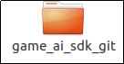 

​                                                                                图1 SDK2.4及以上版本

2. TTKP训练时需要准备的配置文件包（如图2），cfg文件夹需要放置配置文件，data文件夹放置对应的数据图片，output文件下有四个子文件夹用于放置用来训练（train和valid）和训练时产生（Class_train和Class_valid）的图片。
3. 不同的游戏需要重新配置对应的配置文件，训练时将环境变量设置为配置文件路径。

​                                      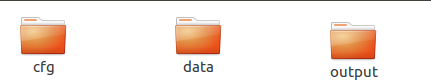   

 

​                                                                        图2  TTKP训练及配置文件目录结构

​		 																  	

## 2  样本录制和模型训练

### 2.1  样本录制及相关文件介绍

- 进入SDK下 {path to AISDK}/tools/SDKTool/bin/ActionSampler/cfg目录，新建TTKP (游戏名）的样本录制配置文件，我这里命名为action_TTKP.json（建议命名为action_{游戏名}.json），如图3
- 注：如果bin目录下无ActionSampler目录文件，需将ActionSampler文件手动添加到{path to AISDK}/tools/SDKTool/bin/目录下

​                                       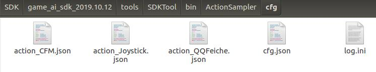 

​                                                    图3   {path to AISDK}/tools/SDKTool/bin/ActionSampler/cfg

action_TTKP.json文件内容如下：

（可以通过SDKTool工具进行配置action_TTKP.json文件，添加动作配置，根据需要可以配置不同的actions：click.swipe等）

```
{
    "screenWidth":640,
    "screenHeight":360,
    "actions":[
        {
            "id":0,
            "name":"None",
            "type":0
        },
        {
            "id":1,
            "name":"slip",
            "type":3,
            "startRectx":0,
            "startRecty":230,
            "width":115,
            "height":129
        },
        {
            "id":2,
            "name":"jump",
            "type":3,
            "startRectx":528,
            "startRecty":244,
            "width":103,
            "height":106
        }
    ]
}
```

（上图仅作为格式参考，具体数值需根据实际情况来产生）

· screenHeight：录制样本的屏幕高度

· screenWidth:录制样本的屏幕宽度

· actions:录制时定义动作的位置

· startRectx:定义动作的左上角x轴像素值

· startRecty:定义动作的左上角y轴像素值

· width：定义动作的区域的宽度像素值

· height：定义动作的区域的高度像素值

· contact:指触点的标识,可以取-1到9的整数。0到9代表动作对应的触点，-1表示不点击

· name:定义动作的名字，可以自己定义

· id:定义动作的id，通常是从0开始的（我这里定义的0为不做动作，1为点击，需要与配置文件中{path to AISDK}/cfg/task/agent/ImitationLearning.json中actionDefine的actionIDGroup一致）

· type：定义动作的类型，0为不做动作，3为点击click，4代表划动swipe，5代表摇杆   （如果在配置过程中需要用到其他几种动作，可参考以下例子）

```
       {
            "id":4,
            "name":"huadong",
            "type":4,
            "startRectx":306,
            "startRecty":225,
            "startRectWidth":47,
            "startRectHeight":51,
            "endRectx":332,
            "endRecty":374,
            "endRectWidth":88,
            "endRectHeight":78
        },
        {
            "id": 1000,
            "type": 5,
            "QuantizedNumber": 4,
            "centerx": 230,
            "centery": 480,
            "rangeInner": 35,
            "rangeOuter": 90,
            "name" : "joystick"
        }
```

{path to AISDK}/tools/SDKTool/bin/ActionSampler/cfg/cfg.json文件内容如下：

```
{
    "Debug": true,
    "GameName": "TTKP",
    "FrameFPS": 10,
    "FrameHeight": 360,
    "FrameWidth": 640,
    "ActionCfgFile": "cfg/action_TTKP.json",
    "OutputAsVideo": false,
    "LogTimestamp": false
}
```

- 需要注意的配置项：

**·** GameName：定义游戏样本保存在game_ai_sdk_git/tools/SDKTool/bin/ActionSampler/output中的文件夹名字

**·** FrameFPS：游戏中每秒的帧数

**·** FrameHeight：高度像素值（因为本游戏是竖屏的，所以高度大于宽度）

**·** FrameWidth：宽度像素值    （可以按照比例调整宽高）

**·** ActionCfgFile: action_TTKP.json文件的对应路径

 

- 在终端中进入{path to AISDK}/tools/SDKTool/目录下，输入workon game_ai_sdk命令，进入虚拟环境（虚拟环境是自己创建的，可以自己查资料创建，所需要的依赖包都在game_ai_sdk_git根目录下的requirements.txt文件中，如果自己本地环境没有问题，也可以不用虚拟环境），将手机通过usb连接到电脑（保证手机正常连接，可以在终端输入adb devices查看是否连接成功），然后运行工具进行动作采集“输入python main.py 命令并运行”，打开手机上的天天酷跑游戏需要录制的场景，工具中点击“Tools>actionSampler>start"开始录制（这时工具的显示框中会显示出你手机游戏运行的画面）

需要输入的命令：

```
cd {path to AISDK}/tools/SDKTool/
workon game_ai_sdk // 如果是通过自动部署工具部署，通过此命令进入虚拟环境
adb devices // 查看手机设备连接情况
python main.py // 设备连接正常后，运行脚本，启动sdktool
```

​                         

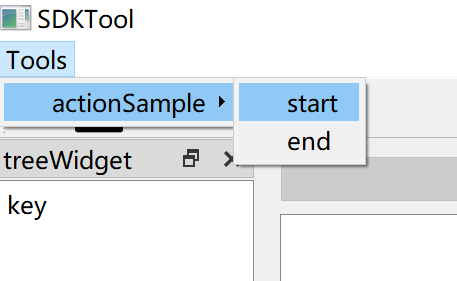

​                                                                               图4 点击start

- 当脚本运行后，在手机游戏录制界面，采用类似四指同时点击的操作开始录制样本（会生成一个文件夹），需要暂停的时候也采用四指同时点击（文件夹中样本不再增加），可以通过电脑上显示出的窗口左上角的帧序号来判断目前的状态是否处于录制中，如果帧序号在变化说明正处于录制中，如果帧序号没有变化，说明没有处于录制中，这时候在"{path to AISDK}/tools/SDKTool/bin/ActionSampler/output/TTKP/日期+时间命名的文件夹"中如图7，可看见输入的图像文件夹，里面存放如图6的图片（为了保证训练效果，TTKP通常需要录制游戏局内时间达到30分钟，游戏手动录制时，尽量玩的好一点，不要做太复杂的操作，录制结束后，将样本图片中，游戏开始和结束的没有游戏操作的图片尽量删除一些）

​                                           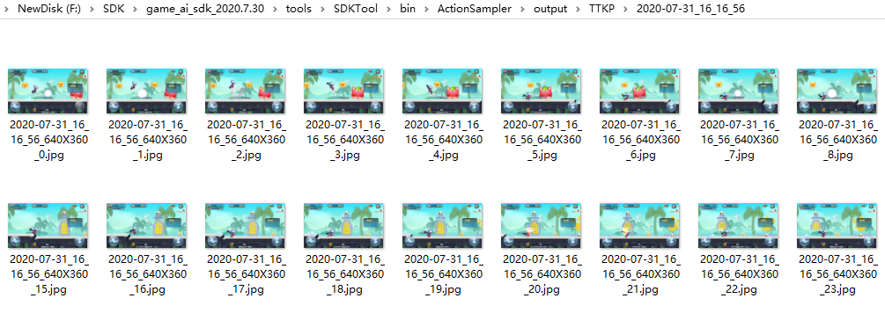 

​                                                                           图5  每一个文件夹，就是一局游戏输入的文件

​                                           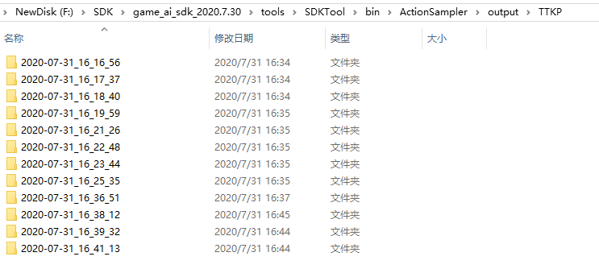 

​                                                                                          图6   每一局游戏样本输入的图片

- 样本录制结束后，将图6中的文件夹分别放到图7配置文件中TTKP/output/train路径和TTKP/output/valid路径中，放置比例为6：1，其中Class_train和Class_valid为放置训练时产生的图片数据，train和valid为放置录制的样本图片。

​                                          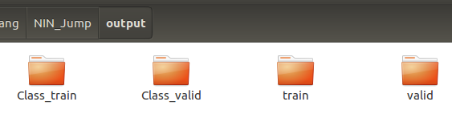  

​                                                                                                   图7 ouput下目录结构

- 结束录制

  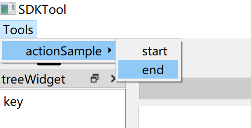
  
  图 8 结束录制

### 2.2.2  模型训练及相关文件介绍

- 首先修改TTKP/cfg/task/agent下的ImitationAction.json。TTKP配置文件各文件夹目录树

​                                                                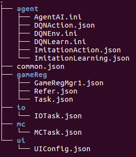

​                                                                             图9 TTKP/cfg文件夹下目录树

ImitationAction.json可以直接复制录制文件action_TTKP.json(action_{游戏}.json)的内容，如果配置中没有contact,添加contact配置，如下：

```
{
    "screenHeight": 360, 
    "screenWidth": 640, 
    "actions": [
        
        {
            "id":0,
            "name":"None",
            "type":0
        },
        {
            "id":1,
            "name":"slip",
            "type":3,
            "contact": 0, 
            "x": 0, 
            "y": 230, 
            "startRectx":0,
            "startRecty":230,
            "width":115,
            "height":129
        },
        {
            "id":2,
            "name":"jump",
            "type":3,
            "contact": 0, 
            "x": 528, 
            "y": 244, 
            "startRectx":528,
            "startRecty":244,
            "width":103,
            "height":106
        }
    ]
}
```

接下来修改ImitationLearning.json，文件内容如下

```
{   
    "inputHeight": 360,
    "inputWidth": 640,
    "roiRegion":[0, 0, 640, 360],
    "trainDataDir":"output/train/",
    "testDataDir":"output/valid/",
    "isSmallNet":true,
    "isMax":true,
    "randomRatio":0.1,
    "actionAheadNum":0,
    "classImageTimes":2,
    "useLstm":false,
    "actionPerSecond":7,
    "actionTimeMs":85,
    "trainIter":20,
    "timeStep":5,
    "actionDefine":[{"name": "None", "actionIDGroup": [0], "prior": 1},
                    {"name": "slip", "actionIDGroup": [1], "prior": 1},
                    {"name": "jump", "actionIDGroup": [2], "prior": 1}]
}                                      
```


· inputHeight：图像高度

· inputWidth：图像宽度

· roiRegion：输入网络的图像区域，包含左上角的x、y坐标、宽度和高度

· trainDataDir：训练数据的文件夹路径

· testDataDir：测试数据的文件夹路径

· isSmallNet：是否采用小网络

· isMax：是否采取概率最大的动作。设置为0时，根据动作概率随机做动作

· randomRatio：isMax为0时，给每个动作的输出概率加一个固定值

· actionAheadNum：动作标签提前多少帧，针对动作延迟设计

· classImageTimes：将样本扩充多少倍

. useLstm：是否使用Lstm

. actionPerSecond：每秒的动作数量

. actionTimeMs：点击动作的时间

. trainIter：训练的次数

. timeStep：Lstm的记忆帧数

· actionDefine：动作定义

· name：动作的名字

· actionIDGroup：由哪些动作组成

· prior：动作的先验，对应动作的输出概率为网络输出值乘先验


 AgentAI.ini文件内容如下：

```
[AGENT_ENV]
UsePluginEnv = 0
EnvPackage = agentenv
EnvModule = ImitationEnv
EnvClass = ImitationEnv

[AI_MODEL]
UsePluginAIModel = 0
AIModelPackage = ImitationLearning
AIModelModule = ImitationAI
AIModelClass = ImitationAI

[RUN_FUNCTION]
UseDefaultRunFunc = 1
;RunFuncPackage = MyPackage
;RunFuncModule = MyModule
;RunFuncName = MyRunFunc
```


· AgentEnv：表示使用的ai算法

· UsePluginEnv:有两个参数1和0,使用1表示使用UsePluginEnv算法，0表示不使用

· EnvPackage:使用的算法的包

· EnvModule:使用的算法的模块

· EnvClass:使用的算法的类

​                                   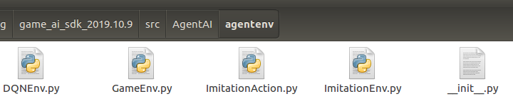

​                                                                    图10 使用的算法包、模块、类的路径

· AIModel:表示使用的ai模型

· UsePluginAIModel:有两个参数1和0,使用1表示使用UsePluginAIModel，0表示不使用

· AIModelPackage:使用的模型的包

· AIModelModule:使用的模型的模块

· AIModelClass:使用的模型的类

​                                    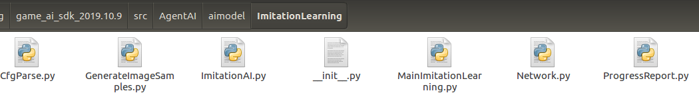

​                                                                         图11 使用的模型的包、模块、类的路径

- 进入SDK下bin目录中，执行以下命令，开始训练

```
workon game_ai_sdk #（linux下需要先安装virtualenvwrapper依赖包，然后创建虚拟环境game_ai_sdk，才能使用该命令进入虚拟环境）
export AI_SDK_PATH=/home/test/TTKP  #linux设置环境变量为TTKP文件（换成对应的游戏配置文件路径）
set AI_SDK_PATH=/home/test/TTKP     #windows设置环境变量为TTKP文件（换成对应的游戏配置文件路径）
python3 agentai.py --mode=train       #开始训练的命令    
```

- 模型训练结束后，会产生一些文件，如图12、图13，其中图12是训练生成的模型，保存在配置文件的data/ImitationModel文件夹里面，图13是训练过程中生成的Class_train文件夹，里面是每个类别对应的训练的样本，可根据data.txt文件中的记录，点进每个文件夹去检查样本是否正确，如图13。


​                                            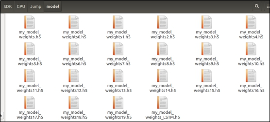 

​                                                                                图12 训练的模型的权重文件

​                                                                  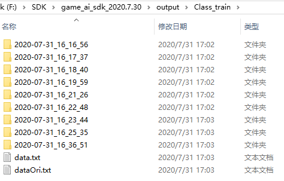

​                                                                     图13  放在output下，Class_train文件夹中样本的分类

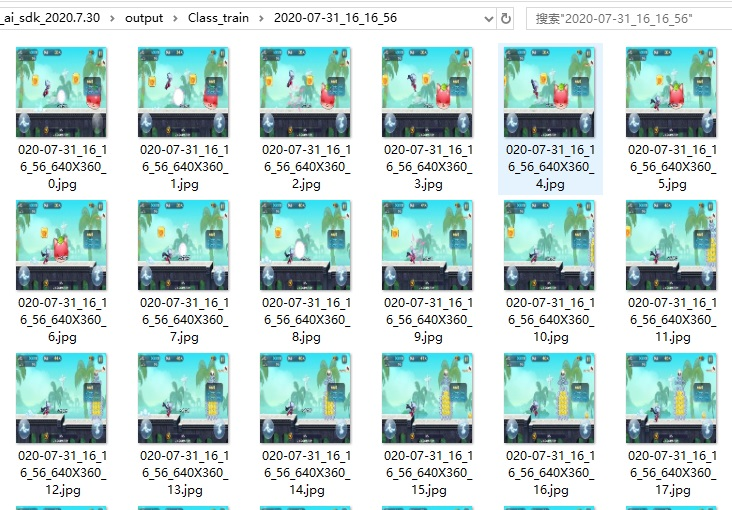

图14 TTKP文件夹下生成的样本