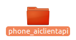
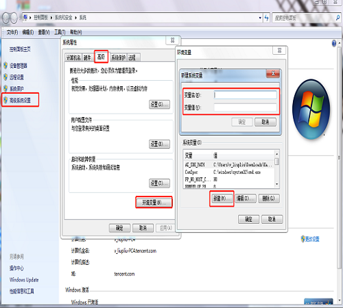

# 运行游戏

[TOC]

## 1  启动

完整的运行一个游戏还需要一个phone_aiclient文件包，运行方式又分两种，如下1.1和1.2。

​                                                                  

​                                                              图1  phone_aiclientapi包

### 1.1  合并运行

将配置文件TTKP的cfg、data直接拖到AISDK的根目录下，系统会提示名字重复，是否取消还是合并，这时候选择合并，将配置文件都合入AISDK中，再将TTKP/data/ImitationModel目录下的文件移动到AISDK/data/ImitationModel目录下，这样运行时直接进入到AISDK的bin目录下执行1.3就可以，不需要再设置环境变量。

### 1.2  添加环境变量运行

(1) 右击 我的电脑——>属性——>高级系统设置——>环境变量——>新建（系统变量），如下图1所示：

```
变量名：AI_SDK_PATH
变量值：你的配置文件的路径
```



图1 设置环境变量

### 1.3  拉起AISDK

1)  执行了1.1或1.2以后（bin目录下），在终端中进入虚拟环境下（虚拟环境是自己创建的，具体方法可以自行查找资料，其中需要安装的依赖包就是AISDK根目录下requirements.txt的依赖包，如果自己本地的环境没有互相干扰问题，也可以不进入虚拟环境），命令如下：

```
workon game_ai_sdk（win下需要先安装virtualenvwrapper-win依赖包，然后创建虚拟环境game_ai_sdk，才能使用该命令进入虚拟环境）
```


2)  拉起AISDK的第一种，使用start脚本拉起（bin目录下），命令如下:

拉起AISDK的UI+AI服务

`./start_ui_ai.sh`

或 拉起AISDK的AI服务

`./start_ai.sh`  


3)  拉起AISDK的第二种，逐个进程拉起(bin目录下)，命令如下：

```
python3 io_service.py
python3 agentai.py
python3 manage_center.py --runType=UI+AI   #如果只运行ai，不需要加--runType=UI+AI
GameReg.exe
UIRecognize.exe  #如果只运行ai，不需要执行该命令
```

注意：以上命令全部执行表示同时拉起UI+AI服务，每一个命令都需要一个单独的终端，都需要先执行1.1或1.2、1.3的1）


### 1.4  配置phone_aiclient并拉起

- 设置AI SDK/tools/AIClient/aiclient/cfg/network_comm_cfg/communication_cfg.ini

代码如下：

```
[IP]
ip = 127.0.0.1
port1 = 8898
port2 = 8899
send_pattern = 5
recv_pattern = 5
; 0 for PAIR, 1 for PUB, 2 for SUB, 3 for REQ,
; 4 for REP, 5 for DEALER, 6 for ROUTER, 7 for PULL, 8 for PUSH
save_last_action = 0
key = 0
comm_type = 1
#1 for zmq, default common_type = 1, currently only support zmq comm
use_env_variable = 0

[MONITOR]
process_speed_test = 1
frame_decode_type = 2
; 0 for raw img, 1 for binary img, 2 for cv2 en/decode img d
save_img = 1
; 0 for not saving imgs, 1 for saving UI images, 2 for saving AI images, 3 for saving UI+AI images. Available when frame_decode_type is 2
max_send_interval = 0.1
# max_send_msg to ai-service interval, /s
max_none_frame_time = 40
# max_none_frame_time is continued none frame max time, /s
max_none_action_time = 10
# max_none_action_time is continued none frame max time, /s

[resource_apply]
service = 1
# 1 AI, 2 UI + AI
auto_apply_resource = 0
```


· ip 为本机ip（127.0.0.1代表本机 ，如果在云端运行,则是在ASM上申请的对应资源的ip）

· Port1、port2 为端口（本地运行一台手机时默认为以上代码中的端口号，多台手机同时运行，端口需保证不能重复，如果是在云端运行，则是在ASM上申请的对应资源的端口）

· Key值（本地运行时为0，如果是在云端运行，则是在ASM上对应申请的资源的key）

· Service 为1时表示运行游戏AI，为2时表示运行游戏UI+AI 

 

- 修改手机截图分辨率大小配置

AI SDK/tools/AIClient/aiclient/cfg/device_cfg/device.ini

```
[device]
use_env_variable = 0
device_type = Android
; device_type is defined in aiclient/device_remote_interaction/device_interface/config.py
platform = Local
; platform is defined in aiclient/device_remote_interaction/device_interface/config.py
long_edge = 1280
; screen captured will be resized to the level of long_edge. The resize rate is long_edge/device_real_long_edge
max_restart_time = 300
; seconds to restart device while keep receiving none frame or frame exception.
; set to 0 for not restarting device when keep receiving none frame or frame exception

[log]
log_dir = ./log/device_log
level = LOG_INFO
;level = LOG_DEBUG, LOG_INFO, LOG_WARNING, LOG_ERROR, LOG_CRITICAL

[mobile_device]
device_serial =
is_portrait = 0
show_raw_screen = 1
; set 1 to show screen on your pc

[pc_device]
foregroundwin_only = 0
; set to 1 so getScreen() will capture the window your cursor selected. set to 0 for the whole screen
win_names =
; window names getScreen() focus on. Each name is separated by "|", eg. win_names = QQ|Wechat

[android_action_handler]
use_login_function = 0
; use_login_function = 1, will auto use game_account and game_pwd to login game
auto_launch_app = 0
app_package_name =
game_account =
game_pwd =

[ios_action_handler]
placeholder =

[windows_action_handler]
placeholder =

```

 1） use_env_varialbe：表示该配置文件中long_edge和is_portrait的值是从系统环境变量中读取还是从该配置文件读取。从环境变量读取的方式如下：

long_edge = int(os.environ.get("IMG_LONG_EDGE"))

is_portrait = int(os.environ.get("IS_PORTRAIT"))

2） device_type：表示支持的设备系统型号，目前支持Android、Windows。后续会支持Ios

3）platform：默认local，该参数目前未使用，为以后开发预留

4） Long_edge：表示从手机中截取图片的长边。

5）max_restart_time：在设定的时间内（时间单位为秒）没收到动作或帧异常时，重新启动设备

6）log_dir：日志文件目录

7）level：日志级别

8） device_serial：表示手机的序列号，当多台手机连接是需要设置，但是手机连接时置为空即可，此时会检测连接的手机。

9） is_portrait：表示截图游戏是横屏还是竖屏，1为竖屏，0为横屏（该项配置参数可以在1.2中资源获取）。

10） show_raw_screen：表示是否在pc中显示手机画面，0不显示，1显示。

11）foregroundwin_only：设置截屏数据，为0时表示抓取整个桌面的图像，为1时表示抓取窗口的数据，用手机跑时，这里设置为0

12）win_names ：窗口的名称，当foregroundwin_only=1时，这里要设置窗口的名称

13） use_login_function：表示使用QQ自动登录功能，0表示不使用，1表示使用。

14） auto_launch_app： 表示是否自动运行app，0表示不使用，1表示使用。

15） app_package_name： 表示自动运行app时，app的包名。

16） game_account： 表示使用自动登录功能时，使用的QQ账号。

17） game_pwd ： 表示使用自动登录功能时，使用的QQ密码。

18）placeholder ：占位符


- 拉起phone_aiclient

  在终端进入phone_aiclient目录下，在终端中进入虚拟环境下（虚拟环境是自己创建的，具体方法可以自行查找资料，如果自己本地的环境没有互相干扰问题，也可以不进入虚拟环境），执行如下命令：

  ```
  workon game_ai_sdk   #（win下需要先安装virtualenvwrapper-win依赖包，然后创建虚拟环境game_ai_sdk，才能使用该命令进入虚拟环境）
  
  python3 demo.py    #拉起phone_aiclient
  ```

