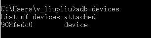
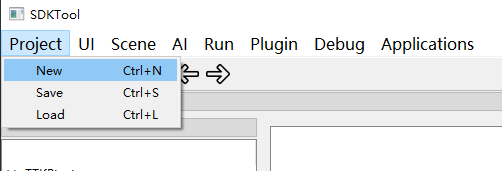
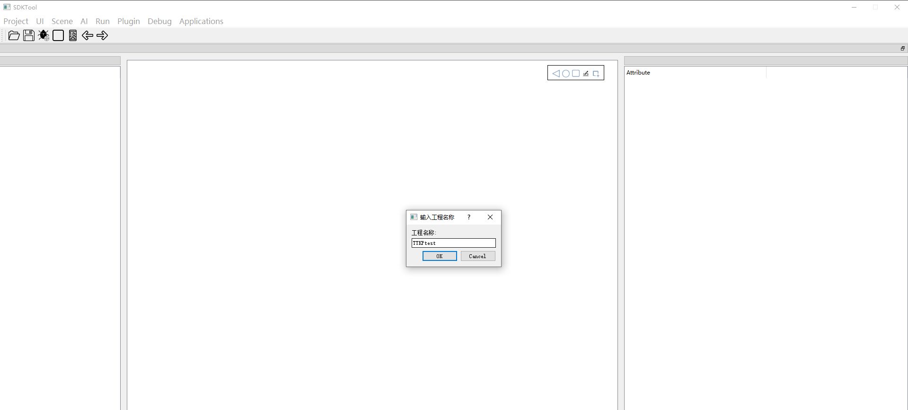
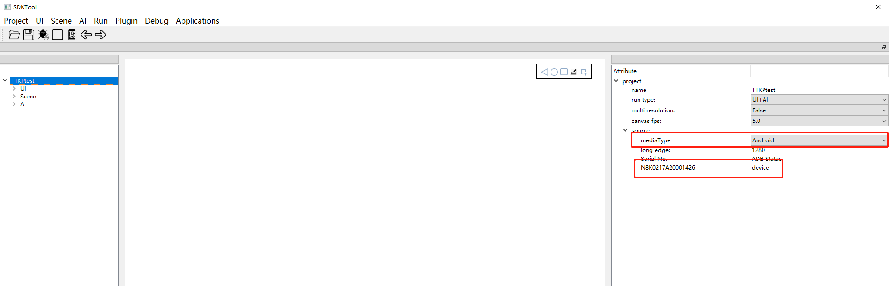
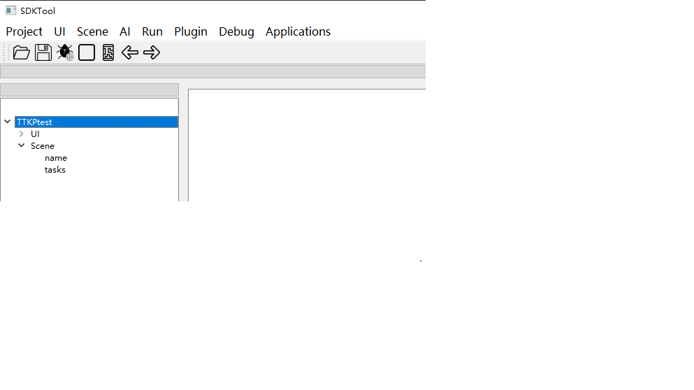
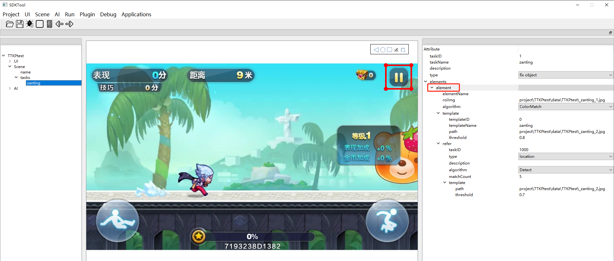
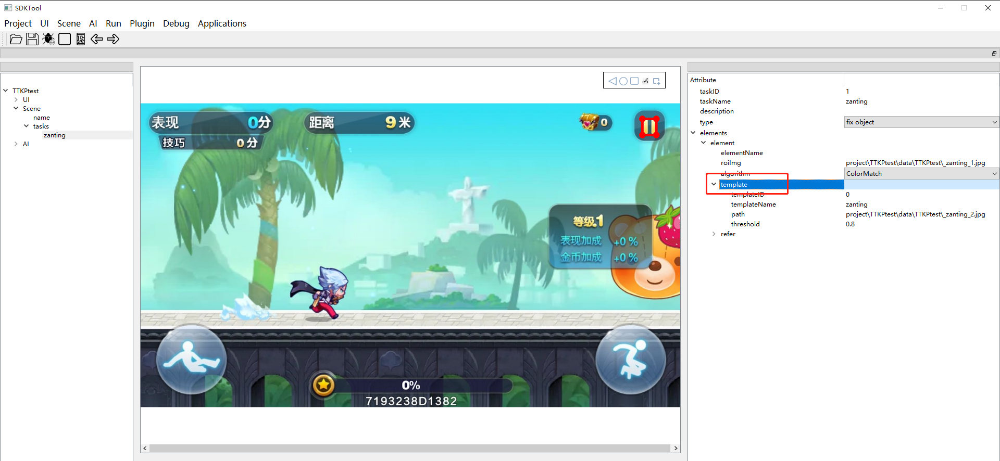
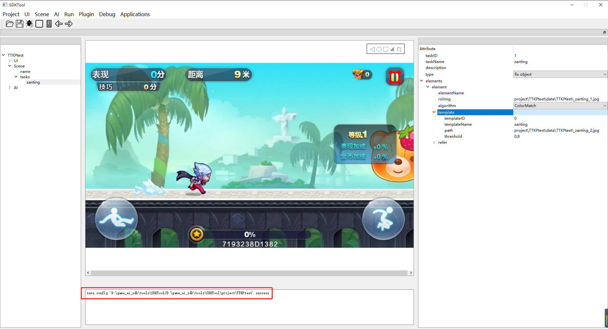
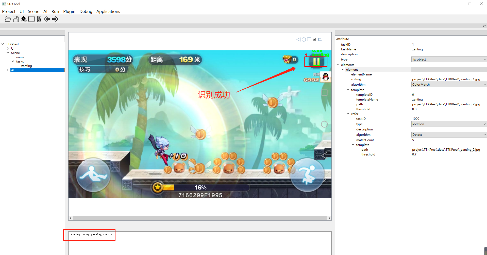

# 场景配置

# 1  配置准备

## 1.1  手机准备

将手机连接上点击，打开开发者选项，并且在命令窗口下使用adb devices命令能获取手机序列号，如下图1所示：



图1 获取手机devices

## 1.2  工具准备

需要准备SDKTool工具，具体环境及操作可以参考SDKTool部署说明.md、UI配置文件说明。

# 2  配置步骤

## 2.1  新建项目

在终端可运行SDKTool的环境下，进入到SDKTool目录，输入命令：

```
python main.py
```

打开了SDKTool页面以后，新建项目流程演示，见下图2、3、4所示：









图4 连接手机

新建完项目后，需要选择运行方式AI 、UI+AI，运行的媒介。双击设备序列号，停顿几秒后中间画布会显示手机画面，表示连接成功。

## 2.2  添加场景

点击菜单栏上的“Scene》New"新建一个场景，如下图5、图6所示：


图5 新建场景



 图6 新建好的场景                                                                        

## 2.3 添加task

scene里面主要就是配置每个task，每个task就是一项单独的识别任务。右击”tasks“选择”add task“，然后输入task的名字，在配置之前先选择type，我这里选择的是fix object（固定物体检测），双击task--description后面对应的value，输入描述内容“zan_ting”，双击element，在图片上框选出搜索模板的区域，该区域不能小于模板的区域，结果如下图7所示：



图7 搜索区域

​                                                                                          

还需要添加一个模板，双击template，在图片上框选出匹配模板区域，结果如下图8所示：




  图8 模板                                                                                           

点击SDKTool界面工具栏上的第二个图标，保存图标进行保存，图片放在SDKTools/project/test（工程名）/data/test（工程名）/下。生成json文件保存在SDKTools/project/test（工程名）/cfg/task/gameReg/下，如下图9所示：




图9 保存配置文件                 

配置好的Task.json文件如下所示：
                                            
## 2.4 测试配置

点击菜单栏的“Debug》GameReg》Start”,开始调试，窗口画面中会显示识别结果，如下图10所示：



​                                                                                            

图10 调试结果

