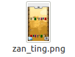
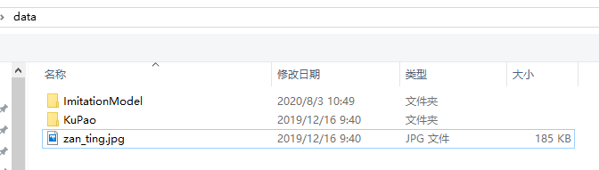
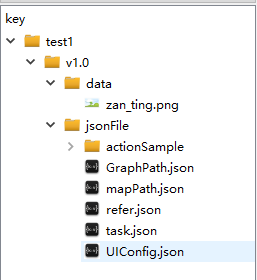
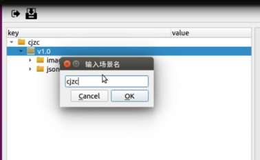
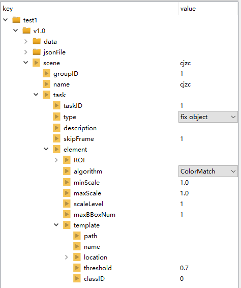
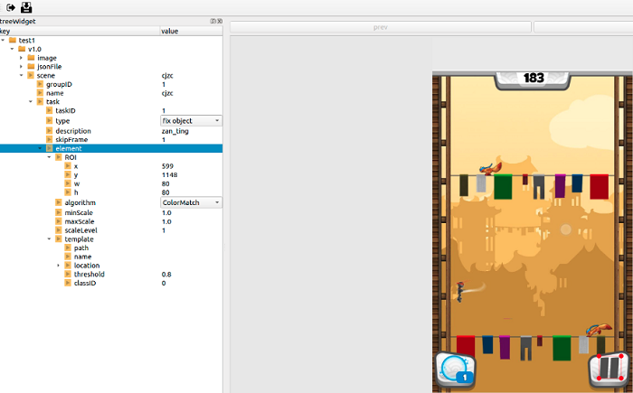
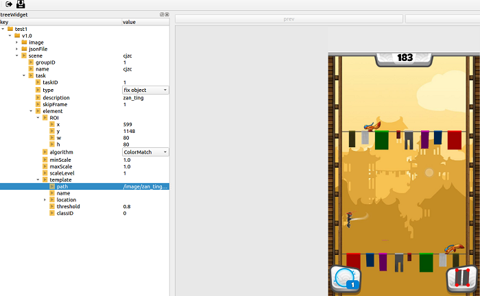
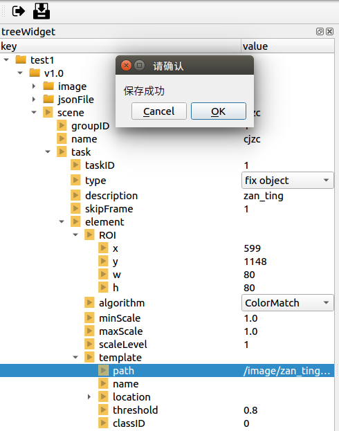

# 场景配置


[TOC]

# 1  配置准备

## 1.1  图片资源准备

​       使用1280x720比例的分辨率的手机，将需要配置的图片截下来，可以手机截屏，但是不能有游戏外的页面，也可以使用AISDK，以及phone_aiclient拉起游戏（将phone_aiclient中phone.ini的show_raw_screen参数置为1，显示出手机画面），截下要配置的游戏画面，下图为天天酷跑的配置图片。



​                                                                                             图1

## 1.2  工具准备

​      需要准备SDKTool工具，具体环境及操作可以参考SDKTool部署说明.md、UI配置文件说明。

# 2  配置步骤

## 2.1  新建项目

在终端可运行SDKTool的环境下，进入到SDKTool目录，输入命令：

```
python main.py
```

打开了SDKTool页面以后，新建项目流程演示（使用1280×720分辨率图片配置），见下图2、3、4、5、6所示：


​                                                                                     图2 屏幕右击


​                                                                                      图3 新建项目


​                                                                                     图4 输入工程名



​                                                                                    图5 选择图片文件夹



​                                                                                   图6 生成工程树状图

选择装有图片的文件夹时，会把所选择文件夹下所有图片或子文件另存到SDKTools/project/test1（工程名）/v1.0（版本号）/data/下。生成json文件保存在SDKTools/project/test1（工程名）/v1.0（版本号）/jsonFile/下。

## 2.2  添加场景

点击添加场景会让你输入一个场景名，输入好之后，就会生成一个场景名为你刚刚输入值的scene，默认会生成三项groupID：1；name：你输入的scene名；一个task。尽量使用1280×720分辨率的图片进行配置。如图7、8、9所示：


​                                                                                        图7 添加场景



​                                                                                        图8 输入场景名



​                                                                             图9 生成场景文件演示

## 2.3 添加task

scene里面主要就是配置每个task，每个task就是一项单独的识别任务。你可以先修改默认生成的task，在配置之前先选择type，我这里选择的是fix object（固定物体检测），双击task--description后面对应的value，输入描述内容“zan_ting”，双击element，选择图片，在图片上框选出搜索模板的区域，该区域不能小于模板的区域，结果如图10



​                                                                                           图10

还需要添加一个模板，双击template，选择图片，在图片上框选出匹配模板区域，结果如图11



​                                                                                             图11

点击SDKTool界面左上角第二个图标进行保存，图片放在SDKTools/project/test1（工程名）/v1.0（版本号）/data/下。生成json文件保存在SDKTools/project/test1（工程名）/v1.0（版本号）/jsonFile/下。



​                                                                                            图12

## 2.3  配置文件调整

将SDKTools/project/test1（工程名）/v1.0（版本号）/jsonFile/task.json文件移动到需要加载的配置文件

TTKP（天天酷跑配置文件名称）/cfg/task/gameReg目录下，并重命名为Task.json。

将SDKTools/project/test1（工程名）/v1.0（版本号）/data/下的图片移动到TTKP（天天酷跑配置文件名称）/data/下（图片存放路径可以自己决定放在data下的某个位置，只需要将Task.json文件中图片加载路径修改为存放图片的路径）。

调整和替换好的Task.json具体内容如下：

```
{
    "allTask":[
        {
            "groupID":1,
            "name":"cjzc",
            "task":[
                {
                    "taskID":1,
                    "taskName":"",
                    "type":"fix object",
                    "description":"",
                    "skipFrame":1,
                    "elements":[
                        {
                            "elementID":1,
                            "elementName":"",
                            "ROI":{
                                "x":1170,
                                "y":16,
                                "w":76,
                                "h":75
                            },
                            "algorithm":"ColorMatch",
                            "minScale":1.0,
                            "maxScale":1.0,
                            "scaleLevel":1,
                            "maxBBoxNum":1,
                            "templates":[
                                {
                                    "templateID":"1",
                                    "templateName":"",
                                    "path":"/data/zan_ting.png",
                                    "name":"",
                                    "location":{
                                        "x":1186,
                                        "y":31,
                                        "w":40,
                                        "h":49
                                    },
                                    "threshold":0.7,
                                    "classID":0
                                }
                            ]
                        }
                    ]
                }
            ]
        }
    ]
}
```

在运行游戏时，将AISDK/cfg/platform/GameReg.ini中ResultShow的参数修改为True，则能看到task任务结果。

结果展示如图13


​                                                                                            图13