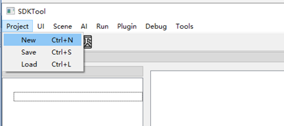
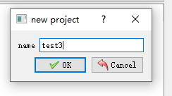
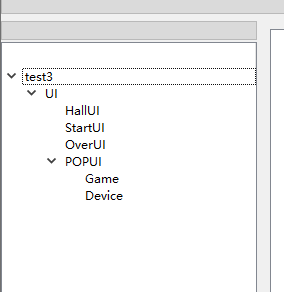
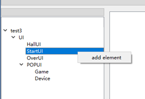
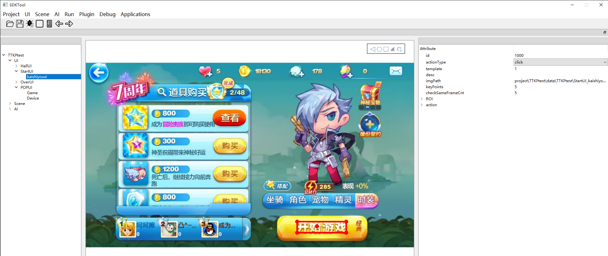
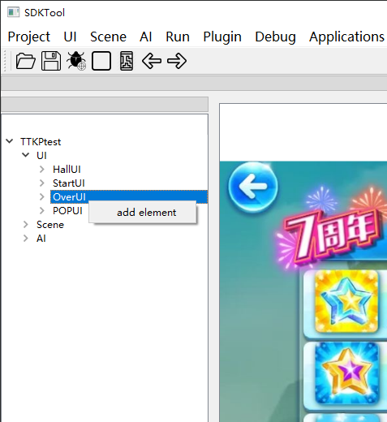
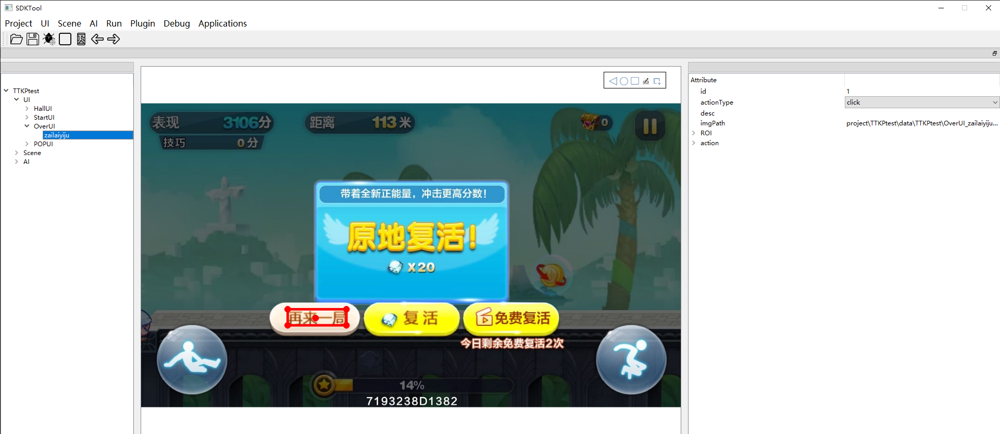
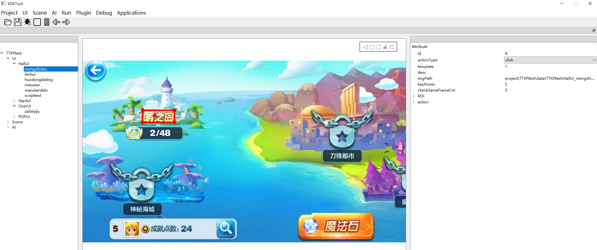
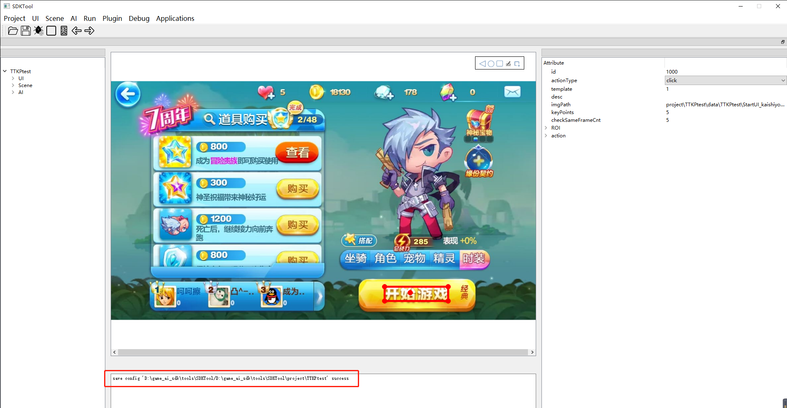

#   UI配置

# 1  配置准备

## 1.1  手机准备
游戏可分为ai和ui两部分，ai需要模仿学习或者强化学习等ai算法实现，主要表现是游戏开始到游戏结束之间的游戏动作，而ui则为其余部分，例如游戏对局中或者游戏对局外的弹窗、以及游戏对局外的页面点击。

手机连接上电脑，使用“adb devices”命令可以获取到手机的序列号，打开SDKTool工具，连接上手机，当工具中出现手机画面，则表示手机准备好了，注意手机要选用16:9的手机

​                                                                                                   

## 1.2  工具准备
需要准备SDKTool工具，具体环境及操作可以参考SDKTool部署说明.md、UI配置文件说明。

# 2  配置步骤

## 2.1  新建项目

在终端可运行SDKTool的环境下，进入到SDKTool目录，输入命令：

```
python main.py
```

打开了SDKTool页面以后，新建项目流程演示，见下图2-1、2-2、2-3所示：



图2-1 新建项目                                        

​   

图2-2 输入项目名称                           


 图2-3 新建好的项目


## 2.2  配置UI

第一步：点击菜单栏的“UI》New",如下图2-4所示：


图2-4 添加UI

添加完UI，生成树状结果图如下图2-5所示：



图2-5 UI树状图         

第二步：添加开始项StartUI

右击“StartUI”选择“add element”，详见下图2-6所示：

​

  图2-6 添加element

双击ROI，这时手机画面会被截图静止，以这张图片作为游戏的开始标志，框选模板为“开始”两个字的范围，点击开始按钮开始游戏，所以点击位置为开始按钮，其他项参数可以自己根据情况修改，这里使用默认参数也可以，如下图2-7所示：



 图2-7  配置开始项

第三步：添加OverUI

右击“OverUI”选择“add element”  
天天酷跑的结束画面作为结束项配置图片，因为每次游戏结束都出现该窗口，右击“OverUI”选择“add element" 输入UI的名字，便于区分UI，当游戏运行到结束画面时，双击”ROI“，然后在图片上框选模板，点击需要点击的位置。详见下图2-8和图2-9所示：



图2-8  添加OverUI下的element



 图2-9 配置结束项

第四步：添加HallUI

右键点击HallUI添加元素，可以看到HallUI下面多了一个新添加的HallUi，如果需要配置模板，则在template后面的输入框中输入模板个数，如果不配置模板，则保持默认值0，输入完模板个数后，直接在画面中框选模板区域，然后点击需要点击的位置，如果不需要配置模板，则直接在画面上点击要点击的位置，然后双击工具中的画面，程序会自动填写imgPath的值；其他项参数可以自己根据情况修改，这里使用默认参数也可以，详见下图2-10：



图2-10  添加HallUI

第五步：保存

点击工具栏上的保存按钮或者是点击菜单栏的“Project》Save”进行保存,下面的log窗口回打印保存成功的信息。



 图2-11  保存文件


注：只有HallUI、StartUI的action_type有drag、dragcheck、script、click类型，OverUI的action_type只有click、drag类型，其他类型的POPUI无action_type

