#   UI配置


[TOC]

# 1  配置准备

## 1.1  图片资源准备

​       游戏可分为ai和ui两部分，ai需要模仿学习或者强化学习等ai算法实现，主要表现是游戏开始到游戏结束之间的游戏动作，而ui则为其余部分，例如游戏对局中或者游戏对局外的弹窗、以及游戏对局外的页面点击。

​       使用1280x720比例的分辨率的手机，将需要配置的图片截下来，可以手机截屏，但是不能有游戏外的页面，也可以使用AISDK，以及phone_aiclient拉起游戏（将phone_aiclient中phone.ini的show_raw_screen参数置为0，显示出手机画面），截下要配置的游戏画面，下图为天天酷跑的ui图片。

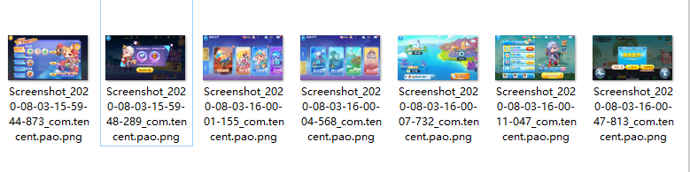

​                                                                                                   图1

## 1.2  工具准备

​      需要准备SDKTool工具，具体环境及操作可以参考[SDKTool部署说明.md](../environment/SDKToolEnv.md)、[UI配置文件说明](../SDKTool/UIConf.md)。

# 2  配置步骤

## 2.1  新建项目

在终端可运行SDKTool的环境下，进入到SDKTool目录，输入命令：

```
python main.py
```

打开了SDKTool页面以后，新建项目流程演示（使用1280×720分辨率图片配置），见下图2、3、4、5、6所示：


​                                                                                     图2 屏幕右击


​                                                                                      图3 新建项目

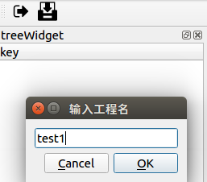

​                                                                                     图4 输入工程名

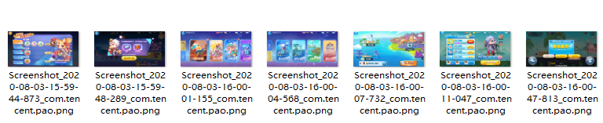

​                                                                                    图5 选择图片文件夹

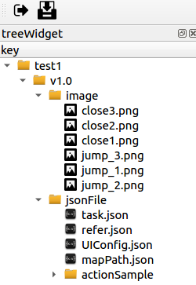

​                                                                                         图6 生成工程树状图

选择装有图片的文件夹时，会把所选择文件夹下所有图片或子文件另存到SDKTools/project/test1（工程名）/v1.0（版本号）/data/，生成json文件保存在SDKTools/project/test1（工程名）/v1.0（版本号）/jsonFile/下。

## 2.2  配置UI

​    第一步：版本号右击添加UI，如图7所示：

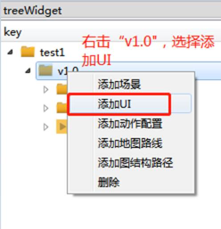

​                                                                                       图7 添加UI

添加完UI，生成树状结果图如下图8所示：

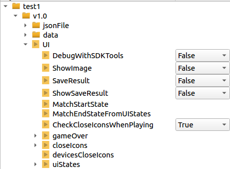

​                                                                                      图8 UI树状结果图

第二步：添加开始项

左键双击uiStates--element--imgPath，选择图片

​                                           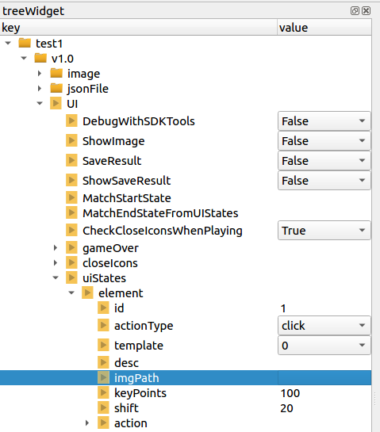

​                                                                                        图9   双击imgPath


​      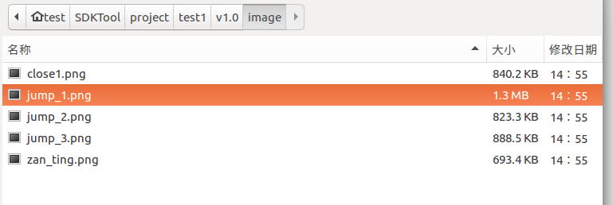

​                                                                                           图10  选择图片

选择图片成功后，以这张图片作为游戏的开始标志，点击开始按钮开始游戏，所以配置位置则为点击位置，其他项参数可以自己根据情况修改，这里使用默认参数也可以，如图11。

​       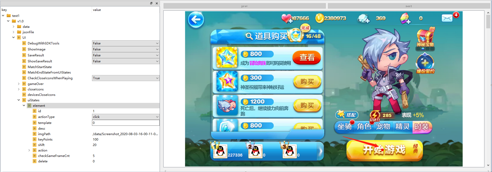

​                                                                                图11  点击图片中开始位置

​        要以这张图片作为开始，还需要将它的id号加入MatchStartState中，右键点击MatchStartState添加ID，双击添加的id对应的value的地方，输入要作为开始项的uiStates的id号，如图12

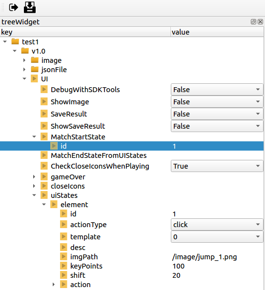

​                                                                                             图12  添加开始ID

第三步：添加closeIcons

左键点击closeIcons前的三角符号，左键双击element--imgPath，选择图片，框出图片要识别的区域，如图13


​                                                                                         图13  添加closeIcons

类似于图13这样的弹框，配置为closeIcons项最好，只要识别的区域都在同一个位置，不同的图片也可以点击，只是识别的时间稍微比uiStates久一点，除此之外，就算在游戏中出现了类似的弹窗，closeIcons也可以点击（前提是，UI的CheckCloseIconsWhenPlaying参数置为true，本游戏在游戏中没有弹窗，所以不需要调整参数），例如在配置的游戏开始的界面（图11中的图片），游戏识别到开始，但是因为触点点击时间太短或者其他原因，游戏已经开始，但是画面一直停留在开始的界面，这时候就可以配置一个该图片的closeIcons，它可以识别到该图片，多次补充点击动作。

右键点击closeIcons添加元素，可以看到closeIcons下面多了一个element，左键双击第二个element--imgPath,选择图片，框出图片要识别的区域，如图14


​                                                                                               图14   添加第二个closeIcons

同样和添加第二个closeIcons一样添加第三个，展示如图15

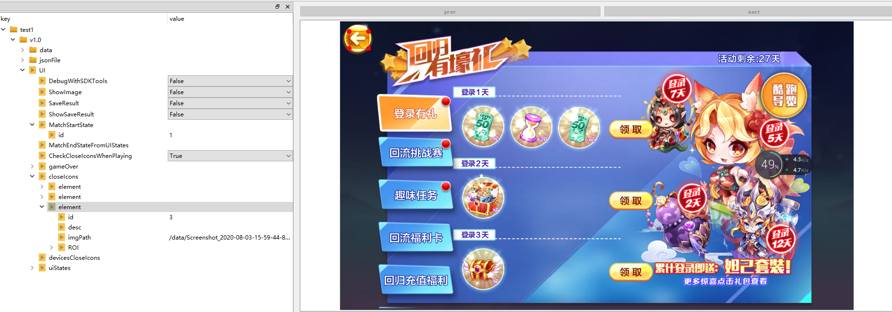

​                                                                                         图15  添加第三个closeIcons

​                                                             

第四步：添加uiStates

右键点击uiStates添加元素，可以看到uiStates下面多了一个element，左键双击第二个element--imgPath,选择图片，选择冒险两个字作为点击位置，其他项参数可以自己根据情况修改，这里使用默认参数也可以，如图17

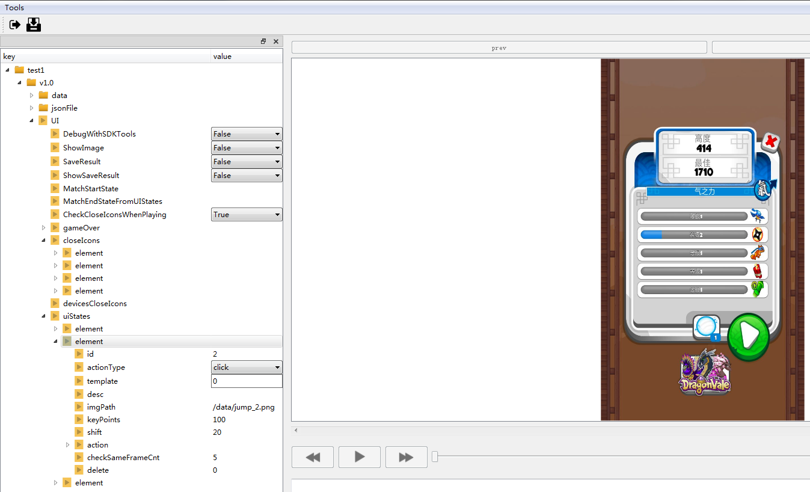

​                                                                                             图17  添加第二个uiStates

右键点击uiStates添加元素，可以看到uiStates下面多了一个element，左键双击第二个element--imgPath,选择图片，选择冒险大陆作为点击位置，如图18

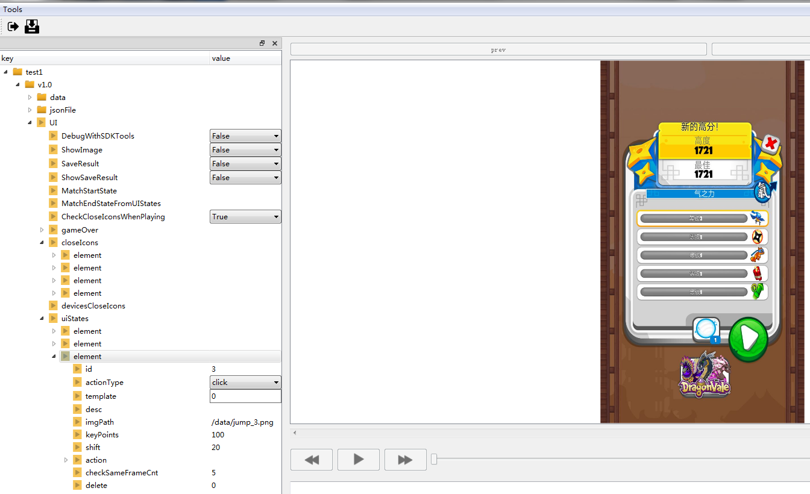

​                                                                                            图18   添加第三个uiStates


右键点击uiStates添加元素，可以看到uiStates下面多了一个element，左键双击第二个element--imgPath,选择图片，选择萌之岛作为点击位置，如图19所示

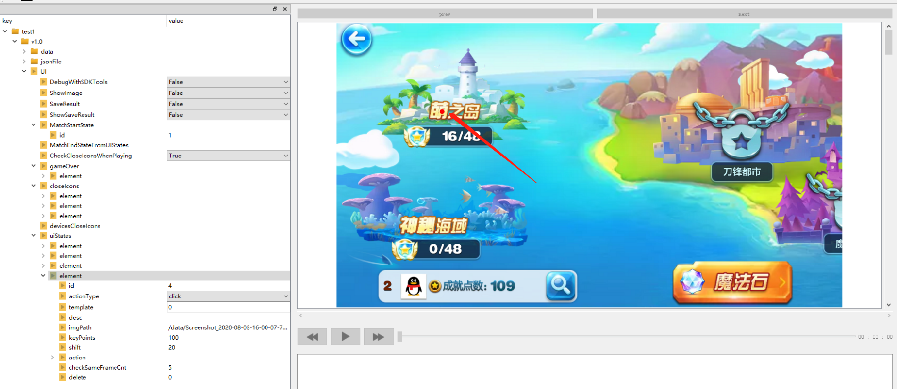


右键点击uiStates添加元素，可以看到uiStates下面多了一个element，左键双击第二个element--imgPath,选择图片，选择返回作为点击位置，如图20所示

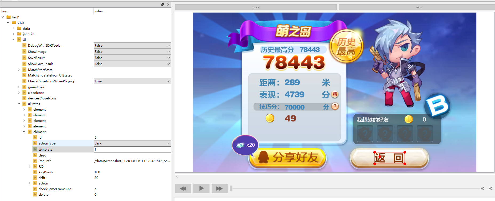


第五步：配置结束画面

这里以Screenshot_2020-08-03-16-00-47-813_com.tencent.pao.png作为结束画面配置，因为每次游戏结束都出现该窗口，点击gameOver前的三角符号，左键双击element--imgPath，选择图片，框出图片需要点击的区域，如图21

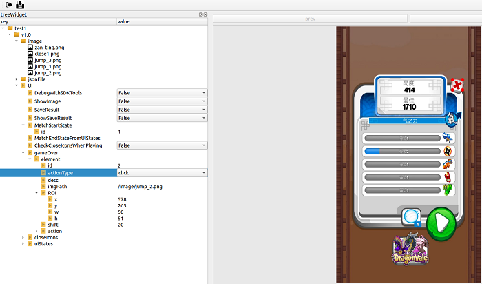

​                                                                                             图21  配置结束画面

第六步：保存

点击SDKTool界面左上角第二个图标进行保存，图片放在SDKTools/project/test1（工程名）/v1.0（版本号）/data/，生成json文件保存在SDKTools/project/test1（工程名）/v1.0（版本号）/jsonFile/下。

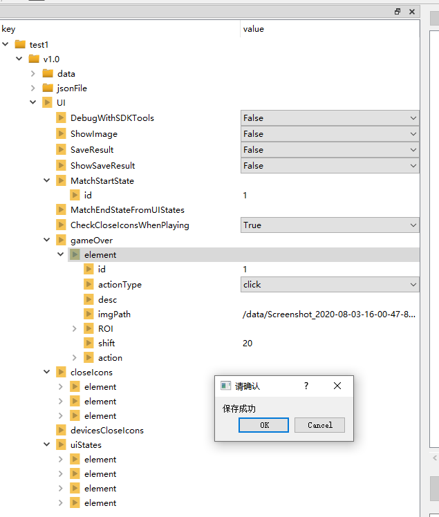

​                                                                                          图22   保存文件

## 2.3  配置文件调整

将SDKTools/project/test1（工程名）/v1.0（版本号）/jsonFile/UIConfig.json文件移动到需要加载的配置文件

TTKP（天天酷跑配置文件名称）/cfg/task/ui/目录下。

将SDKTools/project/test1（工程名）/v1.0（版本号）/data/下的图片移动到TTKP（天天酷跑配置文件名称）/data/（图片存放路径可以自己决定放在data下的某个位置，只需要将UIConfig.json文件中图片加载路径修改为存放图片的路径）。

调整和替换好的UIConfig.json具体内容如下：

```
{
    "debugWithSDKTools":false,
    "showImage":false,
    "saveResult":false,
    "showSaveResult":false,
    "matchStartState":[
        {
            "id":1
        }
    ],
    "matchEndStateFromUIStates":[],
    "checkCloseIconsWhenPlaying":true,
    "gameOver":[
        {
            "id":1,
            "actionType":"click",
            "desc":"",
            "imgPath":"/data/Screenshot_2020-08-03-16-00-47-813_com.tencent.pao.png",
            "x":348,
            "y":489,
            "w":145,
            "h":38,
            "shift":20,
            "actionX":396,
            "actionY":513,
            "actionThreshold":0.7,
            "actionTmplExpdWPixel":25,
            "actionTmplExpdHPixel":25,
            "actionROIExpdWRatio":0.275,
            "actionROIExpdHRatio":0.275
        }
    ],
    "closeIcons":[
        {
            "id":1,
            "desc":"",
            "imgPath":"/data/Screenshot_2020-08-03-15-59-48-289_com.tencent.pao.png",
            "x":14,
            "y":15,
            "width":67,
            "height":57
        },
        {
            "id":2,
            "desc":"",
            "imgPath":"/data/Screenshot_2020-08-03-16-00-11-047_com.tencent.pao.png",
            "x":816,
            "y":619,
            "width":202,
            "height":50
        },
        {
            "id":3,
            "desc":"",
            "imgPath":"/data/Screenshot_2020-08-03-15-59-44-873_com.tencent.pao.png",
            "x":22,
            "y":25,
            "width":48,
            "height":42
        }
    ],
    "devicesCloseIcons":[],
    "uiStates":[
        {
            "id":1,
            "actionType":"click",
            "desc":"",
            "imgPath":"/data/Screenshot_2020-08-03-16-00-11-047_com.tencent.pao.png",
            "keyPoints":100,
            "template":0,
            "shift":20,
            "actionX":910,
            "actionY":643,
            "actionThreshold":0.7,
            "actionTmplExpdWPixel":25,
            "actionTmplExpdHPixel":25,
            "actionROIExpdWRatio":0.275,
            "actionROIExpdHRatio":0.275,
            "checkSameFrameCnt":5,
            "delete":0
        },
        {
            "id":2,
            "actionType":"click",
            "desc":"",
            "imgPath":"/data/Screenshot_2020-08-03-16-00-01-155_com.tencent.pao.png",
            "keyPoints":100,
            "template":0,
            "shift":20,
            "actionX":46,
            "actionY":509,
            "actionThreshold":0.7,
            "actionTmplExpdWPixel":25,
            "actionTmplExpdHPixel":25,
            "actionROIExpdWRatio":0.275,
            "actionROIExpdHRatio":0.275,
            "checkSameFrameCnt":5,
            "delete":0
        },
        {
            "id":3,
            "actionType":"click",
            "desc":"",
            "imgPath":"/data/Screenshot_2020-08-03-16-00-04-568_com.tencent.pao.png",
            "keyPoints":100,
            "template":0,
            "shift":20,
            "actionX":831,
            "actionY":562,
            "actionThreshold":0.7,
            "actionTmplExpdWPixel":25,
            "actionTmplExpdHPixel":25,
            "actionROIExpdWRatio":0.275,
            "actionROIExpdHRatio":0.275,
            "checkSameFrameCnt":5,
            "delete":0
        },
        {
            "id":4,
            "actionType":"click",
            "desc":"",
            "imgPath":"/data/Screenshot_2020-08-03-16-00-07-732_com.tencent.pao.png",
            "keyPoints":100,
            "template":0,
            "shift":20,
            "actionX":267,
            "actionY":224,
            "actionThreshold":0.7,
            "actionTmplExpdWPixel":25,
            "actionTmplExpdHPixel":25,
            "actionROIExpdWRatio":0.275,
            "actionROIExpdHRatio":0.275,
            "checkSameFrameCnt":5,
            "delete":0
        },
        {
            "id":5,
            "actionType":"click",
            "desc":"",
            "imgPath":"/data/Screenshot_2020-08-06-11-28-43-613_com.tencent.pao.png",
            "keyPoints":100,
            "template":1,
            "shift":20,
            "x":820,
            "y":631,
            "w":136,
            "h":52,
            "actionX":844,
            "actionY":651,
            "actionThreshold":0.7,
            "actionTmplExpdWPixel":25,
            "actionTmplExpdHPixel":25,
            "actionROIExpdWRatio":0.275,
            "actionROIExpdHRatio":0.275,
            "checkSameFrameCnt":5,
            "delete":0
        }
    ]
}
```

